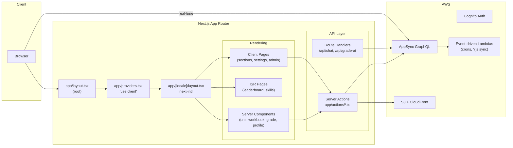

# App Router Migration

> **Status**: Complete — May 2026  
> **Next.js Version**: 16.x with App Router  
> **i18n**: `next-intl` (replaced `next-i18next`)  
> **PWA**: Serwist (`@serwist/next`)

This is a reference for the completed Pages → App Router migration. The `pages/` directory is empty. All routes live under `app/[locale]/`.

---

## Request Flow



## Provider Nesting

```
CacheProvider (Emotion)
  └─ ThemeProvider (MUI)
       └─ AuthProvider (Cognito)
            └─ SettingsProvider
                 └─ ChatContextProvider
                      └─ children
```

---

## Route Structure

### Pages (`app/[locale]/`)

| Route | Rendering | Notes |
|-------|-----------|-------|
| `/` | Client | Home/landing |
| `/units` | Client | Unit list |
| `/unit/[id]` | RSC | Unit detail |
| `/workbook/[id]` | RSC | Server-side Lexical rendering (`@lexical/headless` + `linkedom`) |
| `/instructor/grade/[id]` | RSC | `getServerClient()` |
| `/profile/[username]` | RSC | NailedIt client island |
| `/leaderboard` | ISR | `revalidate: 60s`, live subscription hydration |
| `/skills` | ISR | `revalidate: 300s`, client hydration |
| `/sections` | Client | Section management |
| `/section/[id]` | Client | Section detail |
| `/section/[id]/settings/gamification` | Client | Gamification config |
| `/squads` | Client | Squad list |
| `/squad/[id]` | Client | Squad detail |
| `/settings` | Client | User settings |
| `/profile` | Client | Own profile |
| `/profile/notifications` | Client | Notification inbox |
| `/admin/settings` | Client | Admin panel |
| `/offline` | Client | Offline status |
| `/review/[id]` | Client | Peer review |
| `/xp-history` | Client | XP log |
| `/privacy` | Client | Privacy policy |

### Route Handlers (`app/api/`)

| Endpoint | Purpose |
|----------|---------|
| `/api/chat` | Streaming chat (Vercel AI SDK + block tools + auth) |
| `/api/suggest-blocks` | Block suggestion streaming |
| `/api/content-completion` | Editor content completion |
| `/api/grade-ai` | Custom AI block grading |

### Server Actions (`app/actions/`)

| File | Exports |
|------|---------|
| `chat.ts` | `chatCompletion` |
| `drill.ts` | `generatePracticeDrill` |
| `embeddings.ts` | `generateEmbedding`, `generateEmbeddings` |
| `feedback.ts` | `summarizeGradeFeedback` |
| `gamification.ts` | `awardXP`, `recordGradeCompletion`, `generateSkillTreeFromUnit`, `rebuildLeaderboard` |
| `generate.ts` | `generateAudioFile`, `generateImage`, `generateContent` |
| `grading.ts` | `gradeAnswer`, `gradeCustomAnswer`, `gradeRecording` |
| `moderate.ts` | `moderateContent` |
| `peerReview.ts` | `handleAIMention`, `generateReviewSummary` |
| `section.ts` | `joinSection`, `listSectionStudents` |
| `storage.ts` | S3 upload/download helpers |
| `unitContent.ts` | Unit content operations |

---

## Key Architectural Decisions

1. **All AI calls go through Server Actions or Route Handlers** — no direct Lambda invocation from the client. Retained Lambdas (streakResetCron, yjsSync, mediaConvert, notificationCron) are purely event-driven.
2. **i18n via `next-intl`** — 6 locales (`en`, `es`, `fr`, `de`, `ja`, `zh`), 10 namespaces. Translation files in `public/locales/{locale}/{namespace}.json`.
3. **No `middleware.ts`** — Next.js 16+ handles locale routing without middleware.
4. **Emotion SSR** — MUI v7 streaming support, no manual `getInitialProps`.
5. **Provider nesting** in `app/providers.tsx` (`'use client'`): CacheProvider → ThemeProvider → AuthProvider → SettingsProvider → ChatContextProvider → children.

