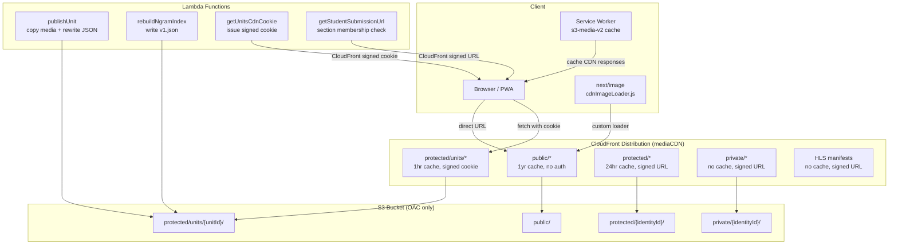
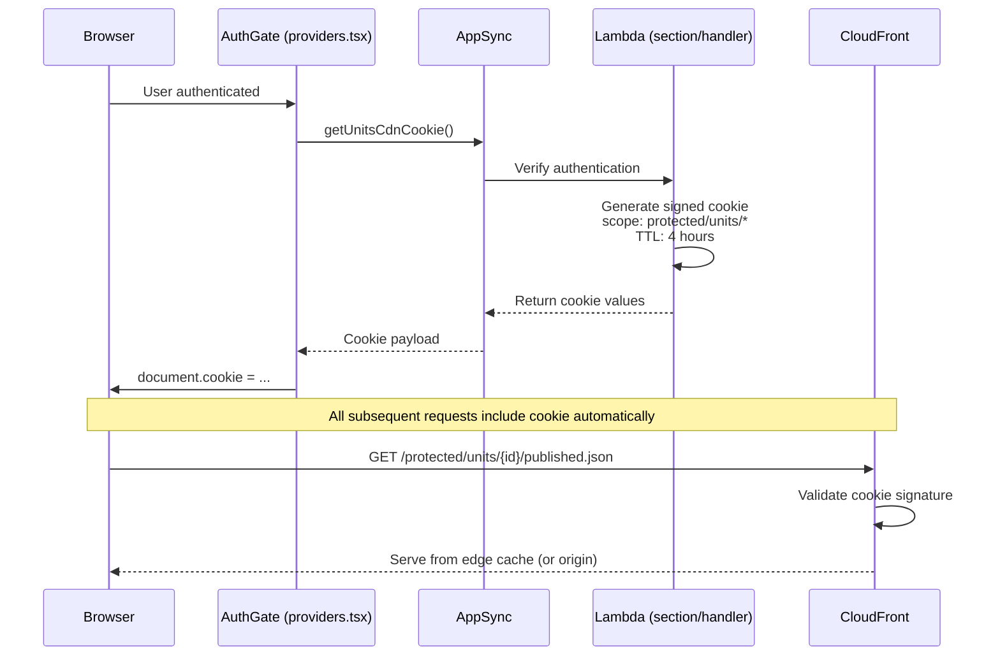
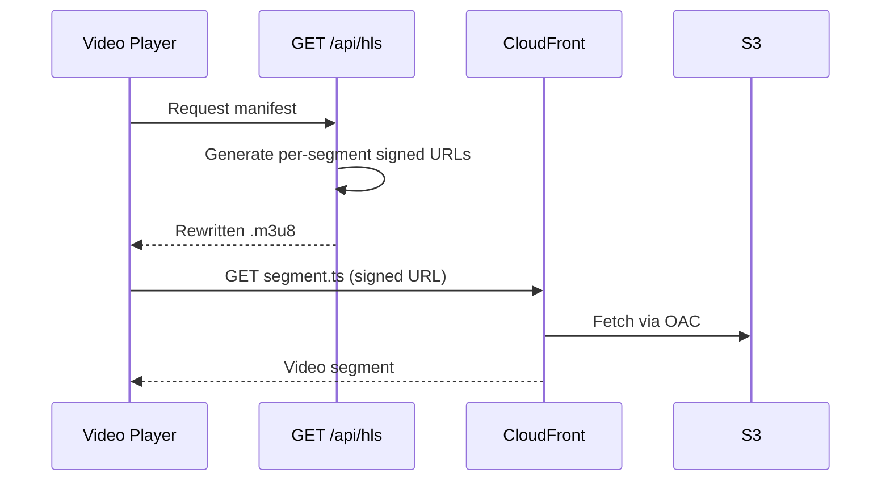

# CloudFront CDN Architecture

> **Status**: Complete — June 2026  
> **Stack**: AWS CloudFront + S3 OAC + CDK

All S3-served media is delivered through a CloudFront distribution with Origin Access Control (OAC), enabling CDN edge caching, stable URLs, Next.js image optimization, and section-scoped unit access via signed cookies.

---

## Architecture Overview

---

## S3 Path Convention

| Path | Access | Cache | Use Case |
|------|--------|-------|----------|
| `public/*` | Anyone | 1 year (immutable) | Fonts, static assets, locale files |
| `protected/units/{unitId}/published.json` | Signed cookie | 1 hour | Published unit Lexical JSON |
| `protected/units/audio/{fileId}.mp3` | Signed cookie | 1 hour | Published TTS + instructor audio |
| `protected/units/images/{fileId}/` | Signed cookie | 1 hour | Published WebP variants |
| `protected/units/ngrams/v1.json` | Signed cookie | 1 hour | Layout autocomplete index |
| `protected/{identityId}/*` | Signed URL | 24 hours | User-uploaded files |
| `protected/{identityId}/{fileId}/*.m3u8` | Signed URL (via `/api/hls`) | No cache | HLS video manifests |
| `private/{identityId}/*` | Signed URL (owner only) | No cache | Student submissions, drafts |

---

## Signed Cookie Strategy

CloudFront's three fixed cookie names (`CloudFront-Policy`, `CloudFront-Signature`, `CloudFront-Key-Pair-Id`) mean only one resource scope can be active per session. The design issues a **single broad cookie** at app load:

**Security boundary**: The CDN cookie proves "authenticated platform user." AppSync data queries enforce the actual enrollment gate — a learner can't load a unit they're not enrolled in regardless of CDN access. S3 listing is prevented because no Amplify Storage client rule exists for the `protected/units/*` prefix.

---

## Image Optimization

Pre-generated WebP variants replace on-the-fly resizing:

| Variant | Max Width | Generated By |
|---------|-----------|--------------|
| `thumbnail.webp` | 200px | `imageProcess` Lambda |
| `small.webp` | 640px | `imageProcess` Lambda |
| `medium.webp` | 1024px | `imageProcess` Lambda |
| `large.webp` | 1920px | `imageProcess` Lambda |

The custom loader (`src/utils/cdnImageLoader.js`) maps Next.js `width` param to the nearest pre-generated variant and returns the CDN URL.

---

## HLS Video Delivery

HLS segments stay at their original `protected/{identityId}/{fileId}/` paths. The `/api/hls` route proxy rewrites each `.ts` segment URL to an individual CloudFront signed URL.

---

## Unit Publishing Flow

When an instructor publishes a unit, the `publishUnit` Lambda:

1. Parses Lexical JSON to find all referenced S3 keys
2. Copies **audio** → `protected/units/audio/{fileId}.mp3`
3. Copies **images** (all WebP variants) → `protected/units/images/{fileId}/`
4. Leaves **video** in place (too many HLS segments to copy)
5. Rewrites Lexical JSON paths to `protected/units/` prefixes
6. Writes rewritten JSON to `protected/units/{unitId}/published.json`
7. Updates `Unit.publishedContentVersion` in DynamoDB

Re-publishing is idempotent — same keys, overwritten.

---

## Service Worker Integration

The `s3-media-v2` cache in `src/sw.ts` intercepts CDN responses:
- CDN hostname detected via `NEXT_PUBLIC_CDN_DOMAIN`
- Public assets cached with CacheFirst strategy
- Protected/private assets use NetworkFirst with fallback

---

## Key Files

| File | Purpose |
|------|---------|
| `amplify/custom/mediaCDN/resource.ts` | CDK construct: OAC, key group, cache behaviors |
| `amplify/functions/publishUnit/handler.ts` | Copy media + rewrite Lexical JSON on publish |
| `amplify/functions/section/handler.ts` | `getUnitsCdnCookie` + `getStudentSubmissionUrl` |
| `src/utils/getCachedUrl.js` | CDN URL for public paths, presigned for others |
| `src/utils/cdnImageLoader.js` | Next.js custom image loader |
| `src/utils/layoutNgrams.ts` | Fetch ngrams index via CDN |
| `src/sw.ts` | Service worker CDN caching |
| `app/providers.tsx` | Calls `getUnitsCdnCookie()` in AuthGate |
| `next.config.mjs` | `NEXT_PUBLIC_CDN_DOMAIN`, custom image loader config |

---

## Environment Variables

| Variable | Purpose |
|----------|---------|
| `NEXT_PUBLIC_CDN_DOMAIN` | CloudFront distribution domain |
| `CF_KEY_PAIR_ID` | CloudFront key pair ID (SSM) |
| `CF_PRIVATE_KEY` | RSA private key for signing (SSM SecureString) |
