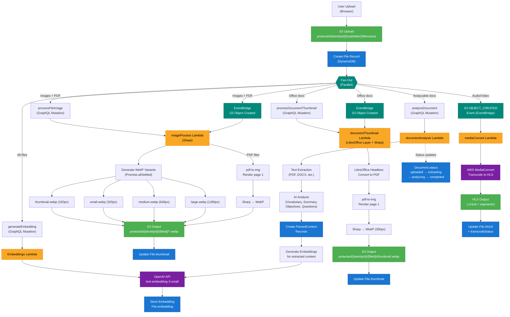
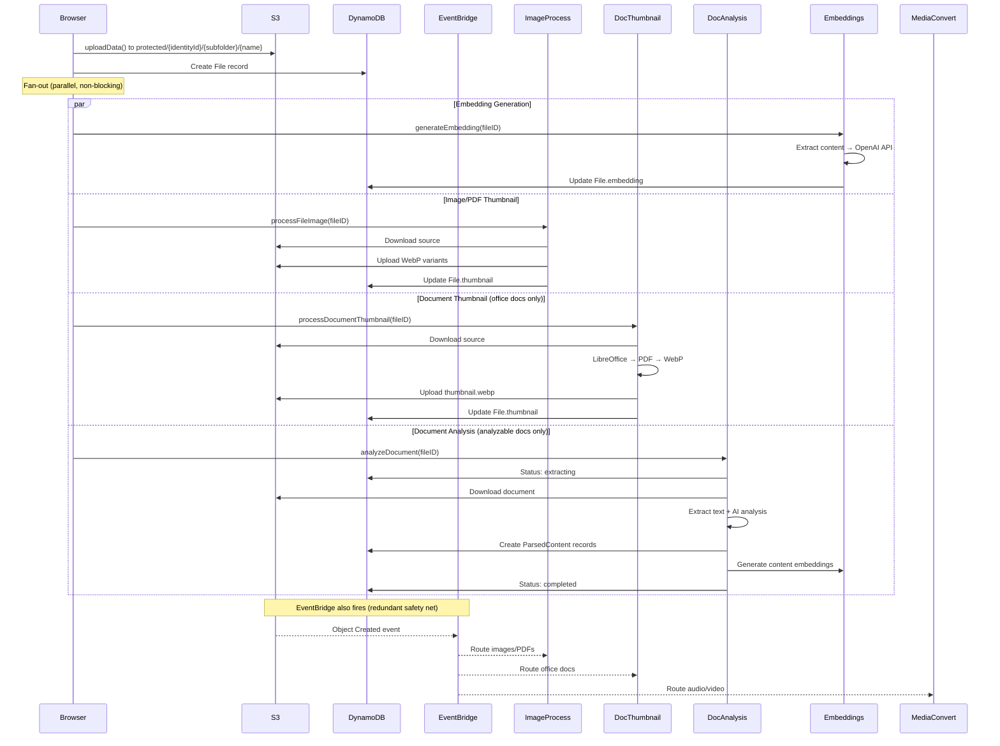

# File Processing Pipeline

Complete architecture documentation for the file upload and processing system.

## Overview

When a file is uploaded, multiple parallel processing pipelines are triggered depending on the file type. The system uses **fan-out** architecture — independent processors run concurrently via EventBridge and explicit GraphQL mutation calls.

```
┌─────────────────────────────────────────────────────────────────────────────┐
│                           FILE UPLOAD                                        │
│                                                                             │
│  Browser → S3 (uploadData) → File record → Fan-out to processors           │
└─────────────────────────────────────────────────────────────────────────────┘
```

## Architecture Diagram



## Pipeline Details

### 1. Image Processing (`imageProcess` Lambda)

| Property | Value |
|----------|-------|
| **Trigger** | `processFileImage(fileID)` mutation + EventBridge S3 Object Created |
| **Input** | Images (JPEG, PNG, GIF, WebP, TIFF, BMP, SVG) and PDF files |
| **Runtime** | Node.js 20, 1024 MB, 120s timeout |
| **Dependencies** | Sharp, pdf-to-img |
| **Output Format** | WebP (next-gen, ~30% smaller than JPEG) |

**Processing stages:**

```
Source Image → Sharp resize → Promise.allSettled (fan-out)
                              ├─ thumbnail (150px max width)
                              ├─ small (320px)
                              ├─ medium (640px)
                              └─ large (1280px)
                              All → WebP conversion → S3 upload
```

**PDF path:**
```
PDF → pdf-to-img (render page 1 at 2x scale) → Sharp → WebP thumbnail → S3
```

**S3 output paths:**
```
protected/{identityId}/{fileId}/thumbnail.webp
protected/{identityId}/{fileId}/small.webp
protected/{identityId}/{fileId}/medium.webp
protected/{identityId}/{fileId}/large.webp
```

---

### 2. Document Thumbnail (`documentThumbnail` Lambda)

| Property | Value |
|----------|-------|
| **Trigger** | `processDocumentThumbnail(fileID)` mutation + EventBridge S3 Object Created |
| **Input** | Office documents (.doc, .docx, .xls, .xlsx, .ppt, .pptx, .odt, .ods, .odp, .txt, .md, .csv, .epub, .rtf) |
| **Runtime** | Node.js 20, 1536 MB, 300s timeout |
| **Dependencies** | Sharp, pdf-to-img, LibreOffice Lambda Layer (`shelfio/libreoffice-brotli`) |
| **Output Format** | WebP thumbnail (300px max width) |

**Processing stages:**

```
Document → Download from S3
         → LibreOffice headless (--convert-to pdf)
         → pdf-to-img (render page 1)
         → Sharp (resize 300px + WebP)
         → Upload to S3
         → Update File.thumbnail via GraphQL
```

**LibreOffice Layer:**
- ARN: `arn:aws:lambda:{region}:764866452798:layer:libreoffice-brotli:1`
- Binary at: `/opt/libreoffice/program/soffice.bin`
- Requires Node.js 20 runtime, x86_64 architecture

**S3 output path:**
```
protected/{identityId}/{fileId}/thumbnail.webp
```

---

### 3. Embedding Generation (`embeddings` Lambda)

| Property | Value |
|----------|-------|
| **Trigger** | `generateEmbedding(content)` / `generateEmbeddings(fileID)` mutations |
| **Model** | OpenAI `text-embedding-3-small` |
| **Dimensions** | 512 |
| **Storage** | `File.embedding`, `ParsedContent.embedding`, `Word.embedding`, `Question.embedding` |

**Processing stages:**

```
Content (text string or file content)
  → OpenAI Embeddings API (text-embedding-3-small)
  → Vector (512 dimensions)
  → Store in S3: private/{identityId}/embeddings/{model}/{id}.json
```

**Used for:**
- Semantic search across files, vocabulary, and questions
- Content similarity matching
- AI-powered content recommendations

---

### 4. Document Analysis (`documentAnalysis` Lambda)

| Property | Value |
|----------|-------|
| **Trigger** | `analyzeDocument(fileID)` mutation |
| **Cancellation** | `cancelDocumentAnalysis(fileID)` mutation |
| **Input** | PDF, DOCX, and other text-bearing documents |
| **Output** | `Document` + `ParsedContent` records with extracted text, vocabulary, summaries |

**Status progression:**

```
uploaded → extracting → analyzing → completed
                                  ↘ cancelled (if user cancels)
                                  ↘ failed (on error)
```

**Processing stages:**

```
File in S3
  → Download document
  → Text extraction (format-specific: PDF parser, DOCX parser, etc.)
  → AI analysis (vocabulary extraction, summary, objectives, questions)
  → Create ParsedContent records (one per page/section)
  → Generate embeddings for each ParsedContent record
  → Update Document.status = 'completed'
```

**Records created:**
- `Document` — top-level analysis record with status tracking
- `ParsedContent` — individual extracted sections with:
  - `text` — raw extracted text
  - `vocabulary` — identified vocabulary words
  - `summary` — AI-generated summary
  - `embedding` — vector for semantic search

---

### 5. Media Conversion (`mediaConvert` Lambda + AWS MediaConvert)

| Property | Value |
|----------|-------|
| **Trigger** | S3 OBJECT_CREATED event via EventBridge (`S3VideoUploadRule`) |
| **Input** | Audio files (MP3, WAV, M4A, etc.) and video files (MP4, MOV, WebM, etc.) |
| **Output** | HLS streaming format (.m3u8 manifest + .ts segments) |
| **Service** | AWS Elemental MediaConvert |

**Processing stages:**

```
Audio/Video upload
  → Lambda creates MediaConvert job
  → MediaConvert transcodes to HLS
     ├─ Video: 720p, 480p, 360p bitrate ladder
     └─ Audio: AAC
  → EventBridge Job State Change notification
  → Lambda updates File.hlsUrl and File.transcodeStatus
```

**S3 output path:**
```
protected/{identityId}/{fileId}/{fileId}.m3u8    (manifest)
protected/{identityId}/{fileId}/{fileId}_*.ts    (segments)
```

---

## Complete Upload Sequence

When a user uploads a file through the browser, the following sequence executes:



## File Type Routing

| File Type | Image Process | Doc Thumbnail | Doc Analysis | Embeddings | Media Convert |
|-----------|:---:|:---:|:---:|:---:|:---:|
| JPEG, PNG, GIF, WebP, TIFF, BMP, SVG | ✅ | — | — | ✅ | — |
| PDF | ✅ (page 1) | — | ✅ | ✅ | — |
| DOC, DOCX | — | ✅ | ✅ | ✅ | — |
| XLS, XLSX | — | ✅ | — | ✅ | — |
| PPT, PPTX | — | ✅ | ✅ | ✅ | — |
| ODF (.odt, .ods, .odp) | — | ✅ | ✅ | ✅ | — |
| TXT, MD, CSV, RTF | — | ✅ | ✅ | ✅ | — |
| EPUB | — | ✅ | ✅ | ✅ | — |
| MP3, WAV, M4A, AAC | — | — | — | ✅ | ✅ |
| MP4, MOV, WebM | — | — | — | ✅ | ✅ |

## Dual-Trigger Pattern (Redundancy)

Each processor is triggered **two ways** for reliability:

1. **Explicit mutation call** — immediate, triggered by the browser after upload
2. **EventBridge S3 Object Created** — automatic, triggered by S3 (safety net for retries, re-uploads, or direct S3 writes)

Both triggers are idempotent — the Lambda checks if processing is already complete before re-running.

## S3 Path Convention

```
protected/{identityId}/
├── images/{filename}           ← Source image uploads
├── audio/{filename}            ← Source audio uploads
├── files/{filename}            ← Source document uploads
└── {fileId}/
    ├── thumbnail.webp          ← 150px (images/PDF) or 300px (documents)
    ├── small.webp              ← 320px (images only)
    ├── medium.webp             ← 640px (images only)
    ├── large.webp              ← 1280px (images only)
    └── {fileId}.m3u8           ← HLS manifest (audio/video)
```

## Infrastructure (CDK / Amplify Gen 2)

| Resource | Stack | Purpose |
|----------|-------|---------|
| `S3ImageUploadRule` | EventBridge Rule | Routes image/PDF uploads to imageProcess |
| `S3DocumentUploadRule` | EventBridge Rule | Routes document uploads to documentThumbnail |
| `LibreOfficeLayer` | Lambda Layer | LibreOffice binary for document conversion |
| `ImageProcessAppSyncPolicy` | IAM Policy | GraphQL access for imageProcess |
| `DocumentThumbnailAppSyncPolicy` | IAM Policy | GraphQL access for documentThumbnail |
| Storage bucket `grantReadWrite` | S3 IAM | Read source files, write processed output |

## Environment Variables

Both Lambda functions require:

| Variable | Source |
|----------|--------|
| `API_ENDPOINT` | AppSync GraphQL URL |
| `STORAGE_BUCKET` | S3 bucket name |
| `AWS_REGION` | Auto-provided by Lambda runtime |
