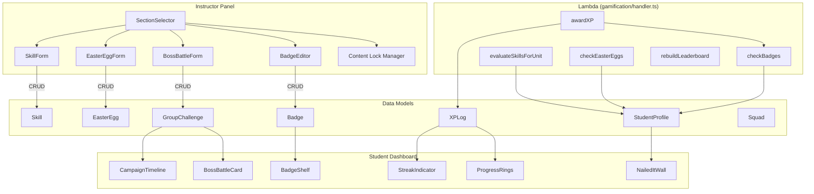
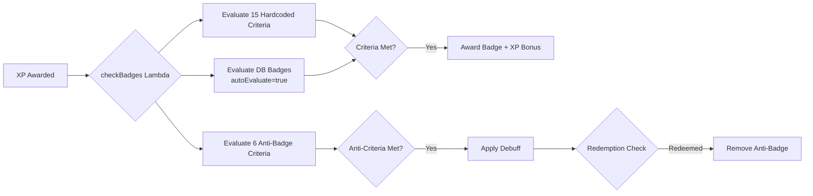
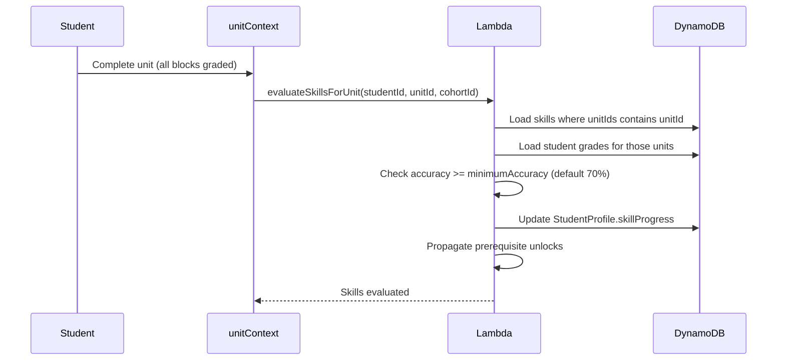

# Gamification System

> **Status**: Implemented — May 2026  
> **Admin Panel**: `app/[locale]/admin/settings/page.tsx`  
> **Section Settings**: `app/[locale]/section/[id]/settings/gamification/page.tsx`

Comprehensive gamification layer with XP, badges, streaks, skill trees, easter eggs, boss battles, campaigns, squads, content locks, and cosmetic unlocks.

---

## System Architecture

---

## XP & Leveling

XP is awarded through server actions and Lambda handlers. Each award is logged in `XPLog` with deduplication via `referenceId`.

**XP Sources**:
| Source | XP | Trigger |
|--------|-----|---------|
| Grade submission | 10–50 | `recordGradeCompletion` |
| Practice drill | 5–25 (diminishing) | Drill completion |
| Peer review | 15 | Review submitted |
| Boss battle contribution | Variable | Grade during active challenge |
| Easter egg discovery | Configurable | Trigger matched |
| Streak milestone | 25/50/100 | Streak days |

**Diminishing Returns**: Practice drills award progressively less XP per repetition of the same material within a 24-hour window.

---

## Badge System

### Evaluation Flow

**Hardcoded Badges** (15): FIRST_SUBMISSION, GOOD_EYE, QUICK_DRAW, SHARPSHOOTER, CONSISTENT, TEAM_PLAYER, DEEP_THINKER, TOP_OF_CLASS, PERFECTIONIST, DRILL_MASTER, COMEBACK_KID, STREAK_14, STREAK_30, EASTER_EGG_HUNTER, PEER_REVIEW_CHAMPION

**Anti-Badges** (6): CONSISTENTLY_WRONG, STREAK_BREAKER, SPEED_RUN_SCHOLAR, THE_GHOST, XP_ZERO_HERO, MINIMALLY_VIABLE_STUDENT — apply debuffs with redemption paths.

**Custom Badges**: Instructors create via `BadgeEditor` with visual picker (shape/icon/gradient/animation) and criteria config. `autoEvaluate=true` badges are checked alongside hardcoded ones.

---

## Skill Tree

Skills are linked to Units with minimum accuracy thresholds. When a student completes a unit, `evaluateSkillsForUnit` checks mastery:

**AI Generation**: `generateSkillTreeFromUnit` server action creates a skill tree from unit content with auto-linked `unitIds` and default 70% accuracy threshold.

---

## Easter Eggs

Four trigger types, all section-scoped:

| Trigger | How It Works | Frontend |
|---------|-------------|----------|
| `KEYWORD` | Student types matching text in workbook | `EasterEggLayer.tsx` listener |
| `SCHEDULE` | Auto-discovered during configured time window | `EasterEggLayer.tsx` polling |
| `SECRET_LINK` | Hidden icon on specific workbook page | `SecretLinkIcon.tsx` |
| `ACHIEVEMENT` | Lambda evaluates metric condition automatically | No frontend needed |

**Achievement Metrics**: `accuracy`, `streak`, `xp`, `level`, `units_completed` with operators `>=`, `<=`, `>`, `<`, `==`.

---

## Boss Battles & Campaigns

**Boss Battles** are group challenges where students collectively defeat a boss by earning XP:

- `targetXP` (HP) — total XP needed to win
- `currentXP` — running total from all participants
- **Stakes system**: lose level, lose XP, lose streak freeze, reset streak, lose badge (by rarity), streak miss penalty, lose cosmetics (with duration)
- Progress displayed via `BossBattleProgress` component

**Campaign Timeline**: Boss battles with `chapterOrder` form chapters in a sequential narrative. `CampaignTimeline.tsx` shows completed/active/locked states with progress bars.

---

## Content Locks

Instructors configure per-unit progression requirements:

| Lock Type | Field | Effect |
|-----------|-------|--------|
| XP Gate | `Unit.requiredXP` | Must have minimum XP to access |
| Badge Gate | `Unit.requiredBadgeId` | Must hold specific badge |
| Module Gate | `Unit.requiredModuleCompletion` | Previous unit must be complete |
| Linear Lock | Section setting | Sequential unit progression |

`ContentLockCard` component and `useContentLock()` hook enforce locks on the student side.

---

## Squads

Student collaborative groups with:
- Embedded members and posts
- Dedicated chat room (Yjs-backed)
- Leaderboard per section
- Squad pages at `/squads` and `/squad/[id]`

---

## Cosmetic Unlocks

Level-based cosmetic rewards:
- Avatar styles (unlocked at level thresholds)
- Editor themes (5 themes: Default, Midnight, Forest, Sunset, Aurora)
- Managed via `CosmeticSelector` component

---

## Copy Between Sections

Instructors can copy gamification configuration between sections:
- Skills (preserves structure, resets student progress)
- Easter Eggs (resets discoveries, sets active=true)
- Group Challenges (resets currentXP=0, empties contributions)
- Does NOT copy: Squads, StudentProfiles, XP logs

---

## Key Files

| File | Purpose |
|------|---------|
| `app/[locale]/admin/settings/page.tsx` | Main instructor gamification panel |
| `app/[locale]/section/[id]/settings/gamification/page.tsx` | Per-section settings |
| `src/components/Gamification/SectionSelector.tsx` | Section scope picker |
| `src/components/Gamification/SkillForm.tsx` | Skill CRUD with unit linking |
| `src/components/Gamification/EasterEggForm.tsx` | Easter egg creation (4 types) |
| `src/components/Gamification/BossBattleForm.tsx` | Boss battle creation |
| `src/components/Gamification/BadgeEditor.tsx` | Badge CRUD + visual picker |
| `src/components/Gamification/BadgeVisualPicker.tsx` | Shape/icon/gradient/animation |
| `src/components/Gamification/CampaignTimeline.tsx` | Student campaign view |
| `src/components/Gamification/BossBattleCard.tsx` | Student challenge card |
| `src/components/Gamification/ContentLockCard.tsx` | Lock gate display |
| `src/components/Gamification/EasterEggLayer.tsx` | KEYWORD + SCHEDULE triggers |
| `src/components/Gamification/SecretLinkIcon.tsx` | SECRET_LINK trigger |
| `amplify/functions/gamification/handler.ts` | All gamification Lambda logic |
| `app/actions/gamification.ts` | Server actions: awardXP, rebuildLeaderboard, etc. |

---

## Known Gaps

| Feature | Status | Notes |
|---------|--------|-------|
| Easter Egg badge picker | Not implemented | Form has no `badgeId` field |
| AI Badge Designer | Not implemented | Chat-style generator not built |
| Squad page challenges | Not implemented | `/squad/[id]` doesn't show active challenges |
| BossBattle edit mode | Not implemented | Create-only, no edit for existing battles |
| Boss Battle contributors | Not implemented | Can't see who contributed most XP |
