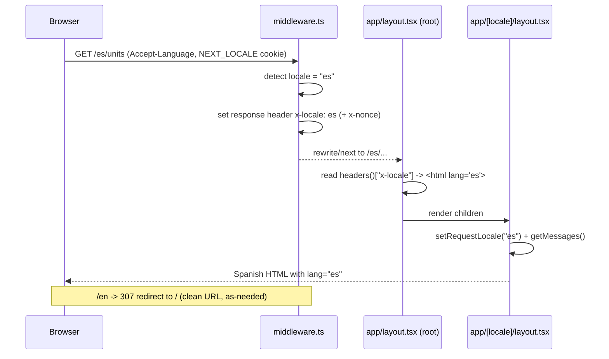

# i18n Correctness + WASM/On-Device LLM Alias Plan

> **Status:** Proposed · **Owner:** Colin · **Created:** 2026-09-20
> **Related:** [`NEXT15_DOWNGRADE_PLAN.md`](./NEXT15_DOWNGRADE_PLAN.md) · [`I18N_MISSING_TRANSLATIONS.md`](./I18N_MISSING_TRANSLATIONS.md) · [`OFFLINE_EXPERIENCE.md`](./OFFLINE_EXPERIENCE.md)

Two independent fixes that ride along with the Next 15 downgrade. Do them **in the same commit as the `proxy.ts` → `middleware.ts` rename**.

---

## Part A — Locale routing & `<html lang>` correctness

### Symptoms
- Deployed `/es` serves English; `/en` returns **200** (should **307 → /** under `localePrefix: "as-needed"`).
- `<html lang>` is `"en"` on every route, including `/es`.

### Root causes (two, both real)
1. **Amplify was not executing `proxy.ts`.** Next 16's `proxy.ts` convention is not run by Amplify's Next ≤15 runtime, so locale detection/redirect/rewrite never happened in production. **Fixed by the rename to `middleware.ts`** in [`NEXT15_DOWNGRADE_PLAN.md`](./NEXT15_DOWNGRADE_PLAN.md) Step 5. The routing config itself (`src/i18n/routing.ts`: `locales: [en, es, fr, de, ja, zh]`, `defaultLocale: en`, `localePrefix: "as-needed"`) is **correct** and needs no change.
2. **`<html lang>` is emitted by the root `app/layout.tsx`**, which sits *above* the `[locale]` segment and therefore has no access to the `locale` param — it can only ever print the default. The `[locale]` layout localizes *content* correctly (`setRequestLocale` + `getMessages`), but the document language attribute stays wrong. This is an a11y/SEO regression and directly undercuts the accessibility story.

### The request flow after the fix


### Fix 1 — set `x-locale` in `middleware.ts`
In the **non-default locale pass-through** branch (where a `pathnameLocale` exists and we `NextResponse.next()`):
```ts
response.headers.set("x-locale", pathnameLocale);   // e.g. "es"
```
In the **default-locale rewrite** branch (the `/` → `/en` internal rewrite):
```ts
rewriteResponse.headers.set("x-locale", DEFAULT_LOCALE); // "en"
```
(Both branches already set `x-nonce`; add `x-locale` right next to it.)

### Fix 2 — read the locale in the root `app/layout.tsx`
The root layout renders `<html>`. Make it read the header (it is already `async` and already calls `headers()` for the nonce):
```ts
import { headers } from "next/headers";
// ...
const h = await headers();
const lang = h.get("x-locale") ?? "en";
return (
  <html lang={lang} suppressHydrationWarning>
    {/* ... */}
  </html>
);
```
> Do **not** try `getLocale()` in the root layout — `setRequestLocale` runs later, inside `[locale]`, so the next-intl request store isn't populated yet at the root. The header is the reliable channel.

### Verification (run against the running dev server and the preview deploy)
```bash
for p in / /en /es /fr /de /ja /zh; do
  echo "== $p =="
  curl -k -s -o /dev/null -w '%{http_code} %{redirect_url}\n' https://localhost:3000$p
done
# Expect: /  -> 200 ; /en -> 307 -> / ; /es,/fr,/de,/ja,/zh -> 200
# Then confirm <html lang> per locale:
for p in / /es /ja; do curl -k -s https://localhost:3000$p | grep -o '<html[^>]*lang="[^"]*"' | head -1; done
# Expect: lang="en" ; lang="es" ; lang="ja"
```
Also spot-check real translated copy on `/es` (e.g. UI strings from `public/locales/es/common.json`).

### Related but out of scope: the translation *backlog*
[`I18N_MISSING_TRANSLATIONS.md`](./I18N_MISSING_TRANSLATIONS.md) tracks **2026 keys** still missing across de/es/fr/ja/zh (generated via the `multi-model-ai-translation` skill, provable mode). That is a content backlog, separate from this routing/lang correctness fix. **Optional enhancement worth doing before showing off other locales:** configure next-intl **fallback to English for missing keys** so partial locales don't render blank/раw keys. In `src/i18n/request.ts`, merge the English namespace as a base and overlay the target locale:
```ts
// load en first as the base, then deep-merge the requested locale over it
const base = loadNamespaces("en");
const overlay = locale === "en" ? {} : loadNamespaces(locale);
return { locale, messages: deepMerge(base, overlay) };
```
This makes `es`/`fr`/etc. safe to demo now, showing English only where a translation is genuinely missing, instead of gaps. Track completion against the backlog doc.

---

## Part B — `onnxruntime-node` alias for the WASM / on-device LLM

### Why this exists
`@huggingface/transformers@^3.4.0` (Transformers.js v3, WebGPU/WASM) **conditionally imports `onnxruntime-node`**, a native Node addon. If that import reaches the **client** bundle, the browser build breaks or bloats. The current Turbopack config redirects it to a browser-safe stub:
```js
// next.config.mjs (Next 16, Turbopack)
turbopack: { resolveAlias: { "onnxruntime-node": "./src/stubs/onnxruntime-node.js" } }
```
The stub (`src/stubs/onnxruntime-node.js`) provides the named exports Transformers.js reads:
```js
export const listSupportedBackends = () => [];
export const InferenceSession = {};
export const Tensor = {};
export default {};
```
On Next 15 the **build** uses webpack, which does not read the `turbopack` key — so **without a webpack alias the native addon leaks back into client bundles.**

### Fix — add a client-only webpack alias (and keep the Turbopack alias for dev)
In `next.config.mjs` (the `webpack` fn from [`NEXT15_DOWNGRADE_PLAN.md`](./NEXT15_DOWNGRADE_PLAN.md) Step 3):
```js
webpack: (config, { isServer }) => {
  if (!isServer) {
    config.resolve.alias = {
      ...config.resolve.alias,
      "onnxruntime-node": path.resolve(__dirname, "src/stubs/onnxruntime-node.js"),
    };
  }
  return config;
},
```
Keep the dev alias too (dev may still use Turbopack):
```js
experimental: { turbo: { resolveAlias: { "onnxruntime-node": "./src/stubs/onnxruntime-node.js" } } }
```
> **Alias, not `false`.** Because Transformers.js imports *named* exports (`InferenceSession`, `Tensor`, `listSupportedBackends`), aliasing to the stub (which defines them) is correct. `resolve.fallback["onnxruntime-node"] = false` (empty module) would break those named imports. Reserve `webpack.IgnorePlugin({ resourceRegExp: /^onnxruntime-node$/ })` as a last resort — it *throws* if the client ever reaches the import, whereas the stub degrades quietly. Server build keeps the real addon (guarded by `!isServer`), so server-side Transformers.js still works.

### Guardrail: it's easy to regress
Both bundlers must stay aliased. On the current stack this splits across two config keys. Add a tiny build assertion so a client bundle can never silently ship the native addon:
```bash
# after: npm run build
! grep -rq "onnxruntime-node/bin" .next/static 2>/dev/null && echo "OK: no native ORT in client" || (echo "FAIL: native ORT leaked to client" && exit 1)
```
Wire this into CI (a step in the build workflow) so a future dependency bump can't reintroduce the leak.

### Verification
- [ ] `npm run build` completes; no "Module not found: onnxruntime-node" and no native `.node` binary under `.next/static`.
- [ ] The on-device AI path (offline WebLLM / Transformers.js features per [`OFFLINE_EXPERIENCE.md`](./OFFLINE_EXPERIENCE.md)) loads and runs in the browser.
- [ ] The server-side Transformers.js path (if any) still resolves the real `onnxruntime-node`.
- [ ] The `.next/static` grep guard passes and is added to CI.

## Acceptance criteria
- [ ] `/en` 307-redirects to `/`; `/es`–`/zh` serve their language; `<html lang>` matches the route on every locale.
- [ ] (Optional) Missing keys fall back to English instead of rendering blank.
- [ ] Client bundle contains no native ONNX runtime; on-device LLM works; CI guard in place.
