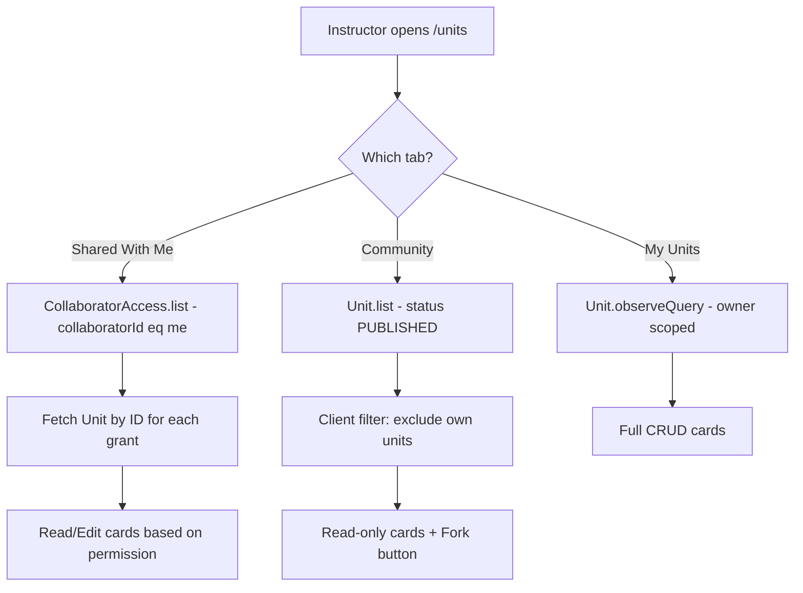
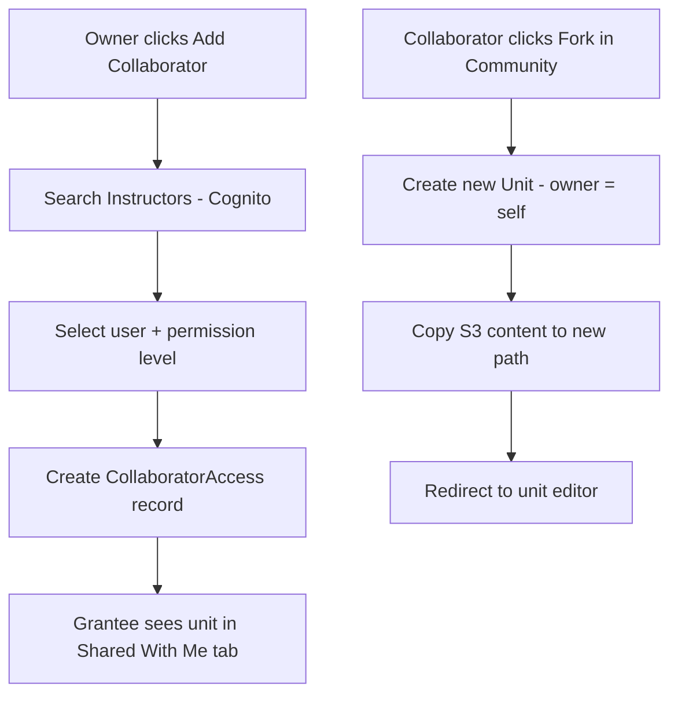

# Instructor Visibility & Collaboration Spec

## Overview

Defines the visibility, access, and collaboration rules for instructors on the platform. Admins see everything; instructors see only their own content by default, with explicit collaboration grants and a read-only community browse view.

---

## Roles & Visibility Matrix

| Role | Own Units | Collaborator Units | Community Browse | Student Work | Platform Search |
|------|-----------|-------------------|-----------------|--------------|-----------------|
| Admin | Full CRUD | Full CRUD | Full (all) | All sections | Platform-wide |
| Instructor | Full CRUD | Read + limited edit (per grant) | Read-only + fork | Own sections only | Own + collaborator + community |
| Learner | — | — | — | Own submissions | Unit-scoped only |

---

## 1. Collaborator Access Model

A **separate join model** (`CollaboratorAccess`) grants visibility between instructors.

### Schema (amplify/data/resource.ts)

```typescript
CollaboratorAccess: a
  .model({
    _version: a.integer(),
    _lastChangedAt: a.timestamp(),
    _deleted: a.boolean(),
    // The unit being shared
    unitID: a.id().required(),
    unit: a.belongsTo("Unit", "unitID"),
    // The instructor being granted access
    collaboratorId: a.string().required(), // Cognito username of the grantee
    // Who granted the access
    grantedBy: a.string().required(), // Cognito username of the grantor
    // Permission level
    permission: a.enum(["read", "edit"]), // "read" = view only, "edit" = can modify content
    // Metadata
    grantedAt: a.datetime(),
    // Owner = the unit owner (for auth purposes)
    owner: a.string(),
  })
  .authorization((allow) => [
    allow.owner(), // Unit owner can manage
    allow.group("Admins"), // Admins can manage all
    // Collaborators can read their own grants (needed to discover shared units)
    allow.authenticated().to(["read"]),
  ])
```

### Relationships

Add to the Unit model:
```typescript
collaborators: a.hasMany("CollaboratorAccess", ["unitID"]),
```

### Key Behaviors

- **Granting access**: Owner, Admin, or any existing `edit`-level collaborator can create a `CollaboratorAccess` record
- **Revoking access**: Owner or Admin can delete any grant; collaborators can delete their own grant (leave)
- **Discovery**: Instructors query `CollaboratorAccess.list({ filter: { collaboratorId: { eq: myUsername } } })` to find units shared with them
- **Self-assignment prohibited**: Cannot grant access to yourself (you're already the owner)
- **Only instructors**: Backend validation ensures `collaboratorId` belongs to a user in the `Instructors` group

---

## 2. Unit List Page — Tabs

The existing `/units` page gets a tab bar:

### Tabs

| Tab | Content | Query Strategy |
|-----|---------|---------------|
| **My Units** (default) | Units where `owner == currentUser` | `Unit.observeQuery()` (already owner-scoped by auth) |
| **Shared With Me** | Units where I'm a collaborator | `CollaboratorAccess.list({ collaboratorId: eq me })` → fetch units by ID |
| **Community** | All published units by other instructors | `Unit.list({ filter: { status: eq PUBLISHED } })` — client-side exclude own |

### Behavior Rules

- **My Units**: Current behavior (no change). Full CRUD.
- **Shared With Me**: Cards show collaborator badge. Click opens unit in read/edit mode based on `permission`.
- **Community**: Read-only cards. Show unit name, description, author, thumbnail. "Fork" button creates a copy owned by current user.

---

## 3. Community Browse — Read-Only + Fork

### Fork Flow

1. Instructor clicks "Fork" on a community unit
2. System creates a new Unit with:
   - `owner`: current user
   - `name`: `"Copy of {original.name}"`
   - `status`: `DRAFT`
   - Copies S3 content (if any) to new owner's protected path
   - Does **NOT** copy grades, assignments, or section bindings
3. Redirect to new unit editor

### What's Visible in Community

- Unit name, description, thumbnail, published date
- Author display name (not email)
- Number of vocabulary words, questions (counts only)
- **NOT** visible: full content, grades, student data, unpublished drafts

---

## 4. Student Work Visibility

Instructors can see student submissions (Grades) **only** for sections they own or are a collaborator on:

- Existing behavior: `Grade` model has `instructorGroup` field with dynamic group auth (`section-{id}-instructors`)
- The community tab does **NOT** expose other instructors' student work
- A new "Section Submissions" sub-view (under Shared With Me or a section detail page) shows grades for sections where the instructor has access

### Query Pattern

```javascript
// Instructor sees grades for their own sections
Grade.observeQuery({
  filter: { sectionID: { eq: mySectionId } }
})

// For shared sections, the section-{id}-instructors Cognito group already grants read access
```

---

## 5. Admin Platform-Wide Search

Admins already have access to all models via `allow.group("Admins")`. The agent search tool already supports `scope: "all"` which loads the instructor-level search bundle.

### Enhancements for Admins

- The semantic_search tool's `"all"` scope should load **all** instructor bundles (not just the current user's)
- Add an admin-specific bundle: `private/unit/search-index-{uuid}.json` rebuilt nightly (UUID generated once and stored in PlatformSettings)
- Admin unit list shows all units across all instructors (unfiltered)

### Search Index Naming Convention

All search index bundles use a UUID filename: `search-index-{uuid}.json`

| Scope | Path Pattern | Example |
|-------|-------------|---------|
| Per-unit | `protected/{identityId}/search-index-{uuid}.json` | `protected/us-east-1:abc123/search-index-550e8400-e29b-41d4-a716-446655440000.json` |
| Per-section | `protected/{identityId}/search-index-{uuid}.json` | `protected/us-east-1:abc123/search-index-7c9e6679-7425-40de-944b-e07fc1f90ae7.json` |
| Instructor roll-up | `private/{identityId}/search-index-{uuid}.json` | `private/us-east-1:abc123/search-index-f47ac10b-58cc-4372-a567-0e02b2c3d479.json` |
| Platform (admin) | `private/unit/search-index-{uuid}.json` | `private/unit/search-index-a1b2c3d4-e5f6-7890-abcd-ef1234567890.json` |

The UUID is generated when the bundle is first created and stored as a reference on the relevant model (Unit, Section, or PlatformSettings). This prevents path enumeration and allows bundles to be rotated without breaking references.

---

## 6. Collaboration Management UI

### Where

- **Unit Editor sidebar** → "Collaborators" section (only for unit owner/admin)
- Shows current collaborators with permission levels
- "Add Collaborator" button → search instructors by name/email
- "Remove" button per collaborator

### Invite Flow

1. Owner clicks "Add Collaborator"
2. Type-ahead search of users in `Instructors` group (via Cognito `listUsersInGroup`)
3. Select user → choose permission (read/edit)
4. Creates `CollaboratorAccess` record
5. (Future) Optional notification to the invited instructor

---

## 7. Security & Authorization

### Backend Validation (Lambda or custom resolver)

- `CollaboratorAccess.create`: Verify grantor is owner/admin/edit-collaborator. Verify grantee is in Instructors group.
- `CollaboratorAccess.delete`: Verify requester is owner/admin or the collaborator themselves (leaving).
- `Unit.update` via collaborator: Verify `CollaboratorAccess` exists with `permission: "edit"` for the requesting user.

### Client-Side Guards

- Community tab hides edit/delete buttons
- Shared units show read-only editor unless `permission === "edit"`
- Fork creates a full independent copy — no ongoing link to original

---

## 8. Implementation Phases

### Phase 1 — Schema & Backend
1. Add `CollaboratorAccess` model to `amplify/data/resource.ts`
2. Add `collaborators` relationship to Unit model
3. Create Lambda trigger for validation (or inline in existing section handler)
4. Deploy schema (`npx ampx sandbox`)

### Phase 2 — Unit List Tabs
1. Add tab bar to `app/[locale]/units/page.jsx` (My Units / Shared With Me / Community)
2. Implement "Shared With Me" query pattern
3. Implement "Community" query with published filter + exclude own
4. Add unit cards with appropriate action buttons per tab

### Phase 3 — Fork Functionality
1. Create `forkUnit` server action in `app/actions/`
2. Copy unit metadata + S3 content to new owner
3. Wire "Fork" button on community cards

### Phase 4 — Collaborator Management UI
1. Build `CollaboratorManager` component for unit editor sidebar
2. Implement instructor search (Cognito `listUsersInGroup`)
3. Add/remove collaborator CRUD operations
4. Permission level selector (read/edit)

### Phase 5 — Admin Enhancements
1. Platform-wide search bundle generation (scheduled Lambda)
2. Admin unit list shows all instructors' content
3. Admin can manage any `CollaboratorAccess` record

### Phase 6 — Agent Integration
1. Update `semantic_search` tool to include collaborator units in search scope
2. Add `scope: "shared"` option for searching shared content
3. Admin scope loads platform bundle instead of per-instructor bundle

---

## 9. Data Flow Diagrams





---

## 10. Migration Considerations

- No breaking changes to existing models
- `CollaboratorAccess` is additive
- Existing `readableGroups`/`writableGroups` on Unit remain for section-level student access
- `CollaboratorAccess` is specifically for instructor-to-instructor sharing
- Community browse uses existing `status: PUBLISHED` — no new fields needed
- Fork is a full copy — no back-references or sync concerns
