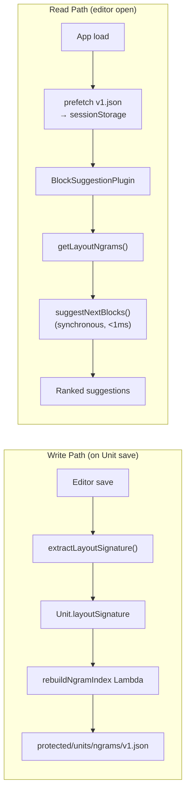

# Layout Suggestions (Block Autocomplete)

> **Status**: Implemented — June 2026  
> **Plugin**: `src/components/Editor3/plugins/BlockSuggestionPlugin.jsx`

AI-powered autocomplete for the Lexical editor that learns from instructors' past unit structures and suggests which block type to insert next.

---

## How It Works



---

## Architecture

The system extracts a `layoutSignature` (ordered list of block types) from every unit on save, builds a pre-computed ngram frequency index across all published units, and serves it via CloudFront behind the same signed cookie used for published unit content.

### Layout Signature

Each unit's content structure is reduced to a token sequence:

```
["heading", "paragraph", "quiz", "answer", "paragraph", "image", "quiz", "answer"]
```

Tokens are mapped from Lexical node types via `extractLayoutSignature()` — a pure function that walks the editor JSON tree.

### Ngram Index

Stored at `protected/units/ngrams/v1.json`:

```json
{
  "version": 1,
  "updatedAt": "2026-06-01T12:00:00Z",
  "unitCount": 247,
  "ngrams": {
    "heading": { "paragraph": 142, "quiz": 31, "image": 18 },
    "paragraph": { "quiz": 89, "answer": 44, "paragraph": 22 },
    "quiz": { "answer": 67, "paragraph": 19, "quiz": 8 },
    "heading|paragraph": { "quiz": 89, "answer": 44, "image": 12 },
    "paragraph|quiz": { "answer": 67, "paragraph": 19, "quiz": 4 }
  }
}
```

Keys are `|`-joined n-gram prefixes (unigrams and bigrams). Values are frequency counts for the next token.

### Suggestion Scoring

`BlockSuggestionPlugin` blends:
- **Ngram score** — data-driven, from real instructor usage
- **Pedagogy score** — static heuristics for good instructional design

Bigram matches are weighted 2× over unigram matches.

---

## Key Files

| File | Purpose |
|------|---------|
| `src/utils/layoutNgrams.ts` | Fetch, cache, and query the ngram index |
| `src/components/Editor3/plugins/BlockSuggestionPlugin.jsx` | Suggestion UI and scoring |
| `amplify/functions/rebuildNgramIndex/handler.ts` | Lambda: scan published units, write v1.json |
| `src/context/unitContext.jsx` | Calls `extractLayoutSignature` on save, prefetches index |

---

## Performance

| Operation | Latency |
|-----------|---------|
| `extractLayoutSignature()` | <1ms (in-memory JSON walk) |
| `getLayoutNgrams()` first call | ~50–150ms (CDN fetch + sessionStorage write) |
| `getLayoutNgrams()` subsequent | <0.1ms (memory cache) |
| `suggestNextBlocks()` | <0.5ms (object lookups) |
| `rebuildNgramIndex` Lambda | ~200–500ms (background, fire-and-forget) |

---

## CDN Integration

The ngram index is co-located under `protected/units/` so the same signed cookie (issued by `getUnitsCdnCookie()` at app load) covers it. No separate auth call needed. See [CloudFront CDN](CLOUDFRONT_CDN.md) for details.
