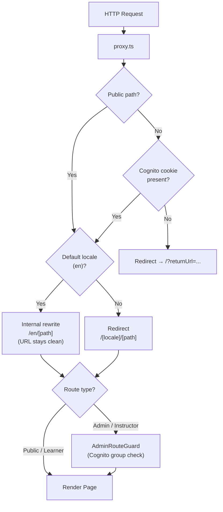
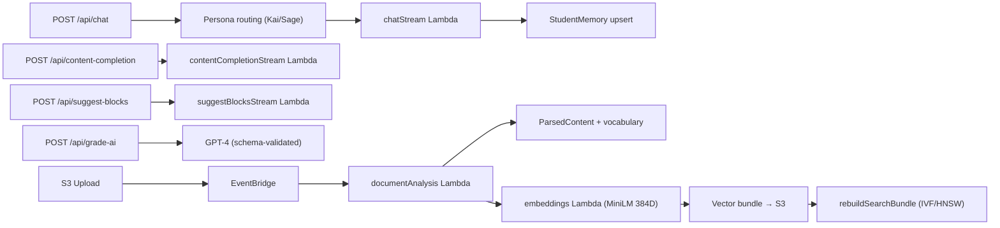
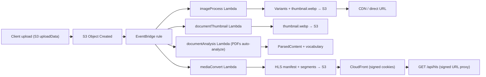
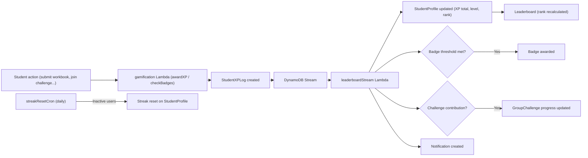
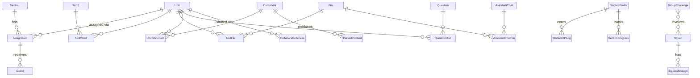
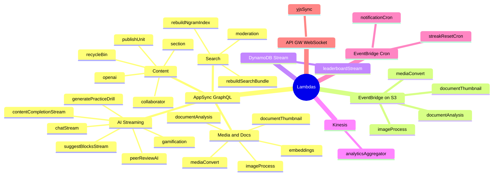

# Main Feature List — Homework Supply

> Source-validated against actual code in routes, contexts, schema, Lambda handlers, and package dependencies.  
> Last updated: 2026-07-14 (re-validated via exhaustive code exploration)

---

## 1. User Roles & Auth

- Cognito-based auth with groups: **Admins, Instructors, Learners**, plus dynamic per-section and peer-review groups defined via `groupDefinedIn` fields in the schema
- Route guards on admin/instructor routes (`app/[locale]/admin/_components/AdminRouteGuard.tsx`, `proxy.ts`)
- Owner + group + authenticated-read auth blends per model
- Role-constrained custom mutations (instructor-only submission URL retrieval, publish/index actions)
- Centralized auth/session context with token/group extraction and lifecycle handling (`src/context/authContext.jsx`)

---

## 2. Core Learning & Content

- **Unit authoring** — create, edit, and publish learning modules using the rich Lexical editor
- **Learner dashboard** — assignments, grade state, sections, and recommendations
- **Workbook execution** — timer-gated starts, rubric grading, completion tracking, and peer-review launch points
- **Sections / classes** — create and manage classes, student enrollments, assignment mapping, and gradebook
- **Vocabulary & question authoring** — word/definition/audio pipelines and question banks
- **Instructor grade review** — multi-attempt context and moderation metadata
- **Student profiles** — progression, streak calendar, badge visibility controls
- **Peer review rooms** — AI-assisted `@mention` handling and review summary generation
- **Practice drills** — AI-generated drill content per unit
- **Leaderboard** — platform-wide and section-scoped student rankings

---

## 3. AI & ML Features

- **Streaming AI chat** — tool use, persona routing, token accounting, chat memory summarization (`app/api/chat/route.ts`, `app/api/_shared/botPersonas.ts`)
- **Editor AI autocomplete** — inline content completion while authoring (`app/api/content-completion/route.ts`)
- **AI block suggestions** — structured tool outputs for inserting Lexical editor blocks (`app/api/suggest-blocks/route.ts`)
- **AI grading** — prompt-hardened, schema-validated, PII-filtered grading endpoint (`app/api/grade-ai/route.ts`)
- **Document analysis** — PDF text extraction and media approval producing parsed vocabulary and educational artifacts; also triggered automatically via EventBridge on S3 upload (`amplify/functions/documentAnalysis/`)
- **Embedding generation + vector search** — `Xenova/all-MiniLM-L6-v2` (384D, offline-compatible); linear/IVF/HNSW architecture with client-side search bundles (`app/actions/embeddings.ts`, `amplify/functions/embeddings/`, `docs/SEARCH_ARCHITECTURE.md`)
- **Content moderation** — text, image, and audio moderation pipeline (`amplify/functions/moderation/`, `app/actions/moderate.ts`)
- **Peer review AI** — handles `@mentions` and generates review summaries (`amplify/functions/peerReviewAI/`)
- **Practice drill generation** — AI creates drill content from unit/section context (`amplify/functions/generatePracticeDrill/`)
- **Skill tree generation** — AI evaluates learner skills per unit and advances progression
- **Student memory** — per-student contextual memory upsert, profile rebuild, and unit-grade-based updates

---

## 4. Editor Features

- **Lexical rich text editor** with SSR skeleton and workbook rendering mode (`src/components/Editor3/`)
- **Graded block types**: `quiz`, `answer`, `meaning-association`, `custom-answer`, `custom-ai`
- **Media blocks**: image, PDF viewer, playlist, table, Excalidraw diagram, file metadata
- **Assignment configuration** — due dates, timer, attempt limits (`src/components/Editor3/components/AssignmentConfiguration.jsx`)
- **Grade history viewer** embedded within editor context (`src/components/Editor3/components/GradeHistory.jsx`)
- **Chat-assisted block insertion** — preview and insert AI-suggested blocks from the sidebar (`src/components/ChatSidebar/BlockInsertPreview.jsx`)
- **Markdown support** via Lexical markdown plugin
- **Vocabulary autocomplete** plugin for inserting dictionary words inline

---

## 5. File & Media Management

- **S3 file management** with public / protected / private storage levels (`src/context/fileContext.jsx`)
- **Image processing** — Lambda generates multiple image variants and PDF first-page thumbnails (`amplify/functions/imageProcess/`)
- **Office / document thumbnails** — LibreOffice Lambda layer for document-to-image conversion (`amplify/functions/documentThumbnail/`)
- **Video transcoding** — AWS MediaConvert pipeline producing HLS adaptive bitrate streams (`amplify/functions/mediaConvert/`)
- **HLS proxy** — signed URL rewriting for HLS segment delivery (`app/api/hls/route.ts`)
- **CloudFront OAC** — signed cookie media delivery for published units
- **Soft delete / restore / permanent archive** — full recycle bin lifecycle (`amplify/functions/recycleBin/`, `app/[locale]/recycle-bin/`)
- **Admin unarchive** — administrators can restore any archived record (`app/[locale]/admin/archives/`)

---

## 6. Gamification

- **XP system** — award, log, history view, toast notifications, level-up celebration (`src/context/xpContext.tsx`, `app/[locale]/xp-history/`)
- **Streaks** — daily streak tracking with scheduled cron reset (`amplify/functions/streakResetCron/`)
- **Badges** — standard badges, anti-badges, custom badges with visual editor (`src/components/Gamification/BadgeEditor.tsx`)
- **Easter eggs** — secret links, hidden triggers, discoverable events (`src/components/Gamification/EasterEggLayer.tsx`)
- **Skill trees** — AI-generated skill trees with visual progression UI (`src/components/Gamification/SkillTree.tsx`, `src/context/skillTreeContext.tsx`)
- **Squads** — create/join squads, squad posts, squad leaderboard, membership management (`app/[locale]/squads/`, `src/components/Gamification/SquadLeaderboard.tsx`)
- **Group challenges / boss battles** — campaign timelines and contribution tracking (`src/components/Gamification/BossBattleCard.tsx`, `src/components/Gamification/CampaignTimeline.tsx`)
- **Content locks** — gamification-gated content cards (`src/components/Gamification/ContentLockCard.tsx`)
- **Personal bests** — tracked per-student per-unit
- **Per-section and platform gamification config** — overrideable settings at section and admin level

---

## 7. Analytics

- **Event ingestion API** — auth + geo enrichment from CloudFront headers (`app/api/analytics/route.ts`)
- **Web vitals ingestion** — payload/rate-controlled Core Web Vitals collection (`app/api/vitals/route.ts`)
- **Kinesis-backed aggregation** — Lambda aggregates events with scope-based rollups: platform / section / unit / squad / page / geo (`amplify/functions/analyticsAggregator/`)
- **Admin analytics dashboard** with dimension filters (`app/[locale]/admin/analytics/`)

---

## 8. Admin & Governance

- **Moderation dashboard** — flagged-item review and resolution workflows (`app/[locale]/admin/moderation/`)
- **Vocabulary maintenance** — batch delete and diagnostics (`app/[locale]/admin/words/`)
- **Platform settings** — AI feature toggles and gamification controls (`app/[locale]/admin/settings/`)
- **Archive management** — list, view, and restore archived records (`app/[locale]/admin/archives/`)
- **Instructor AI override** — per-section AI settings (`app/[locale]/section/[id]/settings/ai/`)
- **Admin user management** — Cognito admin operations via management scripts

---

## 9. Collaboration & Real-Time

- **Real-time data subscriptions** across all core models (units, grades, sections, words, files, chat, notifications) via Amplify `observeQuery`
- **Yjs collaborative infrastructure** — WebSocket sync Lambda, Yjs hooks for shared editor state (`amplify/functions/yjsSync/`, `src/yjs/`)
- **Notifications** — real-time feed with unseen count badge (`src/context/notificationContext.tsx`, `app/[locale]/profile/notifications/`)
- **Workbook comments** — inline commenting on student submissions

---

## 10. Offline & PWA

- **Service worker** (Serwist) with offline caching strategy (`src/sw.ts`)
- **Offline workbook page** — degraded-mode workbook experience when network is unavailable (`app/[locale]/workbook-offline/`)
- **PWA manifest** — installable app with icons and theme configuration (`public/manifest.json`)

---

## 11. Search

- **N-gram index rebuild** — Lambda-based n-gram search index for vocabulary and content (`amplify/functions/rebuildNgramIndex/`)
- **Vector search bundles** — linear/IVF/HNSW client-side search (HNSW for ≥5000 vectors) with Lambda-powered bundle rebuild (`amplify/functions/rebuildSearchBundle/`, `src/utils/searchBundles.ts`)
- **Global search context** — unified search across units, words, and files (`src/context/searchContext.tsx`)

---

## 12. Internationalization

- **Multi-locale routing** via `next-intl` — locale-scoped pages under `app/[locale]/`; 6 supported locales: **de, en, es, fr, ja, zh**
- **Clean default-locale URLs** — `/units` rewrites internally to `/en/units` (no prefix in URL)
- **Non-default locale redirects** — e.g. `/es/units` for Spanish
- Translation JSON files in `public/locales/`

---

## 13. Technical Infrastructure

- **Next.js App Router** — server prefetch + client hydration; no legacy `pages/` directory
- **AWS Amplify Gen 2** — DynamoDB, AppSync GraphQL, Cognito, S3, Lambda
- **Optimistic locking** — `_version` fields on all models for concurrent update safety
- **Scheduled Lambda crons** — streak reset, notification dispatch
- **Vercel AI SDK** — streaming chat with `useChat` hook and tool call support
- **Material UI** component library
- **Storybook** component development with mocked AWS services and mock data in `.storybook/__mocks__/`
- **Cypress E2E** tests, **Vitest** unit/integration tests, **Playwright** browser tests
- **TypeScript migration in progress** — `allowJs: true`, new files as `.tsx`
- **Agent permissions system** — file-operation gating with audit logs (`scripts/agent-cli.ts`, `.github/agent-permissions.json`)

---

## 14. Data Models

38 primary models plus join tables:

| Category | Models |
|---|---|
| **Content** | `Unit`, `Assignment`, `Grade`, `Section`, `Question`, `Word`, `File`, `Document`, `ParsedContent` |
| **AI / Chat** | `AssistantChat`, `AgentJob`, `AIFeedback`, `StudentMemory` |
| **Users** | `Settings`, `StudentProfile`, `StudentXPLog`, `SectionProgress` |
| **Gamification** | `Badge`, `Skill`, `Squad`, `GroupChallenge`, `EasterEgg`, `PracticeSession`, `SquadMessage` |
| **Platform** | `PlatformSettings`, `Notification`, `WorkbookComment`, `HomeworkRoom`, `AnalyticsSummary` |
| **Join tables** | `UnitFile`, `UnitWord`, `QuestionUnit`, `UnitDocument`, `QuestionFile`, `WordFile`, `QuestionWord`, `DocumentWord`, `DocumentQuestion`, `AssistantChatFile`, `CollaboratorAccess` |

---

## 15. Backend Lambda Functions

23 GraphQL resolver Lambda functions + 1 WebSocket server under `amplify/functions/`. Event-driven and WebSocket triggers; AppSync resolver functions are detailed in the table below.

| Function | Purpose |
|---|---|
| `openai` | GPT-4, Whisper, TTS, image analysis, and feedback summarization via OpenAI |
| `section` | Section lifecycle — create groups, enroll students, peer-review operations, submission URL signing, CDN cookie issuance |
| `embeddings` | Generate and store vector embeddings (Xenova/all-MiniLM-L6-v2) |
| `moderation` | Text, image, and audio content moderation |
| `documentAnalysis` | PDF extraction, `approveMedia` mutation, and EventBridge S3 auto-analysis trigger |
| `mediaConvert` | AWS MediaConvert → HLS transcoding |
| `imageProcess` | Image variant generation and PDF thumbnails |
| `documentThumbnail` | LibreOffice document thumbnail conversion |
| `gamification` | XP awards, badge checks, streak updates, leaderboard, memory, challenges, skills, battle-stakes |
| `generatePracticeDrill` | AI-generated practice drills with TTS audio |
| `peerReviewAI` | Peer review AI mentions and summary generation |
| `chatStream` | Streaming AI chat handler |
| `contentCompletionStream` | Streaming editor autocomplete |
| `suggestBlocksStream` | Streaming AI block suggestions |
| `leaderboardStream` | DynamoDB stream consumer — updates StudentProfile/SectionProgress, badge checks, notifications, challenge progress |
| `analyticsAggregator` | Kinesis-backed event aggregation |
| `notificationCron` | Scheduled notification dispatch |
| `streakResetCron` | Scheduled daily streak resets |
| `publishUnit` | Unit publishing — S3 content write, path rewrites, section outline metadata updates, CloudFront signed cookies |
| `rebuildNgramIndex` | N-gram search index rebuild |
| `rebuildSearchBundle` | Linear/IVF/HNSW vector search bundle rebuild |
| `recycleBin` | Soft delete, restore, permanent delete, unarchive, listArchives, getArchive |
| `collaborator` | Validates grant/revoke collaborator access (Cognito group + ownership checks) |
| `yjsSync` | Yjs WebSocket server for real-time collaborative editor sync (not a GraphQL resolver) |

---

## 16. API Routes (Next.js)

| Route | Purpose |
|---|---|
| `POST /api/chat` | Streaming AI chat with tool use |
| `POST /api/content-completion` | Streaming editor content completion |
| `POST /api/suggest-blocks` | AI block suggestions for editor |
| `POST /api/grade-ai` | AI-assisted grading |
| `GET /api/hls` | HLS proxy with signed URL rewriting |
| `POST /api/analytics` | Client event ingestion |
| `POST /api/vitals` | Web vitals ingestion |

---

## 17. Page Routes

| Route | Audience |
|---|---|
| `/` | Learner dashboard |
| `/units` | Unit library |
| `/unit/[id]` | Unit editor |
| `/workbook/[id]` | Workbook (student execution) |
| `/sections` | Section list |
| `/section/[id]` | Section detail and gradebook |
| `/section/[id]/settings/ai` | Section AI override (instructor) |
| `/section/[id]/settings/gamification` | Section gamification config (instructor) |
| `/instructor/grade/[id]` | Grade review (instructor) |
| `/leaderboard` | Platform leaderboard |
| `/drill/[id]` | Practice drill |
| `/squads` | Squad directory |
| `/squad/[id]` | Squad detail |
| `/review/[id]` | Peer review room |
| `/xp-history` | XP log |
| `/settings` | User settings |
| `/profile` | Own profile (current user) |
| `/profile/[username]` | Student public profile |
| `/profile/notifications` | Notification feed |
| `/privacy` | Privacy policy |
| `/recycle-bin` | Recycle bin |
| `/offline` | Offline fallback |
| `/workbook-offline` | Offline workbook fallback |
| `/admin/analytics` | Admin analytics dashboard |
| `/admin/moderation` | Admin moderation queue |
| `/admin/settings` | Admin platform settings |
| `/admin/words` | Admin vocabulary management |
| `/admin/archives` | Admin archive management |
