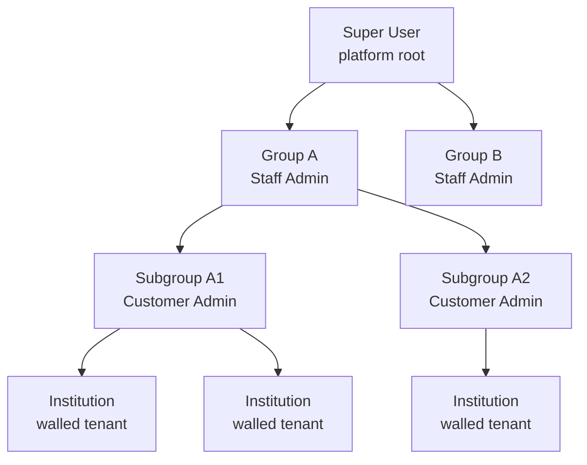

# Multi-Tenant Admin Hierarchy & Institution Catalog — Implementation Plan

_Design plan — drafted 2026-09-20_

## Overview

This plan adds a hierarchical admin model and an institution catalog to Homework Supply, on the existing Amplify Gen2 / AppSync (GraphQL) / DynamoDB / Cognito stack.

Two concepts stay separate:

- **Walled** — data isolation. An institution's records (students, XP ledger, assignments) never reach another institution, even siblings under the same subgroup.
- **Grouped** — an administrative overlay for control and rollup. Grouping sits above the wall and does not open it by default.

Four admin tiers, each anchored to a node in a tree: Super User (platform root), Staff Admin (a group), Customer Admin (a subgroup), and Institution Admin (one walled institution).

## Admin hierarchy

The structure is a forest of trees, and authority flows down each branch from the node an admin is anchored to.



Each institution has an Institution Admin over its own walled data; the tiers above manage structure and rollups, not raw records.

| Tier | Node level | Scope anchor | Manages |
| --- | --- | --- | --- |
| Super User | forest root | everything | all groups, admins, and institutions |
| Staff Admin | Group | one group + all below | its subgroups, customer admins, institutions |
| Customer Admin | Subgroup | one subgroup + all below | its institutions and institution admins |
| Institution Admin | Institution | one walled institution | that institution's users and data |

## Authorization rule

One rule governs every action, and every requirement above is a consequence of it: an actor may act on a target node only if they hold a sufficient role at an ancestor-or-self of that node.

```
canAct(actor, action, target) =
  isPrefix(actor.scopePath, target.path)   // ancestor-or-self of the target
  && roleAllows(actor.role, action)        // action permitted for the actor's tier
```

The consequences you asked for fall out of this rule:

- **Sibling isolation** — Group A's admin (scope `/A`) fails the prefix test against Group B (`/B`), so the check denies it with no special-casing.
- **Delegated creation** — to grant a role at node N, the actor's scope must cover N and the new role must be no higher than the actor's own; a Customer Admin at `/A/A1` can mint Institution Admins under `/A/A1` but never under `/A/A2`.
- **No escalation** — every grant also enforces `new_role <= actor_role` and `new_scope` within `actor_scope`, so no admin can widen their own reach.

## Data model

Model Group, Subgroup, and Institution as one self-referential node with a materialized path; the prefix check then becomes a single string comparison and a single `begins_with` query.

**OrgUnit** (the forest node):

| Field | Notes |
| --- | --- |
| `id` | node identifier |
| `parentId` | null = root of a branch |
| `kind` | `GROUP` / `SUBGROUP` / `INSTITUTION` |
| `path` | materialized, e.g. `A/A1/inst_123` — everything hinges on this |
| `depth`, `name`, `status` | ordinary metadata |
| `tenantId` | on `INSTITUTION` nodes; usually the institution's own id |

**RoleGrant** (scoped roles): a grant is `(userId, role, scopeOrgUnitId)` plus a denormalized `scopePath`, and effective authority is that role over the node and all of its descendants. Roles are `SUPER_ADMIN`, `STAFF_ADMIN`, `CUSTOMER_ADMIN`, and `INSTITUTION_ADMIN`.

**Institution catalog** is a projection over all `kind = INSTITUTION` nodes: name, placement (`path`), `tenantId`, status, plan and entitlements, seat count, owning Institution Admin, and created date. It is the super user's registry plus the API to create, move, suspend, and assign admins to institutions.

Wiring on the Amplify stack:

- `.authorization()` rules are model-level and cannot join to the grants table, so fine-grained checks live in resolver code.
- A Pre-Token-Generation Lambda stamps tier and scope path(s) into a custom claim — paths, never enumerated institutions, since a group admin may cover hundreds and would exceed the JWT size limit.
- Fine-grained actions run through custom mutations and queries backed by Lambda (or AppSync JS pipeline) resolvers that enforce the prefix rule before touching data.
- In DynamoDB, put `path` on a GSI so a subtree fetch is `begins_with(GSI1SK, "A/A1/")` — one query, no recursion.

## Implementation plan

Delivered in four phases; each builds on the single prefix rule above.

**Phase 1 — Forest, scoped roles, and Super User bootstrap**
1. Add the `OrgUnit` and `RoleGrant` models to `defineData`, with a GSI on `path`.
2. Write one shared `assertCanActOn(actor, targetOrgUnitId, action)` authorizer module (the prefix check plus the tier check) and reuse it in every resolver — a single source of truth.
3. A Pre-Token-Generation Lambda stamps `{ tier, scopePaths[] }` into the token.
4. A seed step creates the single Super User grant at the forest root. This is the whole "super user" deliverable — god-mode is just "scope = root," which the prefix rule already handles, since the root path is a prefix of everything.

**Phase 2 — Institution catalog**
5. Custom mutations: `createInstitution` (validates the parent is a subgroup, builds `path`, sets `tenantId`), `moveInstitution` (re-parent, rewrite `path` for the node and every descendant, invalidate cached claims), `suspendInstitution`, and `assignInstitutionAdmin`.
6. A catalog query with filters (group / subgroup / status / plan), scoped automatically by the same authorizer — the Super User sees all, a Staff Admin sees only their branch.
7. Entitlement and seat fields, plus the enforcement hook.
8. Admin UI (MUI): catalog table, create/move dialogs, per-institution admin assignment.

**Phase 3 — Delegated admin tiers**
9. A `createAdmin` mutation enforcing `new_role <= actor_role` and `new_scope ⊆ actor_scope` — literally the "own tree, not siblings" requirement.
10. Group and subgroup management screens for Staff and Customer Admins.

**Phase 4 — Walled-data enforcement**
11. Add `institutionId` to every domain model; filter all reads by the caller's authorized institution set, resolved by a prefix query rather than from the token.
12. Backfill and tests. The load-bearing tests: a sibling institution / subgroup / group cannot read or write across the wall, and no admin can escalate role or scope.

## Decisions to lock before Phase 1

1. **Single global Super User, or per-branch super admins?** This plan assumes one platform root. A "super admin over just their branch" is simply a Staff Admin — the containment rule already gives them god-mode *within* their branch and nothing outside it.
2. **Do Staff / Customer Admins see aggregates, or drill in?** "Walled" implies grouping exposes rollup stats across institutions (counts, XP totals, leaderboards) but not raw student records. Drill-in would require an explicit "act-as" resolver that re-checks containment and is audit-logged — real extra surface area, so decide it deliberately.
3. **1–2 subgroups: hard cap or default?** Recommend enforcing this as soft validation, not a schema constraint, unless it is a true invariant.
