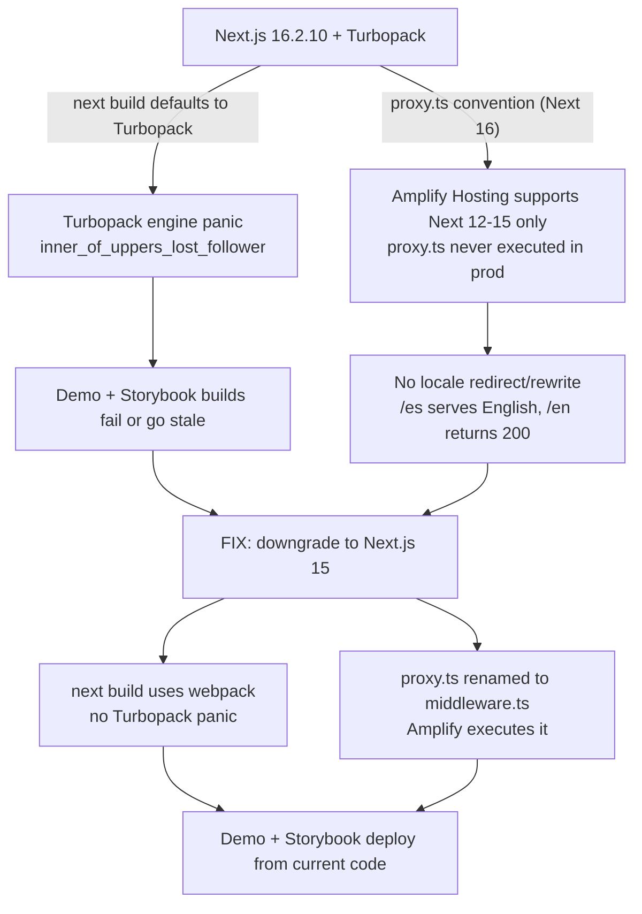

# Next.js 15 Downgrade Plan

> **Status:** Proposed · **Owner:** Colin · **Created:** 2026-09-20
> **Related:** [`I18N_AND_WASM_ALIAS_PLAN.md`](./I18N_AND_WASM_ALIAS_PLAN.md) · [`OSS_LAUNCH_PLAN.md`](./OSS_LAUNCH_PLAN.md) · [`AMPLIFY_DEPLOY_SEQUENCE.md`](./AMPLIFY_DEPLOY_SEQUENCE.md) · [`WEEKEND_EXECUTION_INDEX.md`](./WEEKEND_EXECUTION_INDEX.md)

## Summary

The demo and Storybook builds are failing/going stale, and `/es` serves English. Both trace to the **same root cause**: the app runs **Next.js 16.2.10 with Turbopack + Cache Components + `proxy.ts`**, while **AWS Amplify Hosting officially supports only Next.js ≤ 15**. This causes two independent failures:

1. **Build-time:** On Next 16, `next build` defaults to **Turbopack**, whose incremental engine is panicking (`inner_of_uppers_lost_follower` in `aggregation_update.rs`) while compiling `/[locale]`. The same engine that hangs `npm run dev` (4.1 min compile) runs the production build.
2. **Runtime:** Amplify's Next runtime does not execute the Next 16 `proxy.ts` convention, so locale detection/redirect/rewrite never runs in production → every route falls through to the default locale (English). Confirmed live: deployed `/en` returns **200** instead of the **307** our code requires.

**Decision:** Downgrade to the latest **Next.js 15** (Path A). This is a bounded change — the Next 16-only footprint is small (see [Scope](#scope)). Path B (stay on 16, move hosting off Amplify to Vercel/SST-OpenNext) is recorded in [Alternatives](#alternatives-considered) but not chosen for the launch window.



## Scope

What actually depends on Next 16, and the effort to move each to Next 15:

| Area | Current (Next 16) | Next 15 equivalent | Effort |
|---|---|---|---|
| Middleware | `proxy.ts` at repo root, `export function proxy` | `middleware.ts`, `export function middleware` | Rename + 1 export line |
| Cache Components | `cacheComponents: true` + `"use cache"` + `cacheLife` in **3 pages** | `experimental: { dynamicIO: true }` (keep code) **or** classic caching | 1 flag **or** 3-file refactor |
| React Compiler | top-level `reactCompiler: true` | `experimental: { reactCompiler: true }` + `babel-plugin-react-compiler` dep | Move key + add dep |
| Turbopack alias | top-level `turbopack.resolveAlias` (onnxruntime-node stub) | `experimental.turbo.resolveAlias` (dev) **+** `webpack` alias (build) | See [`I18N_AND_WASM_ALIAS_PLAN.md`](./I18N_AND_WASM_ALIAS_PLAN.md) |
| Dev FS cache | `experimental.turbopackFileSystemCacheForDev: true` | remove (16-only; also the likely panic amplifier) | Delete 1 line |
| Build bundler | `next build` → Turbopack (implicit) | `next build` → webpack (default on 15) | None (implicit) |

**Not affected (already work on 15):** `connection()` (stable since 15), `ViewTransition` (a React 19 feature, version-independent), `next-intl@4`, `output: "standalone"`, custom image loader, `optimizePackageImports`, `headers()`, Serwist, the `[locale]` layout with `setRequestLocale`/`getMessages`/`generateStaticParams`.

## Preconditions

- [ ] Create a branch: `git switch -c chore/downgrade-next-15`
- [ ] Confirm a clean tree (`git status`) and note current `next` resolved version (`npm ls next`) for rollback.
- [ ] **Colin:** remove `package-lock.json` and reinstall after the `package.json` edits below (Step 2). Reinstall with `npm install` (not `npm ci`) so the lock regenerates against the new pins.
- [ ] Clear stale build caches first — the Turbopack graph panic can be a poisoned cache: `npm run clean` (defined script: removes `.next storybook-static node_modules/.cache/storybook node_modules/.vite`), then also `rm -rf .turbopack`.

## Steps

### 1. Clean caches and branch
```bash
git switch -c chore/downgrade-next-15
npm run clean            # existing script
rm -rf .turbopack .next  # ensure no Turbopack persistent cache survives
```

### 2. Pin the Next.js 15 family in `package.json`
Change these dependency ranges, then reinstall. Pin the whole `next`-family to the same major to avoid peer conflicts:

| Package | From | To (latest 15.x line) |
|---|---|---|
| `next` | `^16.1.0` | `^15.5.0` |
| `eslint-config-next` | (match 16) | `^15.5.0` |
| `@next/bundle-analyzer` | (match 16) | `^15.5.0` |
| `@next/third-parties` *(if present)* | (match 16) | `^15.5.0` |
| `babel-plugin-react-compiler` | *(add)* | `latest` (required by React Compiler on 15) |

Leave unchanged: `react@^19`, `react-dom@^19` (Next 15.1+ supports React 19), `next-intl@^4.11`, `@aws-amplify/adapter-nextjs@^1.7.3` (its declared peer range is `>=13.5 <16` — downgrading to 15 **resolves** the peer conflict that the commented-out `--legacy-peer-deps` in `amplify.yml` was working around), `@serwist/next@^9.5.7`.

Then (Colin): `rm package-lock.json && npm install`

> If `npm install` still reports peer conflicts, resolve them explicitly rather than masking with `--legacy-peer-deps`; a clean install is what makes CI (`npm ci`) reliable again — see [Storybook CI](#5-verify-storybook-ci-unblocks).

### 3. Rewrite `next.config.mjs`
Apply these exact changes.

**Remove** (Next 16-only):
```js
// DELETE these top-level keys:
reactCompiler: true,
cacheComponents: true,
// and inside experimental:
turbopackFileSystemCacheForDev: true,
```

**Move React Compiler and the Turbopack alias under `experimental`, add `dynamicIO`, add a webpack alias.** Target shape:
```js
const nextConfig = {
  reactStrictMode: true,
  transpilePackages: ["@mui/x-data-grid"],
  devIndicators: false,
  output: "standalone",
  productionBrowserSourceMaps: false,
  typescript: { ignoreBuildErrors: true },
  images: { loader: "custom", loaderFile: "./src/utils/cdnImageLoader.js" },
  env: { /* unchanged */ },
  async headers() { /* unchanged */ },

  // Client build: keep the native ONNX addon out of browser bundles.
  // (Full rationale in I18N_AND_WASM_ALIAS_PLAN.md)
  webpack: (config, { isServer }) => {
    if (!isServer) {
      config.resolve.alias = {
        ...config.resolve.alias,
        "onnxruntime-node": path.resolve(__dirname, "src/stubs/onnxruntime-node.js"),
      };
    }
    return config;
  },

  experimental: {
    reactCompiler: true,                 // was top-level on 16
    dynamicIO: true,                     // Next 15 predecessor of cacheComponents; keeps "use cache" working
    optimizePackageImports: [
      "@mui/material", "@mui/icons-material", "react-icons", "@dicebear/core",
    ],
    turbo: {                             // dev-only Turbopack (optional; see note)
      resolveAlias: { "onnxruntime-node": "./src/stubs/onnxruntime-node.js" },
    },
  },
};
```
Add the ESM `__dirname` shim at the top of the file (it currently has none):
```js
import path from "node:path";
import { fileURLToPath } from "node:url";
const __dirname = path.dirname(fileURLToPath(import.meta.url));
```

> **Note on `dynamicIO`:** this keeps the three `"use cache"` pages working with zero code change and is the fastest path to a green build. It is still an experimental flag on 15. If you prefer **zero experimental features** for the public demo, use Step 4 Option B instead and drop `dynamicIO`.

> **Note on dev bundler:** you can keep Turbopack for `npm run dev` on 15 (`next dev --experimental-https` uses it) with the `experimental.turbo` alias above. The **build** uses webpack regardless (Next 15 default), which is what unblocks Amplify. If dev still panics, run `next dev --webpack`.

### 4. Convert the three `"use cache"` pages
Files: `app/[locale]/workbook-offline/page.tsx`, `app/[locale]/offline/page.tsx`, `app/[locale]/workbook/[id]/page.tsx` — each has `"use cache"` + `import { cacheLife } from "next/cache"` + `cacheLife("max")`.

**Option A — keep as-is (recommended for speed).** With `experimental.dynamicIO: true` (Step 3), `"use cache"` and `cacheLife` from `next/cache` continue to work on 15. No edits. Just verify the three routes render after the config change.

**Option B — remove the experimental dependency (recommended for a hardened public demo).** Replace the directive with classic static caching. For the two parameterless shells (`offline`, `workbook-offline`):
```ts
// remove: "use cache";  and the cacheLife import/call
export const dynamic = "force-static";
export const revalidate = false;
```
For `workbook/[id]/page.tsx` (takes a route param): confirm it reads only `params` (not `cookies()`/`headers()`), then:
```ts
export const dynamicParams = true;      // allow ids not in generateStaticParams
export const revalidate = 3600;         // or false if content is immutable per version
// wrap any data fetch in unstable_cache(fn, [keyparts], { revalidate })
```
> Serwist already provides offline HTML/asset caching at the service-worker layer (see [`OFFLINE_EXPERIENCE.md`](./OFFLINE_EXPERIENCE.md)), so the page-level `"use cache"` here is partly redundant — Option B leans on the SW instead. Pick **one** option repo-wide; do not mix.

### 5. Rename `proxy.ts` → `middleware.ts`
```bash
git mv proxy.ts middleware.ts
```
- Change the export signature: `export function proxy(request: NextRequest)` → `export function middleware(request: NextRequest)`.
- Keep everything else (locale detection, auth check, CSP nonce, `config.matcher`) identical.
- **Also add the `x-locale` header here** — this is required for the `<html lang>` fix. Full details in [`I18N_AND_WASM_ALIAS_PLAN.md`](./I18N_AND_WASM_ALIAS_PLAN.md); do both changes in the same commit.

### 6. Update build tooling — `amplify.yml`
- `frontend.artifacts.files` currently excludes `!cache/turbopack/**/*` and `!cache/webpack/**/*`; keep the webpack exclude, the turbopack one is now a no-op (harmless to leave or remove).
- `frontend.cache.paths` currently lists `.turbopack/**/*`; **replace** with the webpack build cache which already lives under `.next/cache/**/*` (already listed) — you can drop `.turbopack/**/*`.
- Re-confirm `baseDirectory: .next` is correct with `output: "standalone"` on Amplify's managed SSR. **Verification step** (do not assume): deploy to a preview branch and confirm the compute bundle serves SSR. If standalone causes a mismatch, either remove `output: "standalone"` (Amplify's adapter handles packaging) or point the artifact at the standalone dir per Amplify docs.
- Local `build` script stays `next build && serwist build serwist.config.mjs` (now webpack-backed). No `--turbopack` flag is present, so nothing to remove.

### 7. Update documentation to match Next 15
- **`app/AGENTS.md` lines 5–6** — the only version-specific agent guidance. Replace:
  - L5: *"This repository uses Next.js 16 `proxy.ts`, not `middleware.ts`, for locale routing…"* → *"This repository uses Next.js 15 `middleware.ts` for locale routing, authentication checks, CSP nonces, rewrites, and redirects."*
  - L6: the Cache Components sentence → reflect the chosen Step 4 option (either "uses `experimental.dynamicIO` with `'use cache'`…" or "uses classic `force-static`/`unstable_cache`; do not use `'use cache'`.").
- **`docs/AMPLIFY_DEPLOY_SEQUENCE.md`** — add a note that the app targets Next 15 for Amplify compatibility and why (link back to this doc).
- **`README.md` / `docs/ONBOARDING.md`** — grep for "Next.js 16", "proxy.ts", "Turbopack build" and correct. (`grep -rn "Next.js 16\|proxy.ts\|Turbopack" README.md docs/ .github/`)
- **`.github/copilot-instructions.md`** — no version-specific lines found in the scan, but re-grep after edits to be safe.

### 8. Verify
Run in order; each is a gate:
```bash
npm run typecheck            # tsc projects
npm run dev:next-only        # confirm /[locale] compiles WITHOUT Turbopack panics
npm run build                # webpack build must complete (this is the deploy gate)
npm run build-storybook      # Storybook builds (feeds both publish workflows)
npm run journeys:wait-and-run # E2E against the running app
```
Then deploy the branch to an Amplify **preview** environment and confirm:
- `curl -I https://<preview>/en` returns **307 → /** (proxy/middleware is running)
- `/es` renders Spanish (see i18n plan for the full locale matrix check)
- Storybook publishes green in both `chromatic.yml` and `deploy-github-pages.yml`.

## Acceptance criteria
- [ ] `npm run build` completes locally with **no Turbopack panic** and no OOM.
- [ ] Amplify preview deploy succeeds; `/en` 307-redirects and `/es` serves Spanish.
- [ ] Storybook publishes to **both** Chromatic and GitHub Pages from current `main`.
- [ ] `npm ci` succeeds in CI **without** `--legacy-peer-deps`.
- [ ] `app/AGENTS.md` and README no longer reference Next 16 / `proxy.ts` / Turbopack-build.
- [ ] The three former `"use cache"` routes render correctly (online and offline).

## Rollback
The change is isolated to a branch. To revert: `git switch main` (or `git revert` the merge). Because `package-lock.json` is regenerated, keep the pre-change lock file (stash or a tagged commit `pre-next15-downgrade`) so a rollback restores the exact Next 16 dependency graph.

## Alternatives considered
- **Path B — stay on Next 16, change hosts.** Move demo hosting to Vercel or SST/OpenNext on AWS (both fully support Next 16 + `proxy.ts`), keeping the Amplify Gen 2 *backend*. Rejected for the launch window: more moving parts under public traffic than a downgrade to a host-supported version. Revisit post-launch if Cache Components / Next 16 features become load-bearing.
- **Stay on Next 16, build with `--webpack`.** The `analyze` script already uses `next build --webpack`; setting the main `build` to `next build --webpack` sidesteps the Turbopack **build** panic *without* downgrading. This does **not** fix the runtime problem (Amplify still won't run `proxy.ts`), so it is at best a partial, unsupported-stack stopgap. Not chosen.
