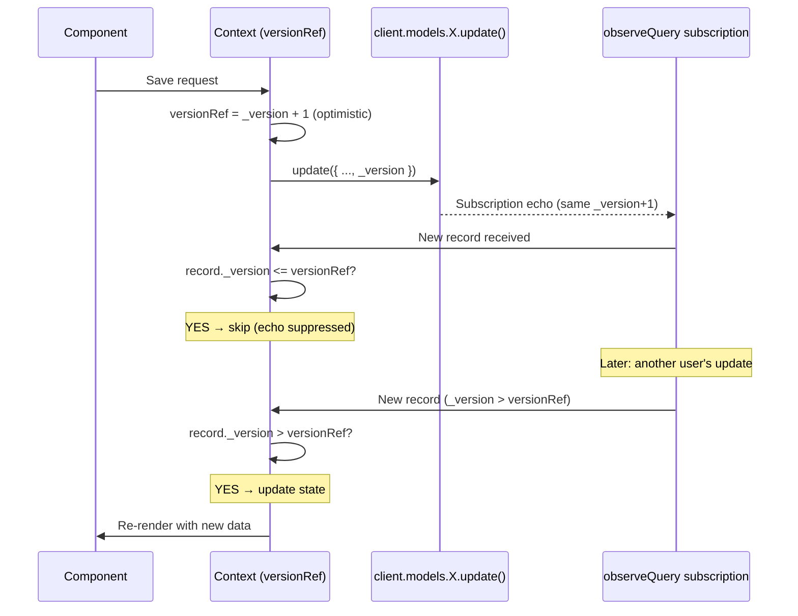

# Optimistic Concurrency & observeQuery

> **Status**: Complete  
> **Implemented**: May 2026

All contexts migrated from manual `onCreate`/`onUpdate`/`onDelete` subscriptions to `observeQuery()` with `_version` guards to prevent echo rerenders.

---

## How It Works



## Background

Gen1 used `DataStore.observeQuery()` which provided:
1. Built-in snapshot deduplication (only emits when data actually changes)
2. Single subscription per model (instead of separate onCreate/onUpdate/onDelete)
3. Combined with optimistic `_version + 1` before saves to prevent echo rerenders

The Gen2 migration switched to manual `onCreate`/`onUpdate`/`onDelete` subscriptions, which:
- Fire for **every** mutation including your own saves (echo problem)
- Require separate error handling per subscription (3x boilerplate)
- Trigger re-fetches on each event (e.g., Grade does a full `list()` on every onUpdate)

## Goal

Switch all contexts to `observeQuery()` and add `_version` guards to prevent rerender noise from subscription echoes.

## Gen1 Reference Pattern (from DataPlugin + unitContext)

```javascript
// BEFORE save: predict next version to block the echo
const predictedNextVersion = currentUnit._version + 1;
versionRef.current = predictedNextVersion;

await DataStore.save(Unit.copyOf(currentUnit, updated => { ... }));

// ON ERROR: roll back
versionRef.current = currentUnit._version;

// In subscription handler:
if (unitVersion <= versionRef.current) {
  return; // Ignore - this is our own save coming back
}
```

Gen1 Grade relied solely on `observeQuery`'s dedup — no explicit `_version` logic needed.

## Current State

### Already using observeQuery (no changes needed):
- `xpContext.tsx` — StudentXPLog.observeQuery with filter
- `skillTreeContext.tsx` — Skill.observeQuery + StudentSkillProgress.observeQuery
- `campaignContext.tsx` — Campaign.observeQuery + GroupChallenge.observeQuery

### Need migration from manual subs → observeQuery + version guards:

| # | Context | Models | Current Pattern | Target |
|---|---------|--------|-----------------|--------|
| 1 | `unitContext.jsx` | Unit | `get()` + `onUpdate` | Keep get+onUpdate (single record) + **add optimistic `_version+1`** |
| 2 | `unitContext.jsx` | Grade | `list()` + 3 manual subs → re-fetches list each time | `observeQuery({ filter: { unitID } })` |
| 3 | `settingsContext.jsx` | Settings | `list()` + `onUpdate` | `observeQuery()` + version guard + optimistic bump |
| 4 | `dictionaryContext.jsx` | Word, Question | `list()` + 3 manual subs each | `observeQuery({ filter })` + version maps |
| 5 | `sectionContext.jsx` | Section, Assignment | `list()` + 3 manual subs each | `observeQuery()` / `observeQuery({ filter: { unitID } })` |
| 6 | `fileContext.jsx` | File | `list()` + manual subs | `observeQuery({ filter })` + version map |
| 7 | `chatContext.jsx` | AssistantChat | `list()` + 3 manual subs | `observeQuery()` + enhance existing chatVersionRef |
| 8 | `gamificationContext.tsx` | StudentProfile, Squad, Skill, GroupChallenge | 10+ manual onCreate/onUpdate subs | `observeQuery()` + version guards |

## Version Guard Strategy

| Model | Guard Type | Mechanism |
|-------|-----------|-----------|
| **Unit** | Optimistic `_version + 1` before save, rollback on error | Single `versionRef` (already exists, add optimistic bump) |
| **Grade** | observeQuery dedup only (no explicit guard) | Like Gen1 — relies on observeQuery not re-emitting unchanged snapshots |
| **Settings** | Optimistic `_version + 1` + single ref | `settingsVersionRef` — bump before `updateSettings`, rollback on error |
| **Word** | Version map, skip if `_version <=` | `wordVersionMap.current = { [id]: _version }` |
| **Question** | Version map, skip if `_version <=` | `questionVersionMap.current = { [id]: _version }` |
| **File** | Version map, skip if `_version <=` | `fileVersionMap.current = { [id]: _version }` |
| **AssistantChat** | Enhance existing `chatVersionRef` with optimistic bump | Already tracks `_version`, add bump before saves |
| **StudentProfile** | Single ref, skip if `_version` unchanged | `profileVersionRef.current` |
| **Squad** | Version map, skip if `_version <=` | `squadVersionMap.current = { [id]: _version }` |
| **Skill** | Version map, skip if `_version <=` | `skillVersionMap.current = { [id]: _version }` |
| **GroupChallenge** | Version map, skip if `_version <=` | `challengeVersionMap.current = { [id]: _version }` |
| **Section** | Version map, skip if `_version <=` | `sectionVersionMap.current = { [id]: _version }` |
| **Assignment** | Version map, skip if `_version <=` | `assignmentVersionMap.current = { [id]: _version }` |

## Implementation Details

### Pattern A: Single-Record Optimistic Bump (Unit, Settings)

```javascript
const versionRef = useRef(0);

// In subscription/observeQuery handler:
if (record._version <= versionRef.current) {
  return; // Skip echo
}
versionRef.current = record._version;
setState(record);

// Before save:
const predictedNextVersion = currentRecord._version + 1;
versionRef.current = predictedNextVersion;

try {
  const { data: saved } = await client.models.Model.update({ ...fields, _version: currentRecord._version });
  versionRef.current = saved._version; // Confirm actual version
} catch (error) {
  versionRef.current = currentRecord._version; // Rollback
}
```

### Pattern B: Version Map (Word, Question, File, Squad, Skill, etc.)

```javascript
const versionMapRef = useRef({});

// In observeQuery handler:
next: ({ items }) => {
  const valid = items.filter(item => item != null && item.id != null);
  
  // Check if any item actually has a newer version
  const hasChanges = valid.some(item => {
    const tracked = versionMapRef.current[item.id];
    return tracked == null || item._version > tracked;
  });
  
  if (!hasChanges && Object.keys(versionMapRef.current).length > 0) {
    return; // All items same or older version — skip
  }
  
  // Update version map
  valid.forEach(item => {
    versionMapRef.current[item.id] = item._version;
  });
  
  // Dispatch state update
  processItems(valid);
}
```

### Pattern C: observeQuery Dedup Only (Grade)

```javascript
// No version guard needed — observeQuery won't re-emit unchanged snapshots
const sub = client.models.Grade.observeQuery({
  filter: { unitID: { eq: id } }
}).subscribe({
  next: ({ items }) => {
    const valid = items.filter(item => item != null && item.id != null);
    processGrades(valid);
  },
  error: (error) => handleSubscriptionError('Grade', error)
});
```

### Gen2 observeQuery API Reference

```javascript
// Basic usage with filter
const sub = client.models.Model.observeQuery({
  filter: { fieldName: { eq: value } }
}).subscribe({
  next: ({ items }) => { /* items is the full current snapshot */ },
  error: (error) => { /* handle errors */ }
});

// Cleanup
return () => sub.unsubscribe();
```

Key differences from manual subscriptions:
- Returns full snapshot (all matching items), not individual events
- Handles create/update/delete internally — single callback
- Built-in deduplication at WebSocket level
- No sorting support — sort client-side
- Filter syntax same as `list()`: `{ fieldName: { eq: value } }`

## Unit Context Special Case

Unit uses `get()` + `onUpdate` (single record) rather than `observeQuery` because:
- Single unit by ID — `observeQuery` would scan all units
- `observeQuery` doesn't support `get`-style single-record fetch
- KEEP current pattern but ADD optimistic `_version + 1` bump before each save

Affected save functions:
- `saveEditorContent` — editor JSON content
- `saveName` — unit name
- `saveDescription` — unit description  
- `saveImage` — unit image

## Implementation Priority (by rerender impact)

1. **Unit saves** — Add optimistic version bump (biggest win: prevents editor rerenders from echoed saves)
2. **Grade** — Switch to `observeQuery` (eliminates 3 subs + expensive re-fetch on every keystroke)
3. **Settings** — `observeQuery` + optimistic bump (theme/locale changes cause full rerender)
4. **Dictionary** — `observeQuery` + version maps (Word/Question editing triggers multiple saves)
5. **File** — `observeQuery` + version map (upload progress updates are noisy)
6. **Section** — `observeQuery` + version map (lower frequency)
7. **Chat** — `observeQuery` + enhance version guard (already partially done)
8. **Gamification** — `observeQuery` + version guards for StudentProfile, Squad, Skill, GroupChallenge

## Testing Strategy

After each context migration:
1. Verify real-time updates still propagate from other users/devices
2. Verify own saves don't cause visible flicker/rerender
3. Check React DevTools profiler for reduced render count
4. Ensure error handling (DuplicatedOperationError, AppSync limits) still works
5. Run existing Vitest and Cypress tests for the affected context

## Notes

- `observeQuery` in Gen2 deduplicates at the WebSocket level — only emits when items array actually changes
- No sorting support in `observeQuery` — must sort client-side (already doing this)
- Always filter nulls: `items.filter(item => item != null && item.id != null)`
- Handle `DuplicatedOperationError` gracefully (transient WebSocket reconnection issue)
- Handle AppSync `in` operator limit (max 5 values) with fallback to client-side filtering
