# Page Story Design Critique & Improvement Plan

Design audit of the application page stories (`📄 Pages/Application Pages` in
Storybook), captured at 1440×900 desktop against the current `main` code. This
document records what was observed per page, the systemic themes behind those
observations, and a prioritized plan to move the UI from "functional" to
"stunning."

> Scope note: This is a **planning document**. It does not itself change
> production components. The only code change made alongside this audit was the
> requested copy rename ("Start Workbook" → "Start"), tracked in the last
> section.

## Method

- Storybook dev server (`npm run storybook`) rendering real components with mock
  data.
- Full-page screenshots per story at desktop width (1440×900).
- Pages sampled to cover every distinct template: learner dashboard, list/detail
  cards, workbook/editor, forms, instructor grading, admin, gamification, and
  system/empty/error states.

Pages captured: Index (dashboard), Sections, Section Detail, Units, Unit Detail,
Workbook, Peer Review, Drill, Leaderboard, Squad Detail, Notifications, Settings,
Profile (public), Instructor Grade, Admin Analytics, Admin Moderation, Offline.

---

## Systemic themes (the big levers)

These repeat across pages and are what most hold the UI back. Fixing these a few
times fixes dozens of screens.

### ChatSidebar Story Coverage

The ChatSidebar stories should model the workflows that instructors actually
need from the dashboard, not only successful tool-call prose. Keep these as
explicit fixture requirements:

- **Create and verify records**: search existing units, sections, assignments,
  vocabulary words, and questions; create only when needed; search again after
  creation; display the created record in Search Results.
- **Dashboard analytics**: show aggregate statistics, section analytics,
  at-risk learners, roster progress, and flagged grade review as searchable or
  dedicated tool results.
- **Assignment management**: show a preflight lookup, assignment creation,
  post-create lookup, due-date change, and confirmation of the resulting
  assignment record.
- **Interactive question creation**: fill-in-the-blank requests must produce a
  custom-answer, answer, or quiz block with a prompt and grading data, never a
  static `Answer:` paragraph.
- **Tour behavior**: the tour story must render the actual ChatSidebar and
  constrain every target and overlay step to that sidebar. A successful
  `start_tour` message is not sufficient without a visible, actionable overlay.
- **Removed interesting scenarios to restore**: analytics deep dives,
  moderation triage (flag → review → resolve), bulk assignment operations,
  record verification after creation, and conversation-player search results.

### 1. The card system wastes space and lacks a consistent identity
- List cards (Sections, Units) have a large **empty vertical gap** between the
  title/metadata and the action buttons — content floats at top, buttons pinned
  at bottom, nothing in between.
- **Left accent bar color is inconsistent**: black on Sections, indigo on
  Section Detail. It reads as accidental, not systematic.
- **Oversized decorative stock imagery unrelated to content** (a sand dune and
  highland cattle for a Japanese course; piano keys for "Japanese Greetings").
  This actively undermines credibility.

### 2. Typography has no deliberate scale or personality
- Headings render in the default system font at very large sizes with little
  weight/spacing hierarchy. Titles, section labels, and body all feel like the
  same voice. There is no editorial rhythm that would make a page feel designed.

### 3. Color usage is unsystematic and sometimes semantically wrong
- **White-on-red count chips** (Instructor Grade "0" badges) are hard to read and
  semantically alarming for a zero/neutral value — this matches earlier feedback.
- **A benign "Cancel" button is styled in error red** (Settings).
- Elsewhere the palette is the opposite problem: monochrome, flat, lifeless
  (Admin Analytics stat cards). The product swings between "too loud" and
  "too gray" with no middle "confident brand" register.

### 4. There is no single Semantic Theme contract
- The app has useful local tokens (`DASHBOARD_TOKENS`, app-shell glass surfaces,
  editor toolbar styles), but they are not yet unified into one application
  theme that owns semantic decisions across pages.
- Components repeatedly encode visual intent inline via `sx` instead of asking
  for semantic variants such as `surface.page`, `surface.panel`,
  `action.primary`, `chip.status`, `appBar.contextual`, or `card.assignment`.
- This makes recurring UI elements drift: dashboard cards, workbook gates,
  instructor review chips, app bars, drawers, completion modals, and empty states
  all solve rounding, elevation, spacing, color, and density independently.
- A Semantic Theme should define the shared visual language first, then components
  should migrate to theme tokens/variants rather than copying local styles.

### 5. Buttons and controls are inconsistent
- ALL-CAPS MUI text buttons are scattered top-right on many pages
  (VIEW SKILL TREE, INSTRUCTOR VIEW, SETTINGS, CREATE NEW, OVERRIDE GRADE).
- Variant usage is arbitrary (contained vs outlined vs text with no clear
  hierarchy of primary/secondary/tertiary).
- Assignment-card action rows need a consistent pattern: secondary actions stay
  outlined on the left, while the primary Start/Review action is solid and
  right-aligned. Long contextual button labels such as `Japanese 102 - Advanced
  Skill Tree` should collapse to icon + short text (`Skills`) with the full
  context available in the dialog title.
- **Offline page uses a raw, unstyled native `<button>Retry</button>`** — a
  clear break from the design system.

### 6. Empty, loading, and error states are neglected
- **Bare centered text** with no illustration, structure, or recovery CTA:
  Squad Detail ("No squads available yet."), Leaderboard "Fastest" tab (renders
  nothing), Drill (a lone button in a sea of white), Peer Review error
  ("Review room not found" as plain pink text).
- **Inconsistent loading treatments**: Notifications shows proper skeletons;
  the Workbook completion state now resolves correctly (fixed); the editor canvas
  still shows a large empty bordered box and the timed-exercise variant renders a
  blank workbook body.
- Alignment mixes within a single screen (left-aligned headings + centered body
  on Squad Detail and Profile).

### 7. Layout containers don't adapt to viewport
- Cards stretch to full content width with huge right-side whitespace; there is
  no max content measure or responsive column system, so wide desktops feel
  empty and unbalanced.

### 8. Persistent chrome overlaps content
- The chat FAB sits bottom-right on every page and can overlap card actions and
  content with no offset/safe-area.

### 9. App chrome needs a responsive information architecture
- On mobile, the app bar quickly becomes overcrowded when page identity,
  workbook/editor status, search, XP/streak/profile actions, and notifications
  all compete for the same row.
- Workbook/editor pages need a two-row app-bar contract: title + description in
  the primary row, and page tools such as search, timer, connection, and progress
  in the attached contextual toolbar row.
- Truncated app-bar title/description text should be interactive: hover reveals
  the clipped content with a marquee-style leftward reveal, and click opens a
  popover with the full text.
- Mobile drawer/search behavior needs a clear rule: app-level actions that do
  not fit in the primary app bar should move into the main menu, while search may
  live in the page contextual toolbar when that page has one.

---

## Per-page findings

Screenshots were captured at 1440×900 desktop from the Storybook stories. Each
image links to the full-resolution capture in `assets/page-critique/`.

### Index (Dashboard)

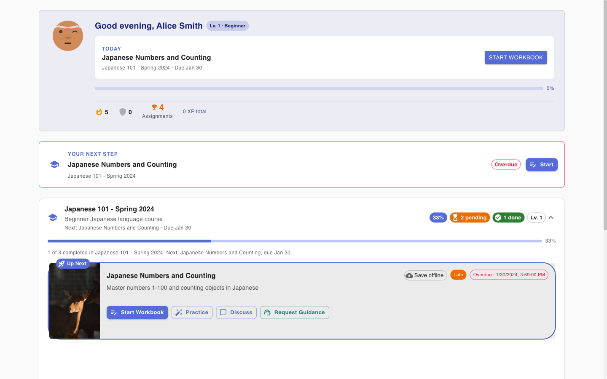

Most visually developed: gradient hero, XP/level. Sets a tone the rest of the app
does not match. Chips/contrast to verify against the rest of the palette.

### Sections

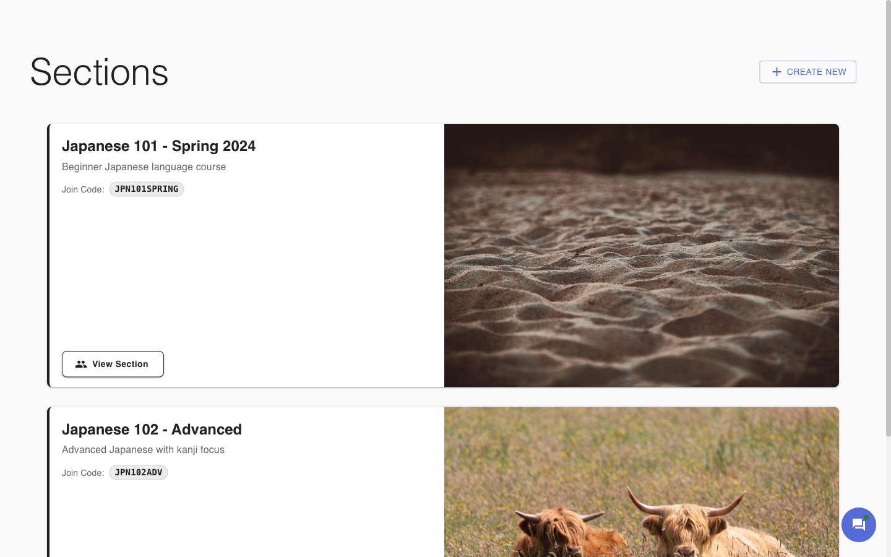

Card empty-space + heavy **black** left accent + irrelevant stock photos.
`CREATE NEW` is an outlined caps button.

### Section Detail

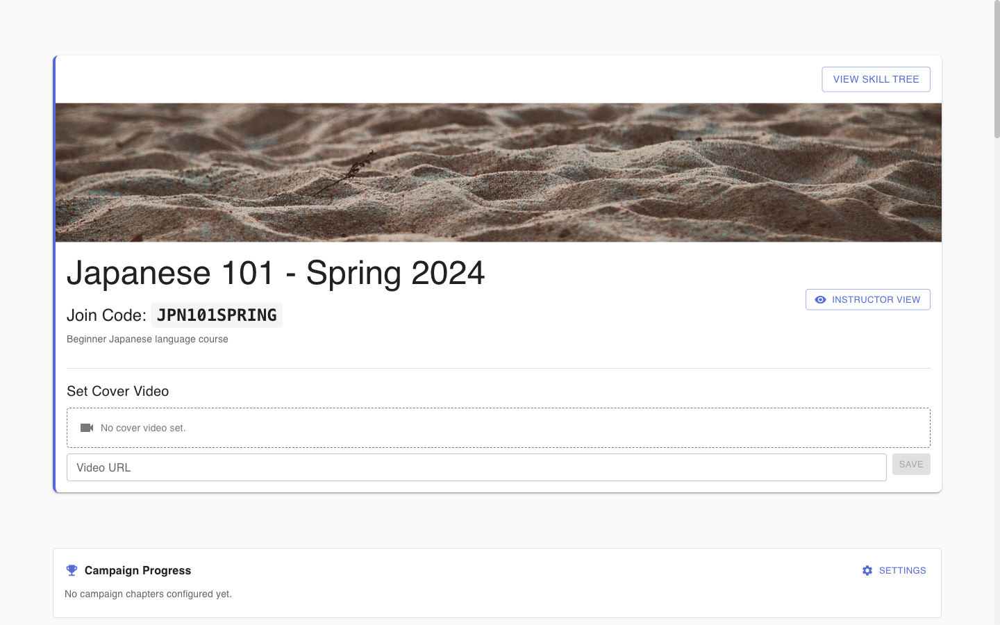

**Indigo** left accent (inconsistent with Sections). Sand-dune cover banner.
Scattered caps text-buttons (VIEW SKILL TREE / INSTRUCTOR VIEW / SETTINGS). Plain
oversized H1.

### Units

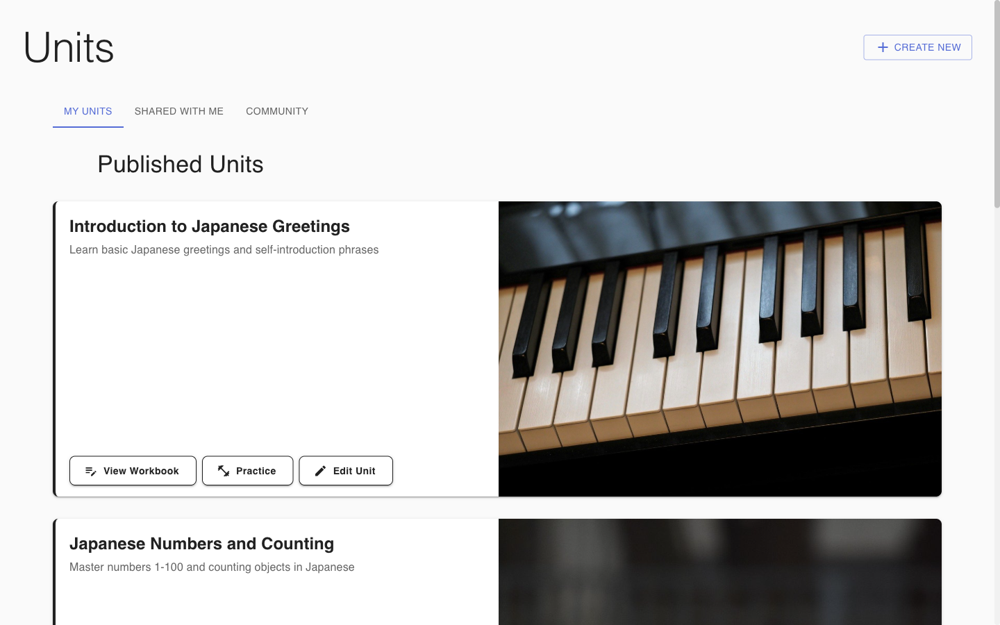

Same card empty-space problem; piano-keys image for a Japanese unit; ALL-CAPS
tabs (MY UNITS / SHARED WITH ME / COMMUNITY).

### Unit Detail (editor)

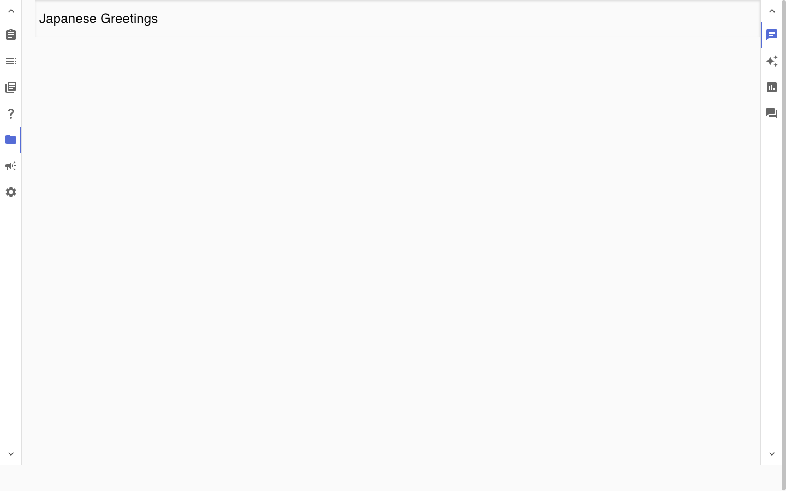

Two icon-only vertical rails with no labels/tooltips; large empty canvas; console
errors in mock. Icon meaning is ambiguous.

### Workbook

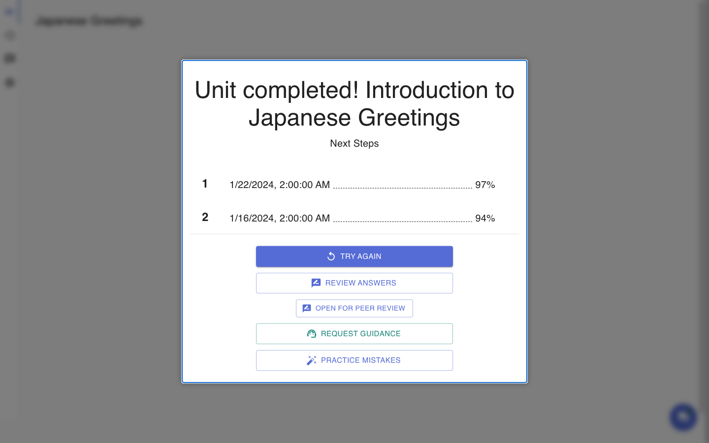

**Fixed (recaptured):** no longer stuck on the "Checking assignment
availability…" banner. Now renders a proper "Unit completed!" card with attempt
history (dated rows with accuracy %) and a clear action stack (Try Again / Review
Answers / Open for Peer Review / Request Guidance / Practice Mistakes). Remaining
polish: the primary heading is very large in the default system font, and the
card floats in a large gray field with the icon-only left rail unlabeled.
Follow-up polish captured during the timed-workbook pass: when start/resume or
completion overlays are visible, the underlying workbook content should not
scroll; the overlay should cover the read-only workbook controls/sidebar but not
break the app shell; and the completed state should keep all learner action
buttons while using a cleaner, responsive layout.

### Workbook (Timed Exercise)

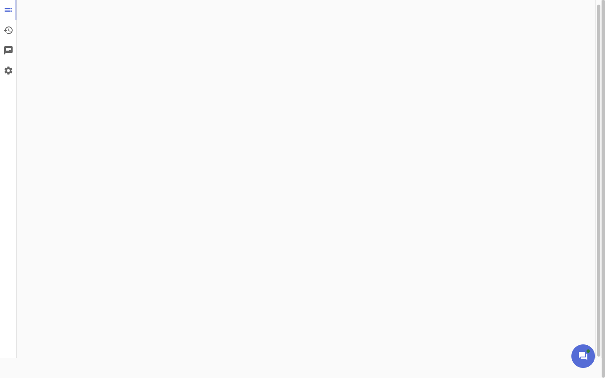

Renders an **empty workbook editor** (Lexical textbox with "No headings found")
and no timed-exercise affordance — there is no timer, countdown, or "Start timed
exercise" gate, and no content in the body. No console errors. This variant still
needs its timed-mode UI wired up (or a proper empty/gated state) so it doesn't
read as a blank page.

Target behavior for this story and production path:
- Provide distinct Storybook states for timed **start**, **in progress/resume**,
  and **completed** attempts, all backed by representative workbook content.
- Start gate shows the configured timer before the attempt begins.
- Resume gate shows a static snapshot of remaining time and does not count down
  until the student resumes the workbook.
- Pressing Start should enter workbook content directly, not immediately show the
  resume gate.
- Completed timed attempts should render the normal unit-completed experience,
  plus time limit and time-to-completion wherever grades are displayed.
- Timer gates should use the same rounding/elevation language as dashboard
  assignment cards, with a translucent blurred backdrop and a plain white fallback
  when blur is unsupported.
- Timed-workbook assignments need explicit controls for disabling workbook
  chatrooms and disabling AI chat/context for that assignment.

### Peer Review

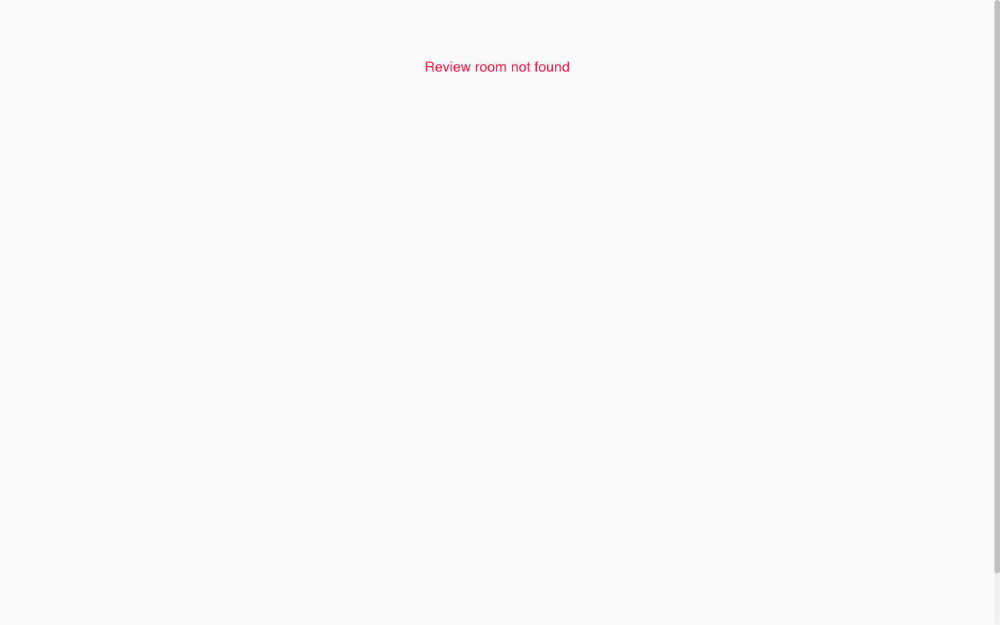

Error state rendered as bare pink centered text ("Review room not found") — no
icon, card, or way back.

### Drill

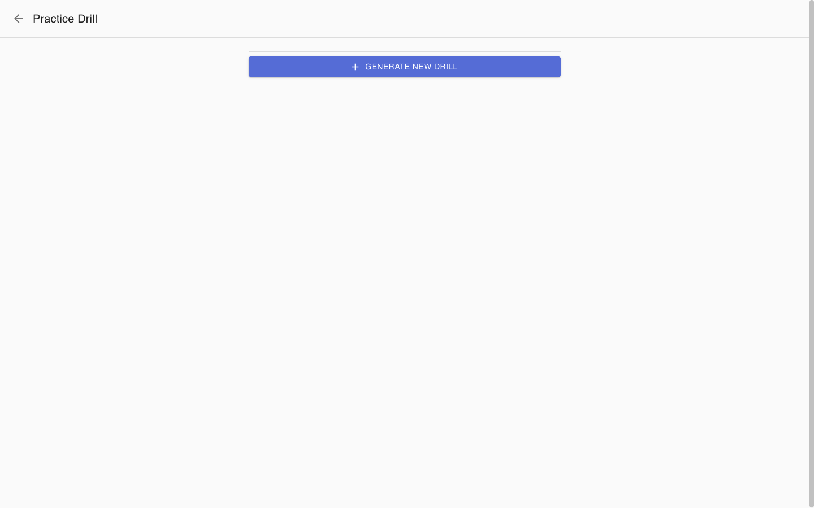

A single centered `GENERATE NEW DRILL` caps button; no empty-state explanation of
what a drill is.

### Leaderboard

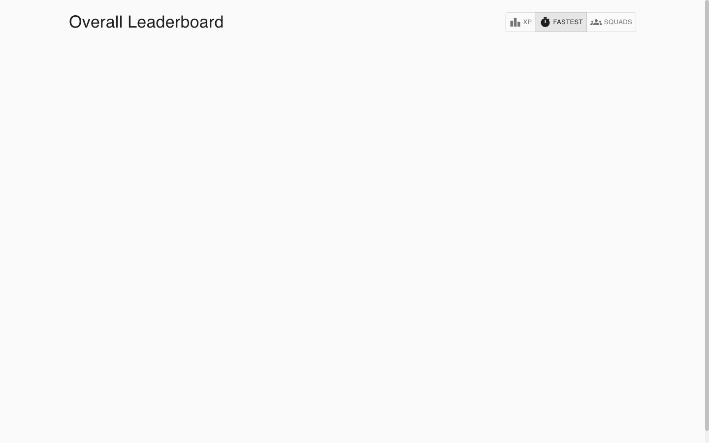

Header + segmented XP/FASTEST/SQUADS toggle (low-contrast selected state); the
Fastest tab body renders empty with no empty state.

### Squad Detail

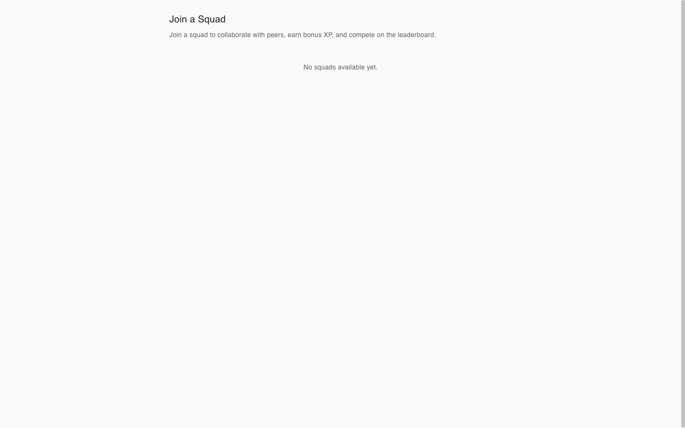

Bare text empty state; heading left-aligned but empty copy centered.

### Notifications

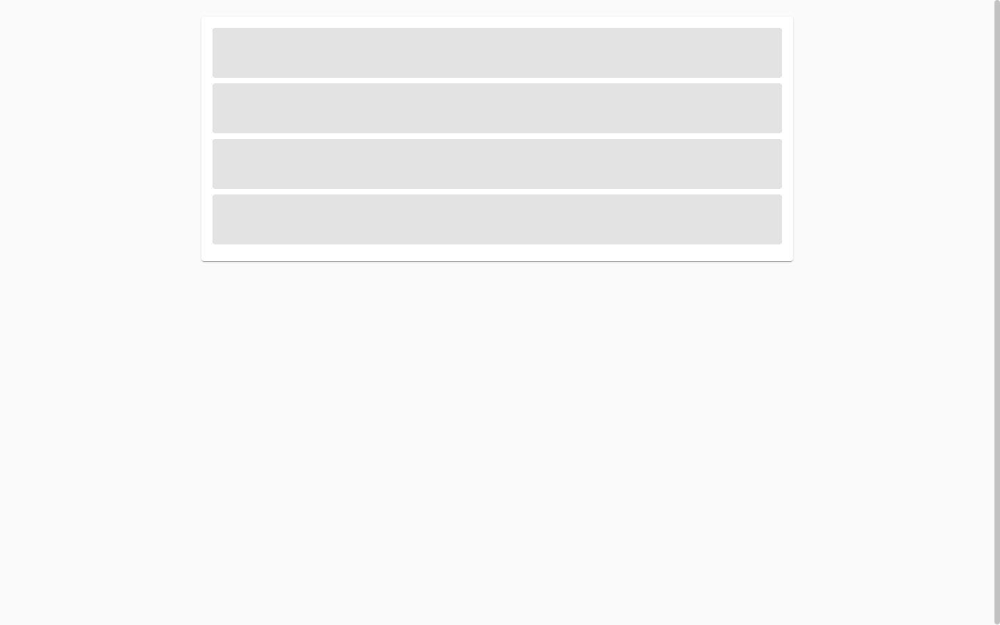

Skeleton loaders present (good reference pattern).

### Settings

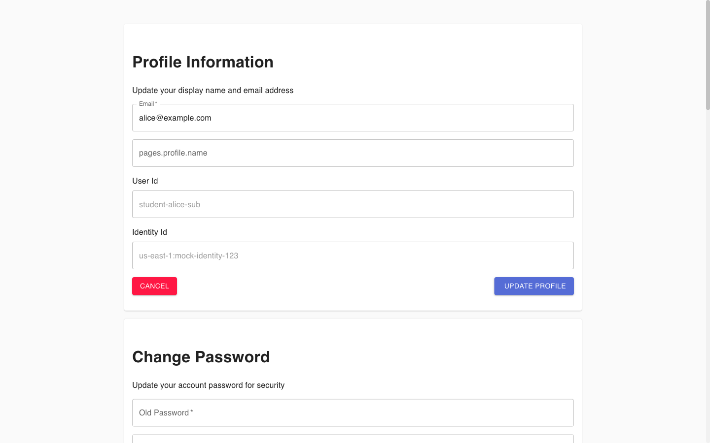

**Raw i18n key `pages.profile.name` shown as placeholder**; **Cancel button in
error red**; mixed field styles (floating label vs label-above); read-only fields
look editable.

### Instructor Grade

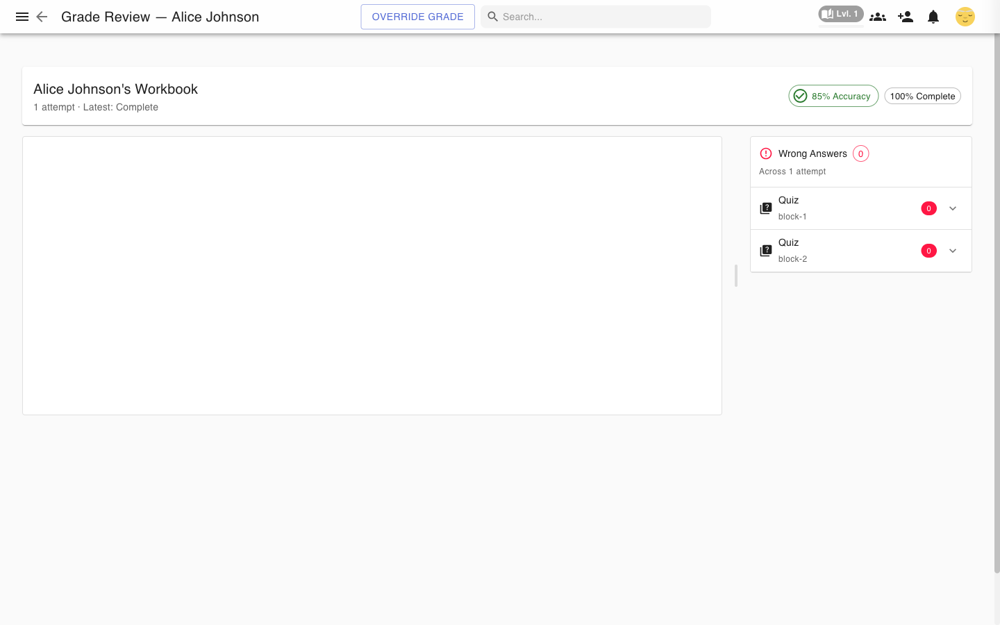

**White-on-red "0" count chips** (unreadable + wrong semantics); empty content
box where the workbook should render; crowded app bar; inconsistent pill styles
(colored vs outlined).
For timed submissions, instructor-facing grade summaries should also display
time to completion so a score can be interpreted alongside pacing.

### Admin Analytics

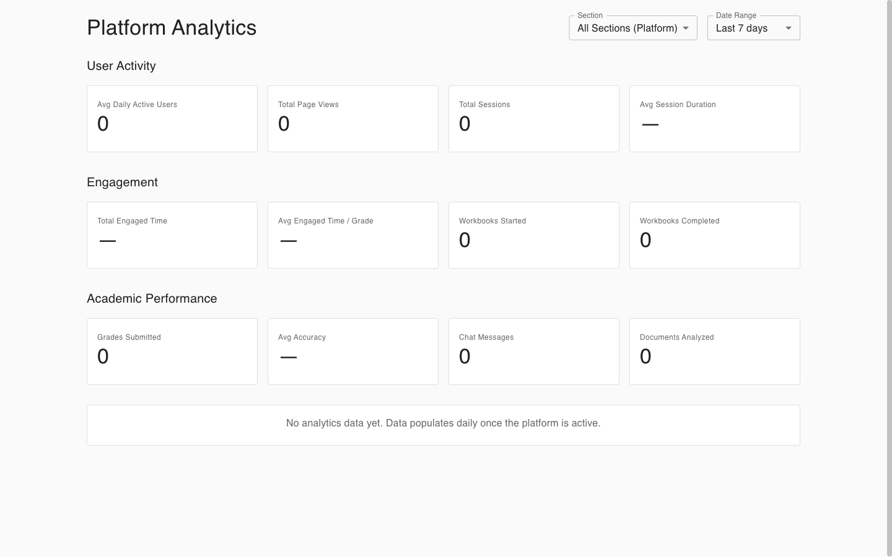

Most consistent grid, but flat/monochrome stat cards — no icons, color coding, or
trend indicators; big "0"s feel lifeless.

### Admin Moderation

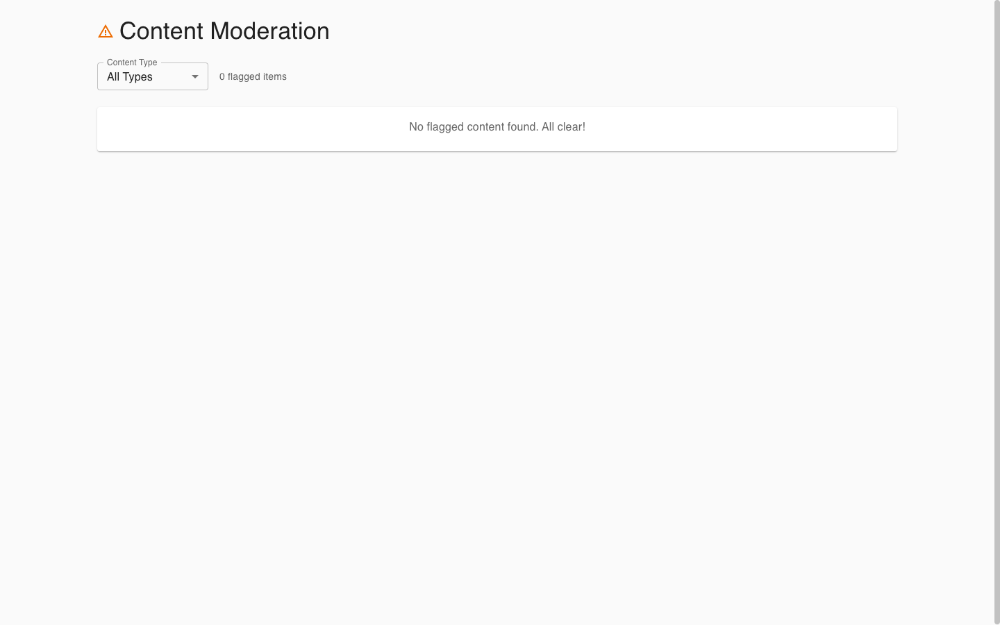

Good carded empty state ("All clear!"); minor: alarming orange warning icon in a
neutral title.

### Profile (public)

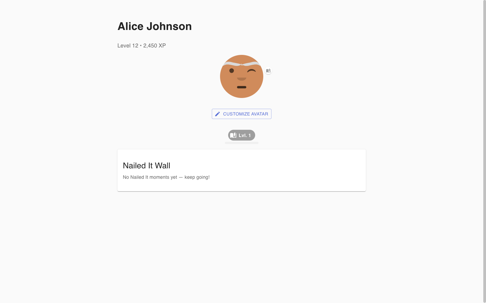

**Data inconsistency: header "Level 12" vs badge "Lvl. 1"**; low-contrast gray
level pill; mixed alignment; bare "Nailed It Wall" empty state.

### Offline

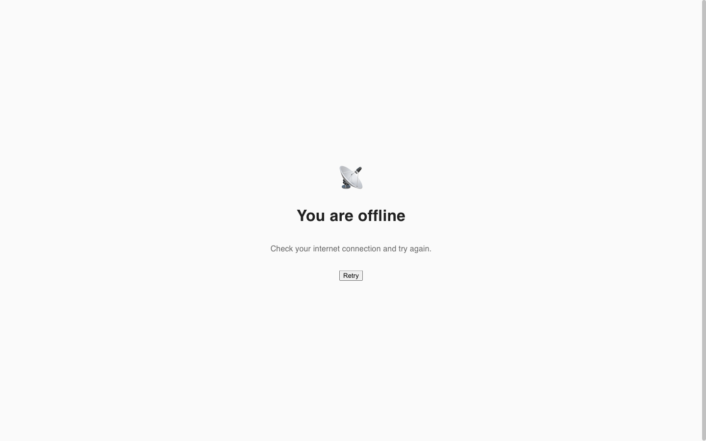

**Unstyled native HTML Retry button**; otherwise a reasonable centered layout.

---

## Prioritized action plan

### P0 — Correctness bugs (small, high-credibility wins)
1. Fix the untranslated `pages.profile.name` key (add the missing translation /
   correct the `t()` namespace) on Settings.
2. Recolor the Settings "Cancel" from error red to a neutral/secondary variant.
3. Replace the Offline page's native `<button>` with the standard MUI `Button`.
4. Reconcile the Profile level mismatch (header vs badge should read the same
   source of truth).
5. Rework the Instructor Grade count chips: neutral/secondary color for zero,
   ensure AA-contrast text on any colored badge; only use red for actual errors.
6. Make timed workbook states real and testable: start gate, resume overlay,
   completed timed attempt, configured timer display, static resume-time snapshot,
   and representative in-progress answers.
7. Add assignment-level controls for workbook chatrooms and AI chat/context, and
   support editing those flags after assignments already exist.

### P1 — Design-system consistency (the multiplier)
8. Create a **Semantic Theme** contract that owns component variants, spacing,
   radius, elevation, typography, semantic colors, app-bar/drawer surfaces,
   chips, cards, buttons, and state components. Migrate page-specific `sx`
   styling into named tokens/variants so dashboard, workbook, editor, instructor
   review, admin, and offline pages share one visual language.
9. Standardize **buttons**: define primary/secondary/tertiary usage; drop
   uppercase; one style for page-level actions; stop scattering caps text-buttons
   in headers.
10. Standardize the **card component**: a single left-accent token (or remove it),
   a content-density layout that eliminates the empty vertical gap, and a
   consistent media treatment.
11. Standardize chip/pill rounding using the dashboard assignment-card language
    (`DASHBOARD_TOKENS.radius.chip`) instead of mixing default MUI capsules with
    bespoke rounded rectangles.
12. Replace **irrelevant stock imagery** with a coherent system: subject-relevant
   art, generated covers, or a clean gradient/monogram fallback keyed to the
   course — never random Unsplash-style photos.
13. Establish a **type scale** (font family, sizes, weights, letter-spacing) and
   apply it to titles/section headers/body for real hierarchy.
14. Introduce a **content max-width / responsive grid** so wide desktops are
    balanced instead of empty on the right.
15. Define a dashboard action-row pattern: secondary actions on the left, the
    primary solid Start/Review action on the right, and compact icon+text labels
    for recurring actions like Skills.
16. Define the workbook/editor app-bar pattern: primary row for title and
    description; contextual row for search, timer, sync/connection, and progress;
    clipped title/description text reveals on hover and opens full text on click.

### P2 — State design (perceived quality)
17. Build shared **EmptyState** and **ErrorState** components (icon/illustration,
    headline, supporting copy, primary CTA) and adopt them on Squad Detail,
    Drill, Leaderboard tabs, Peer Review, and Profile walls.
18. Standardize **loading** on skeletons (use the Notifications pattern); remove
    bare "Checking…" banners and empty bordered boxes.
19. Give the chat FAB a **safe-area offset** so it never overlaps card actions.
20. Lock underlying workbook/editor scrolling while modal overlays are active,
    including start/resume gates and completion modals.
21. Standardize mobile drawer overlays: readable blurred/tinted backdrop, drawer
    close affordance when the drawer covers the app bar, and no scrollbar track
    appearing behind fixed chrome.

### P3 — Delight (what makes it "stunning")
22. Enrich **stat cards** (Admin Analytics) with icons, subtle color accents, and
    trend/sparkline indicators.
23. Add restrained **motion** (hover elevation, entrance transitions) and
    consistent elevation/rounding tokens.
24. Bring the polished **Dashboard hero** language (gradient, depth, gamification
    cues) into Sections/Units/Profile so the whole app feels like one product.

### Suggested sequencing
P0 (bug-fix PR) → P1 (design-system PR: buttons, cards, type, imagery) →
P2 (state components) → P3 (delight). P1 is the highest-leverage step because the
card/button/type systems recur on nearly every page.

---

## Showcase & gamification visual unification

Goal: unify the visual style of **every showcase and gamification element** so
they read as one product, using the Design System Showcase stories as the living
reference. This is a **restyle and re-layout** pass, not a feature cut — **no
functionality may be removed**. Elements may be **collapsed, grouped, or moved**
(for example, replacing a stack of oversized profile cards with a compact series
of toggles/rows), but every control, stat, and affordance must survive the
reorganization.

### Canonical examples to match

Treat these two stories as the target visual language; migrate other showcase and
gamification surfaces toward their density, rounding, elevation, and rhythm:

- **Toolbars** — `🧩 UI Components/Design System Showcase` → "Toolbars (all
  variants, in proportion)"
  ([Toolbars story](http://localhost:6006/?path=/story/%F0%9F%A7%A9-ui-components-design-system-showcase--toolbars)),
  backed by [ToolbarSpecimens](../src/components/DesignSystem/ToolbarSpecimens.tsx).
- **Recurring Patterns** — "Recurring Patterns (cards · gates · chips · chrome ·
  modals · empty)"
  ([Recurring Patterns story](http://localhost:6006/?path=/story/%F0%9F%A7%A9-ui-components-design-system-showcase--recurring-patterns)).

### Surfaces to verify while iterating

Re-render and visually diff these stories after each change to confirm nothing
regresses and the language converges:

- **Editor Blocks (Live)**
  ([story](http://localhost:6006/?path=/story/%F0%9F%A7%A9-ui-components-design-system-showcase--editor-blocks-live))
- **Gamification Components**
  ([story](http://localhost:6006/?path=/story/%F0%9F%A7%A9-ui-components-design-system-showcase--gamification-components))
- **Real Components (gallery)**
  ([story](http://localhost:6006/?path=/story/%F0%9F%A7%A9-ui-components-design-system-showcase--real-components))

### Constraints

- **No feature loss.** Collapsing cards into toggles/rows/accordions is allowed
  only when every prior control and data point remains reachable. If a card
  exposed an action, that action must still exist after regrouping.
- **Preserve component APIs.** Prefer restyling via the Semantic Theme
  ([src/themes/semanticTheme.ts](../src/themes/semanticTheme.ts)) and shared view
  sub-components (e.g. `AssignmentCardView`, `ProfileCardView`,
  `AccountPreferencesView`) over rewriting behavior.
- **Density over decoration.** Match the proportion and spacing shown in the
  Toolbars and Recurring Patterns stories rather than inventing per-surface
  padding.

### Work items

25. **Adopt the Semantic Theme across showcase + gamification.** Route rounding,
    elevation, spacing, and surface/glass decisions for gamification components
    (`BadgeShelf`, `LevelBadge`, `ProgressRings`, `StreakCalendar`, `SquadCrest`,
    `SectionXPGauge`, `BossBattleProgress`, squad/boss/campaign cards) through
    `SEMANTIC_THEME` tokens instead of local `sx`, so they match the Toolbars and
    Recurring Patterns reference.
26. **Unify gamification card rounding/elevation/chips** with the dashboard
    assignment-card language used in Recurring Patterns (single accent token,
    consistent chip rounding, no bespoke capsule/rectangle mixing).
27. **Collapse oversized profile cards into a compact toggle/row layout.** In the
    profile/settings surfaces (`ProfileCardView`, `AccountPreferencesView`,
    `ProfileInfoView`, `LanguagePreferenceView`, `AdvancedSettingsView`), replace
    stacked full-width cards with grouped toggles/rows/accordions — keeping every
    field, action, and preference intact, only reorganized for density.
28. **Normalize gamification typography** to the established type scale (Typography
    & Font Rhythm story) so XP counters, level labels, streak counts, and squad
    headings share weight/spacing hierarchy instead of default system sizing.
29. **Align gamification empty/loading/error states** with the shared
    `EmptyState`/`ErrorState` pattern (item 17) — squad feeds, leaderboards, boss
    battles, and badge walls must not render bare centered text.
30. **Promote toolbar/app-bar consistency** from the Toolbars specimen into the
    real chrome so main, editor, and contextual toolbars share the same variant
    tokens.
31. **Rework the editor, its blocks, and editor/code styles with the Semantic
    Theme.** The Lexical editor styling currently lives in standalone CSS and
    ad-hoc `sx`:
    - Editor chrome/typography: [src/components/Editor3/theme.css](../src/components/Editor3/theme.css)
      and the Lexical theme-class map in
      [src/components/Editor3/config/LanguageEditorTheme.js](../src/components/Editor3/config/LanguageEditorTheme.js)
      / [LanguageEditorTheme.css](../src/components/Editor3/components/LanguageEditorTheme.css).
    - Custom block nodes (`AnswerNode`, `CustomAnswerNode`, `QuizNode`,
      `MeaningAssociationNode`, word/media blocks) rendered live via
      `NarrativeReader` in the **Editor Blocks (Live)** story.
    - Code blocks / syntax highlighting driven by `CodeHighlightPlugin` and the
      `@lexical/code` token classes.

    Migrate these to `SEMANTIC_THEME` tokens (radius, elevation, spacing,
    surface/glass, semantic colors) and the shared type scale so editor text,
    block containers, chips, gates, and code styling match the Toolbars and
    Recurring Patterns reference instead of drifting from the app theme. Drive
    code-block colors from theme tokens (not hardcoded Prism hex values) so light
    and dark palettes stay in sync. No editor block, plugin, or authoring control
    may be removed — this is styling only.
32. **Regression-check the four verification stories** (Editor Blocks Live,
    Gamification Components, Real Components, plus Recurring Patterns) after each
    change; capture before/after screenshots to confirm convergence and no
    feature loss.

---

## Copy change completed alongside this audit

Requested rename of the "Start Workbook" buttons to just "Start":

- `public/locales/en/components.json` `startWorkbook`: "Start Workbook" → "Start"
- `public/locales/de/components.json`: "Arbeitsheft starten" → "Starten"
- `public/locales/es/components.json`: "Comenzar cuaderno de trabajo" → "Comenzar"
- `public/locales/fr/components.json`: "Commencer le cahier" → "Commencer"
- `public/locales/ja/components.json`: "ワークブックを開始" → "開始"
- `public/locales/zh/components.json`: "开始工作簿" → "开始"
- `app/[locale]/DashboardClient.jsx`: hardcoded hero button "Start Workbook" → "Start"

`src/components/Dashboard/AssignmentCard.tsx` consumes `t("startWorkbook")`, so it
picks up the locale change automatically. Note: existing e2e tests
(`test/e2e/journeys/journey-01-learner-homework.spec.ts`) match the button by
`/Start Workbook/i` and will need updating to `/Start/` when this ships.
