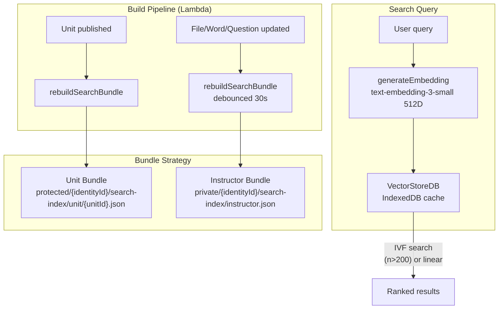

# Search Architecture

_Created: June 2026_

Unified search across all content types — one search bar in the app header, one code path, one embedding dimension, highlights preserved everywhere.

---

## Architecture Overview



## Current State (June 2026)

| What | Status |
|------|--------|
| S3 embeddings migration | ✅ Complete — `embeddingStorage.ts`, schema updated |
| FileManager semantic search | ⚠️ Broken — `performSemanticSearch` calls `performSimpleTextSearch`, never the vector store |
| Chat `executeSearchContent` | ⚠️ Partial — files use vector store, words/questions use keyword-only; missing units |
| Embedding dimensions | ❌ Inconsistent — FileManager generates 1536D, `executeSearchContent` fallback generates 512D |
| Unit plain text | ❌ Missing — not written to S3 on publish; full-text search on unit body not possible |
| Global search bar | ❌ Not built — search only in FileManager and Chat |
| Sections searchable | ❌ Not implemented |

---

## Design Decisions

### 1. Role-Scoped Embedding Bundles (not per-item files)

Rather than loading one S3 file per item (300+ requests on cold start), bundles collapse all vectors for a given scope into a single JSON file.

**Why per-item is bad**: A learner enrolled in 3 sections with 10 units each, 30 words per unit, 15 questions per unit = ~1,350 items × 1 S3 request each. With the 6-connection browser cap, sequential batches of 6 = ~225 round trips before cosine similarity starts.

**Bundle strategy:**

```
# Learner bundles — scoped to a unit, readable by enrolled students
protected/{unit.identityId}/search-index/unit/{unitId}.json
```
Contains the embeddings for that unit's words, questions, and attached files — only what's in the unit. Learners download one bundle per unit they're working on.

`unit.identityId` is the identity of the unit's **creator** (already on the DynamoDB `Unit` record the learner has fetched). The learner doesn't need to know or care which instructor is teaching them — they just use `unit.identityId` from the record. One unit → one bundle path, regardless of how many sections reference that unit.

> **Co-authorship note**: The current `Unit` model is single-owner (`allow.owner()` only; `allow.group("Instructors").to(["create"])` lets instructors create but not edit each other's units). If co-authorship is ever added and `identityId` becomes ambiguous, switch the bundle path to `public/search-index/unit/{unitId}.json` with a signed write-only policy so the Lambda writes it and any authenticated user can read it.

```
# Instructor bundle — their own full content library
private/{identityId}/search-index/instructor.json
```
Contains ALL the instructor's files, words, questions, and units — including drafts and unassigned content not visible to students. Private access level, owner only.

**Access levels match Cognito auth:**
- `protected/` — any authenticated user can read with the correct `identityId` (the unit creator's). Learners assigned that unit can read its bundle.
- `private/` — only the owner. Instructor searches their private bundle; learners never see it.

**Bundle format:**

```typescript
interface SearchBundle {
  version: number;          // Unix timestamp — compare against local cache
  unitId?: string;          // Present on unit bundles
  items: BundleItem[];
}

interface BundleItem {
  id: string;               // DynamoDB record ID
  type: 'unit' | 'file' | 'word' | 'question';
  text: string;             // Short text snippet for keyword fallback + display
  embedding: number[];      // 512D vector
  meta: {
    name?: string;          // filename, phrase, unit name
    mimeType?: string;      // files only
    page?: number;          // files only — multi-page
  };
}
```

**Cold start per learner**: Load bundle for the current unit (one request). Cache in IndexedDB keyed by `unitId + version`. On next visit, compare `version` against cached — only re-download if the Lambda has rebuilt it.

**Cold start per instructor**: Load `instructor.json` (one request). Same IndexedDB caching.

**Bundle rebuild trigger**: After any publish event for a unit, a background Lambda reads `plain.txt`, generates the embedding, saves the per-item file, then rebuilds `unit/{unitId}.json`. After any file/word/question update, it debounces 30s then rebuilds `instructor.json`. Both are fire-and-forget. For non-unit content types the Lambda reads the existing per-item embedding files (no re-generation needed unless the content changed).

**Multi-page files**: Each page is its own `BundleItem` with `meta.page`. The `id` is `{fileId}-p{page}`. On search, results from the same file are grouped and the highest-scoring page is surfaced.

### 2. ANN Pre-Indexing via IVF (Inverted File Index)

Rather than exhaustive linear scan at query time, the **`rebuildSearchBundle` Lambda pre-organizes vectors into clusters** so the client only searches a small fraction of the corpus.

#### Why IVF, not HNSW or LSH

| Algorithm | Lambda build cost | Client search | Serialization |
|-----------|------------------|---------------|---------------|
| **IVF (k-means)** | O(n·k·iterations) — ~150ms for 2000 items | O(√n) — search top-2 clusters only | Compact: K centroids + int8 assignment array |
| HNSW | Complex graph build, ~500ms+ | O(log n), best quality | Large graph structure, hard to diff/cache |
| LSH | Fast | High recall needs many hash tables → large payload | Multiple hash tables needed |

IVF fits this use case: the Lambda already re-runs when content changes, has ample CPU headroom, and the serialized output is a flat structure the client can use without any graph traversal library.

#### How it works

**Lambda (build time):**
1. Collect all 512D vectors for the bundle
2. **Decide strategy**: if `n > IVF_THRESHOLD` (currently 200), run k-means; otherwise set `strategy: 'linear'` and skip clustering
   - Breakeven: IVF overhead (K centroid dot products + cluster filter) costs more than a straight linear scan when K ≈ n/4. Empirically, n=200 → K=15 clusters averaging 13 items each — linear scan wins below this point
   - The Lambda knows n at build time; the client never needs to re-derive this
3. If IVF: cluster into K = `Math.ceil(Math.sqrt(n))` centroids (Lloyd's algorithm, ~20 iterations); assign each item its nearest centroid index
4. Write `index.strategy` into the bundle — client reads this flag, no threshold logic on the client side

**Client (query time):**
1. Read `bundle.index.strategy` — `'linear'` or `'ivf'`
2. If `'linear'`: exhaustive cosine scan across all items (n ≤ 200, fast enough)
3. If `'ivf'`: dot product against K centroids, take top `nProbe` clusters, scan only those items
4. Return top-K results

For an instructor bundle with 2000 items and K ≈ 45 clusters (avg 44 items/cluster), `nProbe=2` searches ~88 items instead of 2000 — **~23× speedup** with >95% recall at cosine threshold 0.3.

For learner bundles (~100 items per unit), the Lambda sets `strategy: 'linear'` — no cluster data is serialized, bundle payload stays small, and the client executes a simple loop.

#### Updated bundle format

```typescript
interface SearchBundle {
  version: number;
  unitId?: string;
  items: BundleItem[];
  index: {
    strategy: 'linear' | 'ivf';  // set by Lambda — client reads, never computes
    // IVF-only fields (omitted when strategy === 'linear')
    k?: number;                  // number of clusters
    nProbe?: number;             // recommended probe count (Lambda-tuned per bundle)
    centroids?: number[][];      // k × 512 (f32)
    assignments?: number[];      // items[i] → cluster index
  };
}
```

`index` is always present (never optional) — the `strategy` field is the canonical routing signal. Old clients that predate this field fall back to linear scan by checking `!bundle.index`.

#### Lambda: strategy selection + k-means (TypeScript, no dependencies)

```typescript
const IVF_THRESHOLD = 200; // Lambda-owned constant — client never sees this

function buildIndex(
  vectors: number[][],
): SearchBundle['index'] {
  if (vectors.length <= IVF_THRESHOLD) {
    return { strategy: 'linear' }; // client gets a clean signal, no threshold math needed
  }

  const k = Math.ceil(Math.sqrt(vectors.length));
  // nProbe scales with k: probe ~5% of clusters, minimum 2
  const nProbe = Math.max(2, Math.ceil(k * 0.05));
  const { centroids, assignments } = runKMeans(vectors, k);
  return { strategy: 'ivf', k, nProbe, centroids, assignments };
}

function runKMeans(vectors: number[][], k: number, iterations = 20) {
  const centroids = initCentroidsKMeansPlusPlus(vectors, k);
  const assignments = new Int32Array(vectors.length);

  for (let iter = 0; iter < iterations; iter++) {
    // Assign step
    for (let i = 0; i < vectors.length; i++) {
      let bestCluster = 0, bestSim = -Infinity;
      for (let c = 0; c < k; c++) {
        const sim = dotProduct(vectors[i], centroids[c]);
        if (sim > bestSim) { bestSim = sim; bestCluster = c; }
      }
      assignments[i] = bestCluster;
    }
    // Update step — recompute centroids as mean of assigned vectors
    for (let c = 0; c < k; c++) {
      const members = vectors.filter((_, i) => assignments[i] === c);
      if (members.length === 0) continue;
      centroids[c] = meanVector(members);
      normalizeInPlace(centroids[c]); // unit sphere for cosine via dot product
    }
  }
  return { centroids, assignments: Array.from(assignments) };
}
```

All vectors are L2-normalized before clustering. `IVF_THRESHOLD` and `nProbe` scaling live **only in the Lambda** — if the breakeven point changes (e.g. after profiling on real bundles), update one constant in one file.

#### Client-side IVF search utility

```typescript
// src/utils/searchBundles.ts

export function search(
  query: number[],
  bundle: SearchBundle,
  topK = 10,
): BundleItem[] {
  // Strategy is pre-computed by the Lambda — client reads, never decides
  if (!bundle.index || bundle.index.strategy === 'linear') {
    return linearSearch(query, bundle.items, topK);
  }

  const { centroids, assignments, nProbe = 2 } = bundle.index;

  // Step 1: rank centroids (nProbe comes from the bundle — Lambda-tuned)
  const centroidScores = centroids!.map((c, i) => ({ i, score: dotProduct(query, c) }));
  centroidScores.sort((a, b) => b.score - a.score);
  const probeClusters = new Set(centroidScores.slice(0, nProbe).map(c => c.i));

  // Step 2: search candidate items in probed clusters
  const candidates = bundle.items
    .filter((_, i) => probeClusters.has(assignments![i]))
    .map(item => ({ item, score: dotProduct(query, item.embedding) }));

  candidates.sort((a, b) => b.score - a.score);
  return candidates.slice(0, topK).map(c => c.item);
}
```

### 3. Single Embedding Dimension: 512

All new embeddings use **512 dimensions** from `text-embedding-3-small`. This is the dimension already stored on DynamoDB model records. 1536D was only ever used in `FileManager2.performVectorSearch` — those items need to be regenerated.

**Enforcement**: Export a single constant:

```typescript
// app/actions/embeddings.ts
export const EMBEDDING_DIMENSIONS = 512;
export const EMBEDDING_MODEL = 'text-embedding-3-small';
```

Every callsite imports this. No hardcoded numbers.

### 2. One Search Function

Remove the two parallel search paths in `executeSearchContent`. The single path:

1. Generate query embedding (512D)
2. Load target embeddings from S3 via `loadEmbedding()` (cached in IndexedDB / `CourseVectorStore`)
3. Cosine similarity in worker
4. Keyword fallback for items without embeddings (score = TF-IDF, not hardcoded 0.7)
5. Merge and rank

### 3. Unit Plain Text on Publish

On every `publishContent()` call in `unitContentStorage.ts`, also write plain text alongside the Lexical JSON:

```
protected/{identityId}/units/{unitId}/published.json   ← Lexical JSON (existing)
protected/{identityId}/units/{unitId}/plain.txt        ← NEW: plain text for embeddings/search
```

**Full pipeline for unit embeddings:**

```
publishContent()
  → writes plain.txt to protected/{identityId}/units/{unitId}/plain.txt
  → triggers rebuildSearchBundle Lambda (fire-and-forget)

rebuildSearchBundle Lambda
  → reads plain.txt (one S3 GET — no DynamoDB Section queries, no Lexical parsing)
  → calls OpenAI text-embedding-3-small (512D)
  → saves vector to private/{identityId}/embeddings/unit/{unitId}.json
  → updates Unit.embedding metadata in DynamoDB (model, dimensions, version, wordCount)
  → assembles search bundle from all per-item embeddings
  → writes bundle to protected/{unit.identityId}/search-index/unit/{unitId}.json
```

**Why `plain.txt` as the embedding source (not Lexical JSON):**
- Lambda doesn't need a Lexical parser — plain string in, vector out
- No DynamoDB `Section.list()` query — eliminates N+1 on publish
- `plain.txt` is already the text a learner reads; embedding it = embedding the learner experience
- Reusable by keyword search, TF-IDF, and any future full-text index

**`generateUnitEmbedding` in `embeddingGenerator.jsx` becomes manual/force-only.** The publish→Lambda path is the primary path. Client-side generation is retained for admin workflows ("regenerate all embeddings" button) and development.

### 4. Global Search Bar in `MainToolbar`

One `<SearchBar>` component in `MainToolbar.jsx`. Updates `?q=` in the URL as the user types (debounced 300ms). A `Popper` dropdown shows grouped results. Clicking navigates to the item's page with `?q=` preserved.

### 5. FileManager Highlighting via URL

FileManager reads `useSearchParams().get('q')` as its initial search term. The file filter bar still works for file-type narrowing within the manager. When the user arrives from a global search, the matching file is already highlighted.

---

## S3 Path Additions

```
# Unit plain text — written on every publish, used to populate bundles
protected/{identityId}/units/{unitId}/plain.txt

# Per-item embeddings — already implemented, source of truth for vectors
private/{identityId}/embeddings/unit/{unitId}.json
private/{identityId}/embeddings/word/{wordId}.json
private/{identityId}/embeddings/question/{qId}.json
private/{identityId}/embeddings/file/{fileId}.json     ← multi-page

# Search bundles — built by Lambda, downloaded by client (new)
# unit.identityId is the unit creator's identity (on the DynamoDB Unit record)
protected/{unit.identityId}/search-index/unit/{unitId}.json  ← learner scope
private/{identityId}/search-index/instructor.json            ← instructor scope
```

Per-item embedding files remain as the write target (Lambda saves there after generation). The search bundles are a **read-optimized projection** assembled from the per-item files — so the write path is unchanged, only the read path changes.

---

## Phase 1: Fix Broken Paths

### 1.1 `EMBEDDING_DIMENSIONS` constant

**File**: `app/actions/embeddings.ts`

Export `EMBEDDING_DIMENSIONS = 512` and `EMBEDDING_MODEL = 'text-embedding-3-small'`. Replace all hardcoded values in:
- `FileManager2.performVectorSearch` (currently 1536)
- `executeSearchContent` fallback (currently 512 — already correct)
- `generateEmbedding` calls everywhere

Any embeddings stored at 1536D should be regenerated; `EmbeddingInfo.dimensions` on the DynamoDB record is the source of truth for detecting stale vectors.

### 1.2 Wire `performVectorSearch` to the search UI

**File**: `src/components/Editor3/components/FileManager2.jsx`

In `performSemanticSearch`, call `performVectorSearch(query)` when `vectorStoreReady` is true:

```javascript
const performSemanticSearch = React.useCallback(async (query) => {
  if (!query.trim()) { setSemanticResults(null); return; }
  setSearching(true);
  try {
    if (vectorStoreReady) {
      const { results } = await performVectorSearch(query, { topK: 50 });
      // Map results → semanticResults format {[fileId]: {maxScore, pages}}
      const mapped = {};
      results.forEach(r => {
        const fid = r.fileId || r.metadata?.fileId;
        if (!fid) return;
        if (!mapped[fid] || r.similarity > mapped[fid].maxScore) {
          mapped[fid] = { maxScore: r.similarity, pages: [] };
        }
        mapped[fid].pages.push({ page: r.page, score: r.similarity, text: r.text });
      });
      setSemanticResults(Object.keys(mapped).length > 0 ? mapped : null);
    } else {
      performSimpleTextSearch(query); // fallback while vector store loads
    }
  } finally {
    setSearching(false);
  }
}, [vectorStoreReady, performVectorSearch, performSimpleTextSearch]);
```

### 1.3 Fix `executeSearchContent` words/questions path

**File**: `src/utils/chatTools.js`

Replace hardcoded `0.7` keyword score with a normalized TF-IDF score:

```javascript
function keywordScore(query, text) {
  const terms = query.toLowerCase().split(/\s+/).filter(t => t.length > 2);
  if (terms.length === 0) return 0;
  const matched = terms.filter(t => text.toLowerCase().includes(t));
  return (matched.length / terms.length) * 0.75; // max 0.75, below vector matches
}
```

Add pagination to `.list()` calls to avoid the 100-record silent limit:

```javascript
async function listAll(model) {
  const items = [];
  let nextToken = undefined;
  do {
    const { data, nextToken: next } = await client.models[model].list({ nextToken });
    items.push(...(data ?? []).filter(Boolean));
    nextToken = next;
  } while (nextToken);
  return items;
}
```

---

## Phase 2: Unit Plain Text + Unit Search

### 2.1 Write plain text on publish

**File**: `src/utils/unitContentStorage.ts`

```typescript
import { extractTextFromLexical } from './extractTextFromLexical';

export async function publishContent(
  identityId: string,
  unitId: string,
  contentVersion: number,
): Promise<void> {
  const draftResult = await downloadData({ path: draftKey(identityId, unitId) }).result;
  const draftContent = await draftResult.body.text();

  // Extract plain text for search index
  const lexicalJSON = JSON.parse(draftContent);
  const plainText = extractTextFromLexical(lexicalJSON);

  await Promise.allSettled([
    // existing: published JSON
    uploadData({ path: publishedKey(identityId, unitId), data: draftContent, options: { contentType: 'application/json' } }).result,
    // existing: history snapshot
    uploadData({ path: historyKey(identityId, unitId, contentVersion), data: draftContent, options: { contentType: 'application/json' } }).result,
    // NEW: plain text for search
    uploadData({ path: plainTextKey(identityId, unitId), data: plainText, options: { contentType: 'text/plain' } }).result,
  ]);
}

function plainTextKey(identityId: string, unitId: string): string {
  return `protected/${identityId}/units/${unitId}/plain.txt`;
}
```

### 2.2 `extractTextFromLexical` shared utility

**File**: `src/utils/extractTextFromLexical.ts` (new)

Extract the function already in `amplify/functions/gamification/handler.ts` (`extractTextFromLexicalJSON`) into a shared utility importable by both the browser and Lambda. The Lambda can then import from `src/utils/` directly (already resolved via `tsconfig.json` paths).

### 2.3 Add `units` type to `executeSearchContent`

**File**: `src/utils/chatTools.js`

```javascript
if (type === 'all' || type === 'units') {
  const units = await listAll('Unit');
  const publishedUnits = units.filter(u => u.status === 'PUBLISHED' && u.identityId);

  const unitsWithEmbeddings = publishedUnits.filter(u => u.embedding?.version);
  const unitsWithoutEmbeddings = publishedUnits.filter(u => !u.embedding?.version);

  if (unitsWithEmbeddings.length > 0) {
    // Load embeddings from S3, then calculate similarities
    const unitVectors = await Promise.all(
      unitsWithEmbeddings.map(u => loadEmbeddingVectors(u.identityId, 'unit', u.id))
    );
    const unitResults = unitsWithEmbeddings
      .map((u, i) => ({
        type: 'unit', id: u.id, name: u.name, description: u.description,
        similarity: unitVectors[i] ? cosineSim(queryEmbedding, unitVectors[i][0]) : 0,
      }))
      .filter(r => r.similarity > 0.3);
    results.push(...unitResults);
  }

  // Keyword fallback on name/description for units without embeddings
  unitsWithoutEmbeddings.forEach(u => {
    const text = `${u.name} ${u.description || ''}`;
    const score = keywordScore(query, text);
    if (score > 0) results.push({ type: 'unit', id: u.id, name: u.name, similarity: score });
  });
}
```

### 2.4 Add `units` and `sections` to chat tool schema

**File**: `amplify/functions/chatStream/handler.ts`

```typescript
type: z.enum(["all", "files", "words", "questions", "units", "sections"])
  .optional()
  .describe('Type of content to search'),
```

---

## Phase 3: Global Search Bar

### 3.1 `SearchContext`

**File**: `src/context/searchContext.tsx` (new)

```typescript
interface SearchState {
  query: string;
  setQuery: (q: string) => void;
  results: SearchResult[];
  searching: boolean;
}

interface SearchResult {
  type: 'unit' | 'file' | 'word' | 'question' | 'section';
  id: string;
  title: string;
  subtitle?: string;        // definition, file type, section name...
  similarity: number;
  navigateTo: string;        // URL to navigate on click
  highlightTerm?: string;   // query fragment to highlight at destination
}
```

The context runs `executeSearch(query)` (debounced 300ms) and writes `?q=` to the URL.

### 3.2 `<GlobalSearchBar>` component

**File**: `src/components/GlobalSearchBar.tsx` (new)

An `InputBase` with a search icon that lives in `MainToolbar.jsx` between the hamburger menu and the right-side icons. Renders a `Popper` results dropdown grouped by type:

```
┌─────────────────────────────────────────┐
│ 🔍 japanese greetings          [×]      │
├─────────────────────────────────────────┤
│ UNITS                                   │
│   Japanese Greetings - Unit 1      0.94 │
│   Japanese Verbs - Unit 3          0.72 │
├─────────────────────────────────────────┤
│ FILES                                   │
│   greetings-audio.mp3              0.88 │
│   hiragana-chart.pdf        p.2    0.81 │
├─────────────────────────────────────────┤
│ VOCABULARY                              │
│   こんにちは · Hello (daytime)     0.85 │
└─────────────────────────────────────────┘
```

Keyboard navigation: arrow keys move focus, Enter navigates.

### 3.3 URL-driven highlighting

On navigation from search results, append `?q={term}` to the destination URL. Every page that renders searchable content reads `useSearchParams().get('q')` and highlights matches.

**FileManager**: Replace its internal `search` state initializer to seed from `searchParams.get('q')`:

```javascript
const [search, setSearch] = React.useState(() => {
  if (typeof window !== 'undefined') {
    return new URLSearchParams(window.location.search).get('q') ?? '';
  }
  return '';
});
```

All downstream highlighting (`FileRowComponent`, `SelectedFileDetailsPanel`) continues unchanged — they already receive `search` as a prop.

**Units page** (`app/[locale]/units/page.jsx`): Add a `useMemo` that filters and highlights unit cards when `?q=` is present.

**Dictionary page**: Read `?q=` and pre-populate the word/question filter.

---

## Files to Create / Modify

| File | Action | Summary |
|------|--------|---------|
| `app/actions/embeddings.ts` | Modify | Export `EMBEDDING_DIMENSIONS`, `EMBEDDING_MODEL` constants |
| `src/utils/extractTextFromLexical.ts` | **Create** | Move `extractTextFromLexicalJSON` from gamification-engine.ts here |
| `src/utils/unitContentStorage.ts` | Modify | Write `plain.txt` on publish |
| `src/utils/searchBundles.ts` | **Create** | `loadUnitBundle()`, `loadInstructorBundle()`, `ivfSearch()`, `linearSearch()` — IndexedDB version check + S3 fallback; ANN probe count configurable |
| `amplify/functions/rebuildSearchBundle/` | **Create** | Lambda: reads `plain.txt` → generates embedding → saves per-item file; assembles `SearchBundle` **with IVF index** (k-means, K = √n, 20 iterations); writes to `search-index/unit/{unitId}.json` or `search-index/instructor.json`. Triggered by unit publish + file/word/question updates, **and by direct Lambda invocation from the admin reindex script** |
| `scripts/rebuild-search-bundles.ts` | **Create** | Admin CLI: pages all Unit/File/Word/Question records via DynamoDB, groups by `owner` (identityId), fans out one Lambda invocation per instructor identity; shows per-identity progress and final summary. Usage: `npm run search:reindex` |
| `src/context/fileContext.jsx` | Modify | Replace per-item S3 load loop with `loadUnitBundle()` (learner) or `loadInstructorBundle()` (instructor) |
| `src/utils/chatTools.js` | Modify | Add `units` type, fix pagination, fix keyword score, remove 1536D |
| `src/components/Editor3/components/FileManager2.jsx` | Modify | Wire `performVectorSearch` to semantic mode, read `?q=` from URL |
| `src/context/searchContext.tsx` | **Create** | Global search state |
| `src/components/GlobalSearchBar.tsx` | **Create** | Header search component |
| `src/components/MainToolbar.jsx` | Modify | Add `<GlobalSearchBar>` |
| `app/providers.tsx` | Modify | Wrap with `SearchContext.Provider` |
| `amplify/functions/chatStream/handler.ts` | Modify | Add `units`, `sections` to type enum |
| `src/utils/embeddingGenerator.jsx` | Modify | Demote `generateUnitEmbedding` to manual/force path only; add note that publish→Lambda is now the primary embedding trigger |

---

## Rollout Order

1. **`EMBEDDING_DIMENSIONS` constant** — breaks nothing, fixes future inconsistency
2. **`extractTextFromLexical` shared utility** — prerequisite for plain text on publish
3. **`unitContentStorage.ts` plain text write** — safe addition; also write `plain.txt` on every publish
4. **`rebuildSearchBundle` Lambda** — reads `plain.txt` for units (no Lexical parser, no Section queries), generates + saves embedding, assembles bundle **and runs k-means to build the IVF index** (K = ⌈√n⌉, 20 iterations, no npm dependency — pure TypeScript). Deployed before client uses bundles. Lambda accepts two invocation shapes:

   ```typescript
   // Event-driven (publish/update trigger)
   { source: 'unit-publish' | 'content-update', identityId: string, unitId?: string }

   // Admin full-reindex (from CLI script)
   { source: 'admin-reindex', identityId: string, force: boolean }
   // force=true: regenerate embeddings even if embedding version matches content hash
   // force=false: skip items whose per-item embedding file is fresh (no OpenAI call)
   ```

5. **`scripts/rebuild-search-bundles.ts` admin CLI** — deploys after Lambda; run once to backfill all existing content:

   ```
   npm run search:reindex              # all instructors, force=false (skip fresh embeddings)
   npm run search:reindex -- --force   # all instructors, regenerate all embeddings
   npm run search:reindex -- --user <identityId>  # single instructor
   ```

   Script logic:
   1. Scan `Unit` table (paginated) → collect all unique `owner` + `identityId` values
   2. For each identity: invoke `rebuildSearchBundle` Lambda asynchronously with `{ source: 'admin-reindex', identityId, force }`
   3. Poll Lambda execution status (via CloudWatch Logs or direct invocation `RequestResponse`) with a concurrency cap of 5 parallel invocations to avoid OpenAI rate limits
   4. Print per-identity result: items processed, embeddings generated vs skipped, bundle size, IVF strategy chosen
   5. Print final summary: total time, total tokens consumed (from Lambda response), any failures
5. **`embeddingGenerator.jsx`** — add comment demoting `generateUnitEmbedding` to manual/force path; add note pointing to Lambda as the primary trigger
6. **`searchBundles.ts` client utility** — `loadUnitBundle` / `loadInstructorBundle` with IndexedDB caching; `search()` reads `bundle.index.strategy` set by the Lambda — no threshold logic on the client
7. **`fileContext.jsx` switch to bundles** — replace per-item S3 loop; role-check determines which load path
8. **Fix `executeSearchContent`** — pagination, keyword score, add unit search, use bundle vectors
9. **Fix FileManager `performSemanticSearch`** — wire to actual vector store
10. **`SearchContext` + `GlobalSearchBar`** — additive, doesn't remove existing search
11. **FileManager `?q=` seeding** — test that existing highlight logic still works
12. **Dictionary + Units pages `?q=` highlighting** — polish

---

## Non-Goals

- **Per-learner search** — learners search only published content they have access to. The same `executeSearch` function works; it just queries `status: PUBLISHED` units. No separate index needed.
- **Server-side full-text search** (OpenSearch/Elasticsearch) — the current volume doesn't justify it. Client-side vector + keyword hybrid handles thousands of records well.
- **Search analytics / logging** — not in scope for this phase.
