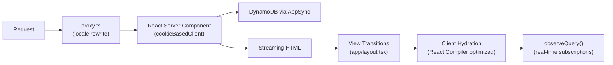

# SSR & Performance Reference

Next.js 16.2.1 with Turbopack, React Compiler, and Amplify Gen 2 server-side data access.

---

## Request Flow



---

## Current Configuration

| Feature | Status | Config Location |
|---------|--------|----------------|
| Turbopack (default bundler) | ✅ | `next.config.mjs` |
| Turbopack FS Cache (dev) | ✅ | `experimental.turbopackFileSystemCacheForDev` |
| React Compiler | ✅ | `reactCompiler: true` in `next.config.mjs` |
| `proxy.ts` (replaces middleware) | ✅ | Project root |
| `loading.tsx` files | ✅ | All server routes |
| View Transitions | ✅ | `app/[locale]/layout.tsx` |
| Client instrumentation | ✅ | `instrumentation-client.ts` |
| Server instrumentation | ✅ | `instrumentation.ts` (OpenTelemetry/Phoenix) |
| ISR caching | ✅ | `/skills` (300s), `/leaderboard` (60s) |
| Cache Components / `"use cache"` | ⛔ | Incompatible with `next-intl` layout (see below) |

---

## Server-Side Data Access (Amplify Gen 2)

### Setup Files

**Server Runner** — `src/utils/amplifyServerUtils.ts`:
```typescript
import { createServerRunner } from '@aws-amplify/adapter-nextjs';
import outputs from '@/amplify_outputs.json';
export const { runWithAmplifyServerContext } = createServerRunner({ config: outputs });
```

**Cookie-Based Data Client** — `src/utils/amplifyServerClient.ts`:
```typescript
import { generateServerClientUsingCookies } from '@aws-amplify/adapter-nextjs/data';
import { cookies } from 'next/headers';
import outputs from '@/amplify_outputs.json';
export const cookieBasedClient = generateServerClientUsingCookies({ config: outputs, cookies });
```

### What Works Server-Side

| Operation | Server Component? | Notes |
|---|:---:|---|
| `.get(id)` / `.list({ filter })` | ✅ | Standard CRUD reads |
| `.graphql({ query })` | ✅ | Raw GraphQL |
| `.create()` / `.update()` / `.delete()` | ✅ | Via Server Actions only |
| `.observeQuery()` / subscriptions | ❌ | WebSocket — browser only |
| S3 `getUrl()` / `uploadData()` | ❌ | Requires browser Storage API |

### Server Component Example

```tsx
import { cookieBasedClient } from '@/utils/amplifyServerClient';

export default async function GradePage({ params }) {
  const { id } = await params;
  const { data: grade } = await cookieBasedClient.models.Grade.get({ id });
  return <GradedWorkbookViewer grade={grade} />;
}
```

---

## RSC Pages (Server-Rendered)

| Route | Strategy | Notes |
|-------|----------|-------|
| `instructor/grade/[id]` | RSC + `cookieBasedClient` | ~200ms TTFB vs ~2s client-side |
| `profile/[username]` | RSC + NailedIt client island | Server redirect from `/profile` |
| `leaderboard` | ISR (60s revalidate) | Live subscription hydrates on client |
| `workbook/[id]` | RSC + `@lexical/headless` + `linkedom` | Content visible before hydration |
| `skills` | ISR (300s revalidate) | Client hydration for interactivity |

---

## Server Actions

All AI/generation calls route through Server Actions in `app/actions/`:

| Action | File | Wired To |
|--------|------|----------|
| Chat streaming | `chat.ts` | ChatSidebar, RecordingStudio3 |
| Grading | `grading.ts` | AnswerComponent, CustomAnswerComponent, RecordingStudio2 |
| Generation | `generate.ts` | EnhancedGenerators, FileManager2, RecordingStudio3 |
| Feedback | `feedback.ts` | unitContext `summarizeGradeFeedback` |
| Moderation | `moderate.ts` | `moderateContent.jsx` |
| Practice Drill | `drill.ts` | `usePracticeDrill.ts` |
| Embeddings | `embeddings.ts` | embeddingGenerator, FileManager2, chatTools |
| Gamification | `gamification.ts` | unitContext, SkillTree |
| Section | `section.ts` | MainToolbar `joinSection` |
| Peer Review | `peerReview.ts` | Review page AI mentions |
| Storage | `storage.ts` | File operations |

---

## Key Pitfalls

**`redirect()` in Server Components**: Must be called OUTSIDE `try/catch` — it throws a `NEXT_REDIRECT` error internally.

**Amplify Gen 2 server auth**: Use `session.tokens?.idToken?.payload?.sub`, NOT `session.userSub` (doesn't exist in server context).

**Lexical server rendering**: Import `HorizontalRuleNode` from `@lexical/extension`, NOT `@lexical/react/LexicalHorizontalRuleNode` (pulls in React hooks).

**`"use cache"` incompatibility**: `next-intl` requires dynamic `await params` + `getMessages()` in the locale layout, which conflicts with PPR's requirement that all dynamic access be inside `<Suspense>`. Use ISR (`export const revalidate`) instead.

---

## Skeleton Variants (AppSkeleton.jsx)

| Variant | Used By |
|---------|---------|
| `page` | `app/providers.tsx` AuthGate |
| `sections` | sections page |
| `cards` | squads page |
| `detail` | unit, review, squad detail pages |
