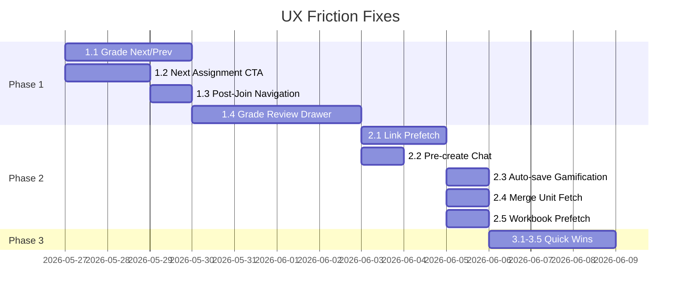

# UX Friction Audit — Implementation Plan

> Generated May 24, 2026 from full user journey analysis across Learner, Instructor, and Admin roles.

## Summary

This plan addresses 15 identified opportunities to reduce clicks, eliminate unnecessary page navigations, and remove loading friction. Prioritized by user impact × frequency of occurrence.

---

## Phase 1: High-Impact (Tier 1)

### 1.1 Grade Review Next/Previous Navigation

**Problem**: Instructors grading sequentially must bounce back to section page between every student (3 clicks, 2 full navigations per student).

**Solution**: Add Next/Previous student controls to the grade review page.

**Files to modify**:
- `app/[locale]/instructor/grade/[id]/GradeActions.tsx` — add nav controls
- `app/[locale]/section/[id]/page.jsx` (~L1125) — pass ordered grade IDs as query params when navigating to grade page

**Implementation**:
1. When instructor clicks a grade cell, encode `gradeIds` array (current section's grade sequence for that assignment) and `currentIndex` as URL search params
2. Grade page reads params and renders ← / → buttons (+ keyboard `ArrowLeft`/`ArrowRight`)
3. Next/Prev uses `router.replace` to swap grade ID without full remount
4. After override/save, auto-advance to next unreviewed grade (opt-in toggle)

**Data available**: Section page already has full grade map in context. No new queries needed.

**Estimated savings**: −2 clicks and −2 navigations per student × avg 25 students = **~50 fewer navigations per grading session**

---

### 1.2 "Next Assignment" CTA on Unit Completion

**Problem**: Learner finishes a workbook and has no path forward — must navigate back through sections to find next assignment (4 clicks, 3 navigations).

**Solution**: Add a "Next Assignment" button to the completion modal.

**Files to modify**:
- `src/components/Editor3/plugins/UnitCompletedPlugin.jsx` (~L261) — add Next button
- `src/context/unitContext.jsx` — expose `nextAssignment` computed value

**Implementation**:
1. UnitContext already has `sectionId` and assignment data
2. Compute `nextAssignment` = first incomplete assignment in same section with `dueDate` after current, sorted by due date
3. Completion modal renders "Next Assignment →" button that navigates to `/workbook/{nextId}`
4. If no next assignment exists, show "All caught up!" message with link back to section

**Data available**: Section assignments already loaded via SectionContext subscription.

**Estimated savings**: −3 clicks, −2 navigations per unit completion

---

### 1.3 Post-Join Navigation to New Section

**Problem**: After joining a section with a code, page reloads but user must manually find and navigate to the new section.

**Solution**: Return `sectionId` from join action and auto-navigate.

**Files to modify**:
- `app/actions/section.ts` (~L21-33) — return section ID on success
- `src/components/MainToolbar.jsx` (~L554-609) — replace reload with `router.push`

**Implementation**:
1. `joinSection` server action already creates/joins — add `sectionId` to return payload
2. On success in MainToolbar, `router.push(\`/\${locale}/section/\${sectionId}\`)` instead of `window.location.reload()`
3. SectionContext subscription will pick up new section automatically

**Estimated savings**: −1 click, −1 navigation, eliminates full page reload

---

### 1.4 Inline Grade Drawer (Alternative to Full Page)

**Problem**: Every grade cell click navigates away from section context entirely, losing the instructor's place in the gradebook.

**Solution**: Open grade review in a right-side drawer on the section page.

**Files to modify**:
- `app/[locale]/section/[id]/page.jsx` (~L1125) — add Drawer component
- New component: `src/components/GradeReviewDrawer.tsx`
- Reuse rendering logic from `app/[locale]/instructor/grade/[id]/GradeActions.tsx`

**Implementation**:
1. Grade cell click opens a MUI Drawer (width ~600px) instead of navigating
2. Drawer loads grade data inline (same query as grade page)
3. Next/Prev buttons cycle through visible grades in current filtered table
4. Keep full grade page route as deep-link fallback (e.g., for sharing URLs)
5. Drawer includes override controls already present in grade page

**Estimated savings**: −2 full navigations per grade review. Instructor keeps gradebook visible and scrolled to context.

---

## Phase 2: Medium-Impact (Tier 2)

### 2.1 Convert Navigation to Next.js `<Link>` for Prefetch

**Problem**: All high-traffic routes use MUI `Button href` or `router.push`, missing Next.js automatic route prefetch.

**Files to modify**:
- `app/[locale]/page.jsx` — dashboard cards (~L612, L637, L726, L836, L954)
- `app/[locale]/section/[id]/page.jsx` — workbook/grade links (~L1125, L2442)
- `app/[locale]/sections/page.jsx` — section cards (~L631)

**Implementation**:
1. Create a `PrefetchButton` wrapper that renders Next.js `<Link>` with MUI Button styling
2. Replace `Button href=` with `<PrefetchButton href=...>` on identified links
3. For dynamic routes, use `prefetch={true}` on high-probability targets (first 3 assignments visible)

**Estimated savings**: Eliminates 200-500ms perceived load time on every navigation from these pages

---

### 2.2 Pre-create Chat Session Post-Auth

**Problem**: First chat open has 1-3s delay while AssistantChat record is created.

**Files to modify**:
- `src/context/chatContext.jsx` (~L276)

**Implementation**:
1. After auth session is confirmed and subscription is active, check if user has any existing AssistantChat
2. If not, create one during idle (use `requestIdleCallback` or 3s timeout post-mount)
3. When user opens chat, session is ready immediately

**Estimated savings**: −1-3s first-open delay

---

### 2.3 Auto-save Gamification Settings

**Problem**: Gamification settings require explicit Save button click after every change.

**Files to modify**:
- `app/[locale]/section/[id]/settings/gamification/page.tsx` (~L241, L433)

**Implementation**:
1. Replace form submission with debounced auto-save (800ms, matching InlineGradeCell pattern)
2. Show "Saved" indicator on successful write, "Saving..." during debounce
3. Keep Save button visible but disabled when no pending changes (progressive disclosure)

**Estimated savings**: −1 click per settings change

---

### 2.4 Merge Redundant Unit Editor Server Fetch

**Problem**: Unit editor page.tsx calls `Unit.get()` twice (metadata + preview).

**Files to modify**:
- `app/[locale]/unit/[id]/page.tsx` (~L17)

**Implementation**:
1. Single `Unit.get()` with full selectionSet covering both metadata and content
2. Pass both pieces to client component as props

**Estimated savings**: −1 API call, −100-300ms page load

---

### 2.5 Workbook Content Prefetch from Dashboard

**Problem**: Clicking an assignment card from dashboard requires waiting for full workbook page load.

**Files to modify**:
- `app/[locale]/page.jsx` — assignment card rendering

**Implementation**:
1. Filter assignments to only incomplete ones (in-progress first, then unstarted), sorted by due date:
   ```javascript
   const prefetchTargets = assignments
     .filter(a => !a.complete)
     .sort((a, b) => {
       // In-progress before unstarted
       if (a.started && !b.started) return -1;
       if (!a.started && b.started) return 1;
       // Then by due date ascending
       return new Date(a.dueDate) - new Date(b.dueDate);
     })
     .slice(0, 3);
   ```
2. Use `router.prefetch(\`/\${locale}/workbook/\${assignmentId}\`)` for each `prefetchTarget` when cards render
3. Skip completed assignments entirely — learners rarely revisit them, and prefetch budget is better spent on likely next actions
4. Reuse the same incomplete-assignment filtering logic from 1.2's `nextAssignment` computation

**Estimated savings**: Near-instant workbook open from dashboard for the assignments users are most likely to click

---

## Phase 3: Quick Wins (Tier 3)

### 3.1 Keyboard Shortcuts for Grade Navigation

**Files**: `app/[locale]/instructor/grade/[id]/GradeActions.tsx`

- `←` Previous student grade
- `→` Next student grade  
- `Enter` Confirm override
- `Escape` Close/back

---

### 3.2 Bulk Grade Override

**Files**: `app/[locale]/section/[id]/page.jsx`

- Multi-select checkboxes on gradebook rows
- "Apply override to selected" action bar
- Pattern: similar to existing curve select-all at ~L1702

---

### 3.3 Editor Tab Labels/Tooltips

**Files**: `src/components/Editor3/components/TabsVerticalLeft.jsx` (~L184)

- Add text labels below icons on first visit (persisted via localStorage flag)
- Always show tooltip on hover
- Consider expanded mode toggle

---

### 3.4 Dashboard Completed Assignments CTA

**Files**: `app/[locale]/page.jsx` (~L489-510)

- Currently computes completed assignment data but renders nothing
- Add "Review" link → workbook with read-only grade view
- Add "Retry" link if retries are enabled

---

### 3.5 Inline Workbook Link in Gradebook Cells

**Files**: `app/[locale]/section/[id]/page.jsx` (~L1784)

- Learner sees grade score in table → add small icon button to open workbook directly
- Saves scrolling to assignment cards section

---

## Implementation Order



## Testing Strategy

| Phase | Test Type | Coverage |
|-------|-----------|----------|
| 1.1 | Vitest unit + Cypress E2E | Grade page renders nav controls, cycles correctly |
| 1.2 | Vitest unit + Storybook | Completion modal shows next assignment when available |
| 1.3 | Cypress E2E | Join flow navigates to section |
| 1.4 | Storybook + Cypress | Drawer opens, renders grade, cycles |
| 2.x | Lighthouse + manual | Prefetch reduces LCP, no regressions |
| 3.x | Storybook visual | UI additions render correctly |

## Metrics to Track

- **Clicks-to-task-completion** per flow (instrument with existing analytics)
- **Time-on-section-page** (should decrease as users spend less time re-finding context)
- **Grading session duration** (should decrease with sequential nav)
- **Workbook-open latency** (should decrease with prefetch)
- **Chat first-response time** (should decrease with pre-creation)

## Dependencies & Risks

| Risk | Mitigation |
|------|-----------|
| Grade drawer increases section page bundle size | Lazy-load drawer component with `dynamic()` |
| Prefetch causes excess API calls for large rosters | Limit to viewport-visible cards only |
| Auto-save gamification conflicts with concurrent edits | Use `_version` optimistic locking (already in place) |
| Next assignment computation stale if assignments change mid-session | Use subscription data from SectionContext (real-time) |
