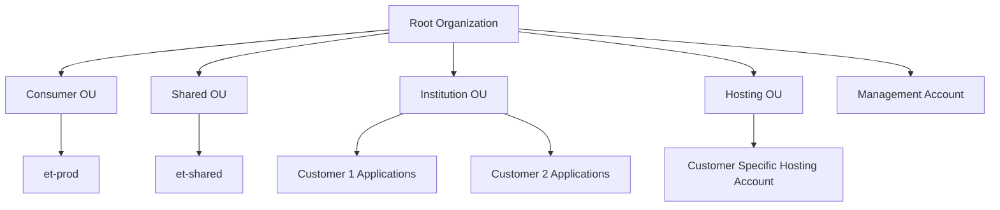
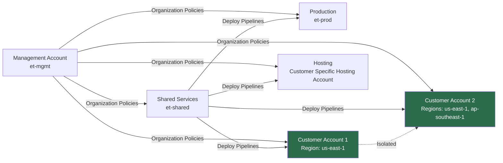
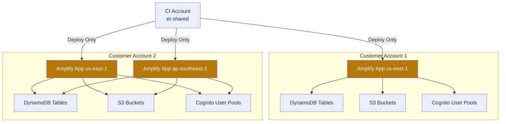

# AWS Account Architecture & Governance

## Overview

This document describes the multi-account AWS architecture, security posture, data governance, and compliance frameworks implemented across the organization.

## Account Structure

### Organizational Units (OUs)

The AWS Organization is structured into the following Organizational Units:



### Account Inventory

#### Management Account
- **Account Name**: et-mgmt
- **Account ID**: 521459372895
- **Purpose**: AWS Organization management, billing consolidation, organizational policies
- **Regions**: us-east-1

#### Production Accounts

##### Consumer OU
- **Account Name**: et-prod
- **Account ID**: 759854655984
- **Purpose**: General consumer-facing production workloads, brand pages
- **Regions**: us-east-1

##### Shared Services OU
- **Account Name**: et-shared
- **Account ID**: 238809176525
- **Purpose**: CI/CD pipelines, shared services, cross-account deployment automation
- **Regions**: us-east-1

##### Institution OU (Customer Accounts)
The following accounts host isolated customer workloads:

- **Customer Account 1**
  - **Regions**: us-east-1
  - **Regional Configuration**: Amplify deployments per region
  
- **Customer Account 2**
  - **Regions**: us-east-1, ap-southeast-1
  - **Regional Configuration**: Multi-region Amplify deployments

##### Hosting OU
- **Account Name**: Customer Specific Hosting Account
- **Account ID**: 590183950866
- **Purpose**: Dedicated hosting workloads
- **Regions**: us-east-1

## Account Interconnection Architecture

### Cross-Account Access Patterns



### Customer Account Isolation

Customer accounts within the Institution OU are **logically isolated** from each other:

- ✅ **Network Isolation**: No VPC peering or direct connectivity between customer accounts
- ✅ **IAM Isolation**: No cross-account IAM role assumptions between customer accounts
- ✅ **Data Isolation**: Each account maintains separate data stores with no cross-account access
- ✅ **Deployment Isolation**: Independent Amplify applications per customer per region



## Security & Encryption

### Data Encryption

#### Encryption at Rest
All customer data is encrypted at rest using AWS managed services:

- **DynamoDB**: Encrypted using AWS KMS with customer-managed keys (CMK) or AWS managed keys
- **S3**: Server-Side Encryption (SSE) with AES-256 or AWS KMS
- **RDS/Aurora** (if applicable): Encrypted volumes using AWS KMS
- **EBS Volumes**: Encrypted using AWS KMS

#### Encryption in Transit
All data in transit is encrypted using industry-standard protocols:

- **HTTPS/TLS 1.2+**: All API Gateway and Amplify endpoints
- **VPC Endpoints**: AWS service communication via private networking
- **AppSync**: GraphQL APIs served over HTTPS only

#### End-to-End Encryption

**Important Distinction**: While AWS Amplify provides comprehensive encryption at rest and in transit, it does **not** implement end-to-end encryption (E2EE) by default in the same manner as messaging applications like Signal or WhatsApp.

**Current Encryption Model**:
```
Client Device → [TLS 1.2+] → AWS Services (decrypt) → [KMS Encryption] → Storage
```

**What This Means**:
- ✅ Data is encrypted during transmission (TLS)
- ✅ Data is encrypted when stored (KMS)
- ⚠️ AWS services can decrypt and process data server-side
- ⚠️ Not true E2EE where only the client holds decryption keys

**Implementing True E2EE**:
For applications requiring true end-to-end encryption, you would need to:
1. Encrypt data client-side before sending to AWS
2. Store encryption keys only on client devices
3. AWS services store only encrypted payloads
4. Decrypt data only on authorized client devices

### Identity & Access Management

- **Cognito User Pools**: Customer-specific user authentication per account
- **IAM Policies**: Principle of least privilege across all accounts
- **MFA Enforcement**: Multi-factor authentication for privileged operations
- **Service Control Policies (SCPs)**: Organizational guardrails applied from management account

### Network Security

- **Security Groups**: Restrictive inbound/outbound rules
- **NACLs**: Network-level access controls
- **AWS WAF**: Web application firewall for public endpoints
- **CloudFront**: DDoS protection and edge security

## Data Governance & Compliance

### AWS Amplify Compliance Frameworks

AWS Amplify inherits compliance certifications from underlying AWS services. The following frameworks are applicable:

#### Global Compliance

| Framework | Status | Description |
|-----------|--------|-------------|
| **SOC 1/2/3** | ✅ Compliant | Service Organization Controls reports |
| **ISO 27001** | ✅ Certified | Information security management |
| **ISO 27017** | ✅ Certified | Cloud security controls |
| **ISO 27018** | ✅ Certified | Privacy in cloud computing |
| **ISO 9001** | ✅ Certified | Quality management systems |
| **PCI DSS Level 1** | ✅ Compliant | Payment card industry security |
| **GDPR** | ✅ Compliant | General Data Protection Regulation (EU) |
| **CCPA** | ✅ Compliant | California Consumer Privacy Act |

#### Educational & Research Compliance

**Critical for Institution OU Customer Accounts**:

| Framework | Status | Relevance |
|-----------|--------|-----------|
| **FERPA** | ✅ Supported | Family Educational Rights and Privacy Act (US) |
| **COPPA** | ✅ Supported | Children's Online Privacy Protection Act |
| **PPRA** | ✅ Supported | Protection of Pupil Rights Amendment |

#### FERPA Compliance Details

The **Family Educational Rights and Privacy Act (FERPA)** protects the privacy of student education records. AWS provides a FERPA-compliant environment through:

1. **AWS BAA for FERPA**: AWS offers a Business Associate Agreement for educational institutions
2. **Access Controls**: Strict IAM policies limiting who can access student data
3. **Audit Logging**: CloudTrail logs all data access for compliance auditing
4. **Data Residency**: Data stored in specified AWS regions (us-east-1, ap-southeast-1)
5. **Encryption**: All student records encrypted at rest and in transit

**Customer Account Configuration for FERPA**:
```json
{
    "dataClassification": "Student Educational Records",
    "encryptionRequired": true,
    "auditLogging": "enabled",
    "dataRetention": "as per institutional policy",
    "rightToDelete": true,
    "accessControls": "role-based with MFA"
}
```

#### COPPA Compliance (Children Under 13)

For applications serving children under 13:

- **Parental Consent**: Mechanisms to obtain verifiable parental consent
- **Data Minimization**: Collect only necessary information
- **No Third-Party Disclosure**: Student data not shared without consent
- **Right to Review**: Parents can review/delete child's information
- **Security**: Enhanced security measures for children's data

### Regional Compliance

#### United States
- **FERPA**: Educational records protection
- **COPPA**: Children's privacy (under 13)
- **HIPAA**: Healthcare data (via AWS BAA if applicable)
- **FedRAMP**: Federal compliance (available via AWS GovCloud)

#### Asia-Pacific
- **PDPA (Singapore)**: Personal Data Protection Act
- **APPI (Japan)**: Act on Protection of Personal Information
- **Privacy Act (Australia)**: Privacy and data protection

### Data Residency & Sovereignty

Customer accounts are configured with specific regional deployments:

- **Customer Account 1**: us-east-1 (US-based data residency)
- **Customer Account 2**: us-east-1, ap-southeast-1 (Multi-region deployment)

**Data Residency Guarantees**:
- Data does not leave specified regions unless explicitly configured
- Backups remain in the same region or specified backup region
- Cross-region replication only if explicitly enabled

## Monitoring & Auditing

### CloudTrail
- **All accounts**: API activity logging enabled
- **Log retention**: Centralized in management account
- **Integrity validation**: Log file integrity checking

### CloudWatch
- **Metrics**: Performance and operational metrics
- **Alarms**: Automated alerting for security/operational events
- **Logs**: Application and system logs centralized

### AWS Config
- **Compliance tracking**: Continuous compliance monitoring
- **Configuration history**: Track resource configuration changes
- **Compliance rules**: Automated compliance rule evaluation

### Security Hub
- **Centralized security**: Aggregated security findings
- **Compliance standards**: CIS AWS Foundations Benchmark
- **Integration**: Findings from GuardDuty, Inspector, Macie

## Best Practices & Recommendations

### For Educational Institutions

1. **Student Data Classification**
   - Classify data according to FERPA guidelines
   - Apply appropriate encryption and access controls
   - Implement data retention policies

2. **Access Management**
   - Enforce MFA for all administrative access
   - Regular access reviews and audits
   - Role-based access control (RBAC)

3. **Incident Response**
   - Documented incident response procedures
   - Regular security training for staff
   - Data breach notification procedures per FERPA (45-day requirement)

4. **Privacy by Design**
   - Minimize data collection
   - Clear privacy policies and user consent
   - Data retention and deletion procedures

## Architecture Decision Records

### Why Multi-Account Strategy?

1. **Blast Radius Containment**: Security incidents contained to single account
2. **Compliance Isolation**: Different compliance requirements per customer
3. **Cost Allocation**: Clear cost attribution per customer/project
4. **Resource Limits**: Avoid AWS service limits across accounts
5. **Regulatory Requirements**: Data sovereignty and regulatory isolation

### Why AWS Amplify?

1. **Rapid Development**: Accelerated full-stack development
2. **Built-in Security**: Authentication, authorization out of the box
3. **Scalability**: Auto-scaling serverless architecture
4. **Compliance**: Inherits AWS compliance certifications
5. **Cost-Effective**: Pay-per-use serverless model

## References

- [AWS Amplify Compliance](https://aws.amazon.com/compliance/services-in-scope/)
- [AWS FERPA Compliance](https://aws.amazon.com/compliance/ferpa/)
- [AWS Security Best Practices](https://aws.amazon.com/architecture/security-identity-compliance/)
- [FERPA Regulations (US Department of Education)](https://www2.ed.gov/policy/gen/guid/fpco/ferpa/index.html)
- [COPPA Guidelines (FTC)](https://www.ftc.gov/business-guidance/resources/complying-coppa-frequently-asked-questions)

## Document Maintenance

- **Last Updated**: January 14, 2026
- **Review Frequency**: Quarterly
- **Owner**: Infrastructure Team
- **Next Review**: April 14, 2026
