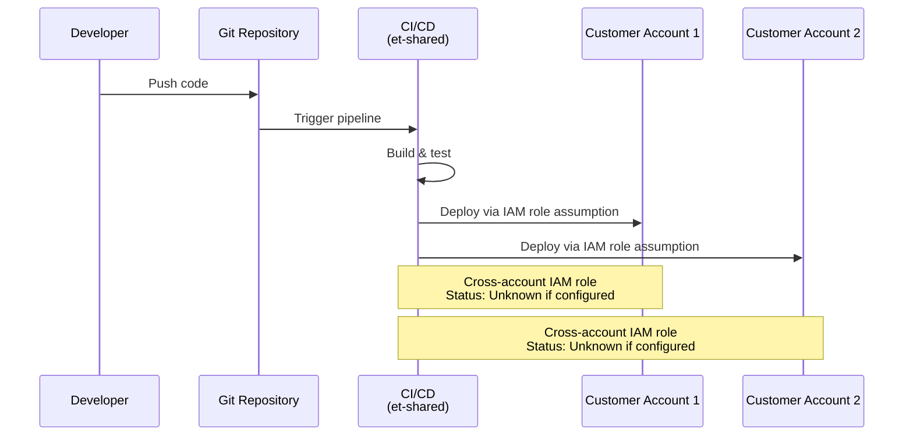
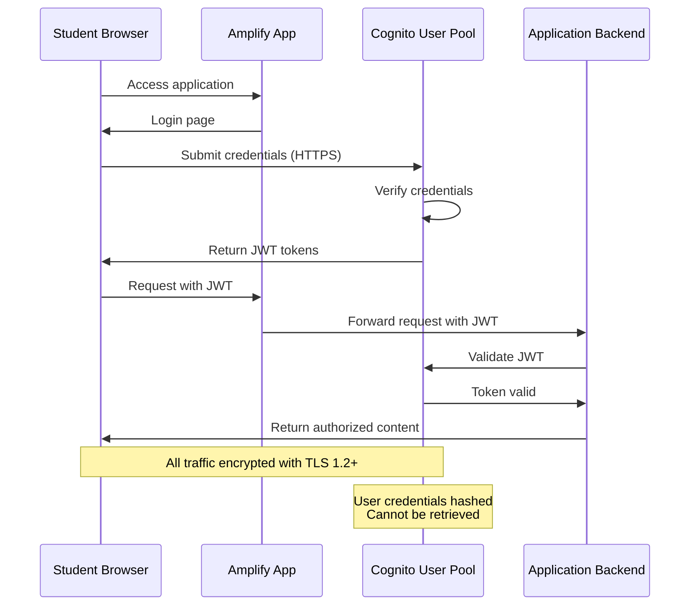
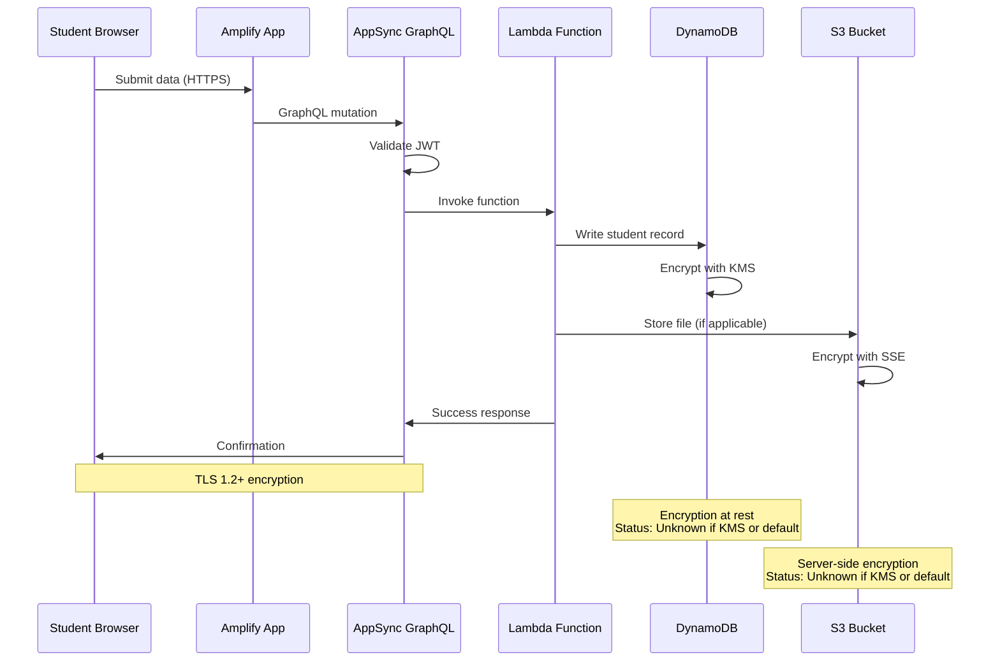
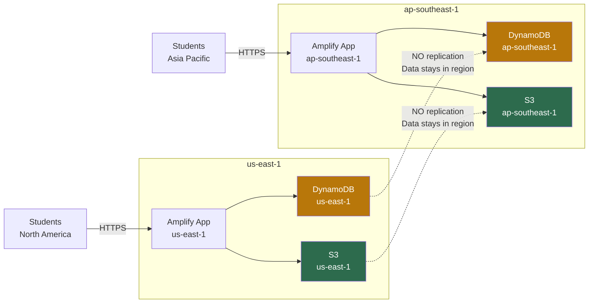
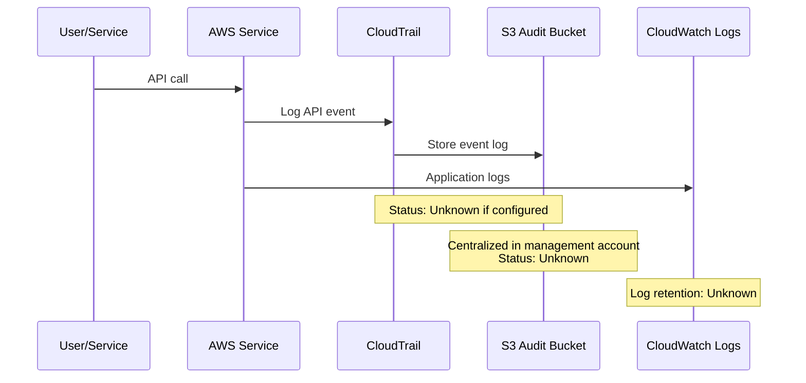
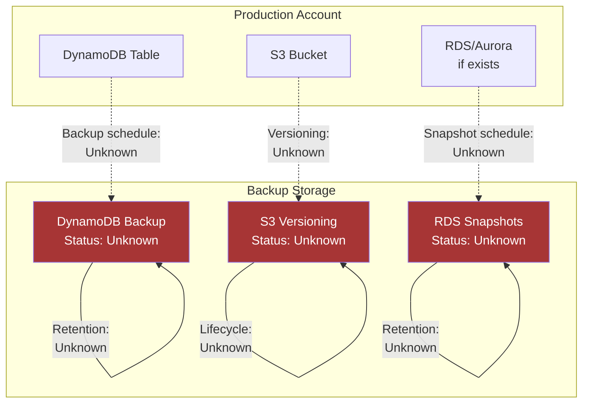
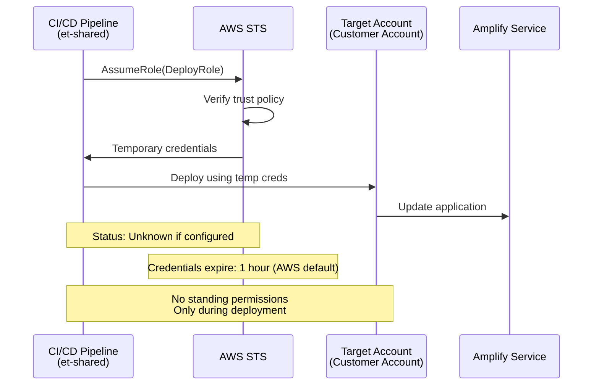
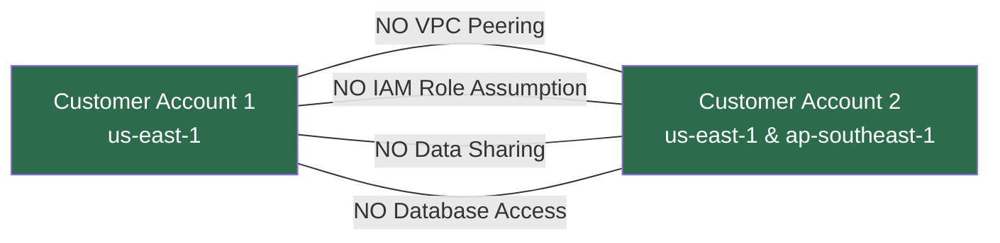

# Data Flow Diagrams

## Document Status

**Last Updated**: January 14, 2026  
**Status**: DRAFT - Based on codebase structure, requires validation  
**Owner**: Infrastructure Team  

## Purpose

This document illustrates how data flows through the AWS multi-account architecture.

## Account Overview

Reference: [ACCOUNT-ARCHITECTURE.md](ACCOUNT-ARCHITECTURE.md)

- **Management Account** (et-mgmt): Organization management, billing
- **Shared Services** (et-shared): CI/CD pipelines
- **Consumer** (et-prod): Consumer-facing applications
- **Institution OU**: Customer Account 1 (us-east-1), Customer Account 2 (us-east-1, ap-southeast-1)
- **Hosting** (neopros-life-prod): Dedicated hosting

## Data Flow 1: Code Deployment Pipeline

**Current State**:
- ✅ Code exists in `accounts/` subdirectories
- ✅ Infrastructure as Code: AWS CDK application in repository
- ✅ CI/CD pipeline configuration: CDK-based deployment
- ✅ Cross-account deployment roles: CDK bootstrap roles (configured in `accounts/` folder)

**Data Elements**:
- Application code (no PII)
- Infrastructure as Code (CDK templates)
- Build artifacts (JavaScript, Lambda functions)

**Encryption**: Code in transit via HTTPS to AWS services

## Data Flow 2: Student Authentication (Customer Accounts)

**Current State**:
- ✅ Cognito User Pools: Available per account (specific configuration unknown)
- ✅ Encryption in transit: TLS 1.2+
- ❓ MFA enabled: Unknown
- ❓ Password policies: Unknown
- ❓ Session timeout: Unknown

**Data Elements**:
- Student email/username (PII)
- Password (hashed, not retrievable)
- JWT tokens (temporary, time-limited)

**Encryption**:
- In transit: TLS 1.2+ (HTTPS)
- At rest: Cognito managed encryption (AWS default)

**FERPA Considerations**:
- Student identifiable information stored in Cognito
- No access to plaintext passwords
- JWT tokens expose user identity

## Data Flow 3: Student Data Storage & Retrieval

**Current State**:
- ✅ DynamoDB: Available (encryption status unknown)
- ✅ S3: Available (encryption status unknown)
- ❓ KMS customer-managed keys: Unknown if configured
- ❓ Specific Lambda functions: Unknown
- ❓ AppSync APIs: Unknown if configured

**Data Elements** (Examples - Actual data schema unknown):
- Student names (PII)
- Student IDs (PII)
- Learning progress data
- Submitted assignments
- Test scores (Education records - FERPA protected)

**Encryption**:
- In transit: TLS 1.2+
- At rest: DynamoDB encryption (default or KMS - unknown)
- At rest: S3 encryption (SSE-S3 or SSE-KMS - unknown)

**Data Isolation**:
- Customer Account 1 data separate from Customer Account 2
- No cross-account data access
- Each region maintains separate data stores

## Data Flow 4: Multi-Region Deployment (Customer Account 2)

**Current State**:
- ✅ Customer Account 2 configured for us-east-1 and ap-southeast-1
- ❌ Cross-region replication: NOT configured (confirmed by architecture)
- ✅ Data residency: Data remains in original region

**Data Residency**:
- US students' data: Stored only in us-east-1
- Asia-Pacific students' data: Stored only in ap-southeast-1
- No automatic cross-region data transfer

**Regional Isolation Benefits**:
- Compliance with local data protection laws
- Reduced latency for regional users
- Blast radius containment per region

## Data Flow 5: Audit Logging

**Current State**:
- ❓ CloudTrail enabled: Unknown
- ❓ S3 audit bucket: Unknown if exists
- ❓ Log retention period: Unknown
- ❓ Log encryption: Unknown
- ❓ CloudWatch Logs: Unknown configuration

**Data Elements in Logs**:
- IAM principal (who made request)
- Source IP address
- Timestamp
- API action performed
- Resources affected
- Request parameters (may contain PII)

**FERPA Considerations**:
- Audit logs may contain student identifiers in API parameters
- Must be protected with same controls as student data
- Required for breach investigation

## Data Flow 6: Backup and Disaster Recovery

**Current State**:
- ❓ DynamoDB backup: Unknown if point-in-time recovery enabled
- ❓ S3 versioning: Unknown if enabled
- ❓ RDS snapshots: Unknown if RDS exists or snapshot schedule
- ❓ Backup retention: Unknown
- ❓ Backup testing: Unknown if ever tested

**Data Elements**:
- Complete copy of production student data
- Same FERPA protection requirements as production

**Encryption**:
- ❓ Backup encryption: Unknown (should match production)

## Data Flow 7: Cross-Account Access (CI/CD Deployment)

**Current State**:
- ❓ Cross-account IAM roles: Unknown if configured
- ❓ Trust relationships: Unknown
- ❓ Least privilege policies: Unknown
- ❓ MFA requirement for assume role: Unknown

**Security**:
- Temporary credentials only (if configured)
- No long-lived access keys in CI/CD (if configured correctly)
- Audit trail via CloudTrail (if enabled)

## Data Does NOT Flow Between

### Customer Account Isolation

**Confirmed Isolation**:
- ✅ Separate AWS accounts
- ✅ Separate DynamoDB tables
- ✅ Separate S3 buckets
- ✅ Separate Cognito user pools
- ✅ No network connectivity
- ✅ No cross-account IAM roles between customer accounts

## Data Retention

**Current State**: UNDEFINED

**Required Information** (Not Currently Documented):
- How long student data is retained
- Deletion procedures for withdrawn students
- Backup retention periods
- Log retention periods
- Compliance with institutional data retention policies

See: DATA-RETENTION-POLICY.md (to be created)

## Data Export/Portability

**Current State**: UNDEFINED

**Required Information** (Not Currently Documented):
- How institutions export their student data
- Data format for exports
- Frequency of exports
- Encryption of exported data

## Known Gaps in Documentation

This document is based on:
- Repository code structure in `accounts/` directories
- AWS service availability
- Standard AWS Amplify architecture patterns

**Not Verified**:
- Actual AWS service configurations
- Encryption key types (AWS managed vs. customer managed)
- Backup schedules and retention
- CloudTrail and logging configuration
- Cross-account IAM roles
- Monitoring and alerting setup
- Actual data schema
- Lambda function implementations

## Related Documents

- [ACCOUNT-ARCHITECTURE.md](ACCOUNT-ARCHITECTURE.md) - Account structure and compliance
- [INCIDENT-RESPONSE-PLAN.md](INCIDENT-RESPONSE-PLAN.md) - Incident response procedures
- PRIVACY-POLICY.md - (To be created)
- DATA-RETENTION-POLICY.md - (To be created)
- MONITORING-RUNBOOK.md - (To be created)

## Next Steps

To make this document accurate:
1. Audit actual AWS configurations per account
2. Document encryption key types (KMS vs. AWS managed)
3. Verify CloudTrail and logging setup
4. Document backup schedules and test restores
5. Map actual Lambda functions and APIs
6. Document actual data schema
7. Verify cross-account IAM role configurations
8. Document CI/CD pipeline implementation

---

**IMPORTANT**: Diagrams represent architectural design based on code structure. Actual implementation may differ. All "Unknown" items require verification before this document can be considered accurate.
